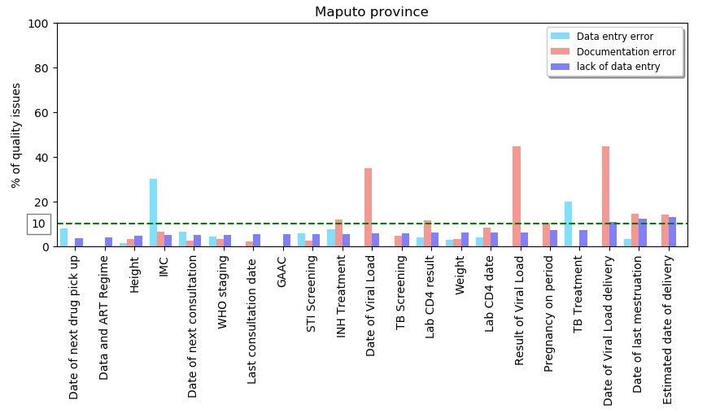

 

# Introduction
## Background and Rationale

In the context of the world-wide push to achieve HIV epidemic control, quality health information is essential to benchmark and monitor progress to achieving 95-95-95 care cascade targets. Evidence from research and practices suggests that electronic patient tracking systems (EPTS) improve the quality and use of clinical data. To this end, Mozambique has rapidly scaled-up the use of EPTS in public health clinics, with funding from the US government President’s Plan for Emergency AIDS Relief (PEPFAR). Nonetheless, the Mozambique Ministry of Health (MoH) relies on paper-based reporting systems at the health facility level, which the district and province statistical centers aggregate into an electronic DHIS2-based national health information system (SIS-MA). MoH uses this information to monitor HIV epidemic trends and allocate resources. Given the reliance on both electronic and paper-based reporting systems at the site level, concordance between the two datasets takes on high importance to ensure accurate, timely, complete, and reliable data for decision-making. 

Since 2015, PEFPAR clinical/implementing partners (IPs) have conducted EPTS data quality assessments (DQA) to evaluate and improve concordance between patient health information in EPTS and paper files. In total, PEPFAR IPs offer technical assistance to 470 health facilities, which provide the majority of antiretroviral treatment (ART) to the 1.5 million patients currently on treatment in Mozambique. During an EPTS DQA, IP evaluation teams visit sites and sample patient charts, abstracting a set of variables and comparing them to data in electronic patient files. Teams calculate concordance as a measure of timeliness of data entry, accuracy of information, and completeness of both paper and electronic records. For the exact steps involved in this activity, review the project protocol.  PEPFAR strategic information partner, the University of California San Francisco (UCSF) manages the national EPTS DQA dataset and produces summary reports.  

This report presents findings from EPTS DQAs that PEPFAR IPs conducted from October to December 2017. In total, IPs conducted EPTS DQAs at 278 sites, reviewing data from the Q4 quarter. IPs shared site level results with UCSF via Excel for analysis. UCSF looked at global concordance between patient charts and EPTS data for select variables and presents trends by type of error: documentation error in patient charts; lack of data entry in EPTS; or error in EPTS data entry. To be considered good quality data, we are aiming for concordance of 90% or higher.  

## Objectives 

1. Evaluate the agreement of the existing data in the Clinical Process and the data in the electronic database (SESP).
2. Evaluate the completeness of the data entered into the electronic database.
3. Improve the quality of data in SESP.

# Methods or Procedures
## Patient Chart Selection for EPTS DQA

For the first EPTS DQA, IPs selected a representative sample of patient charts, using the guidance from Table 1. For each subsequent EPTS DQA at the same site, IPs selected a convenience sample, as described below.

<figure>

<figcaption><a>**Table 1**: Patient Chart Sampling: Representative Sample</a></figcaption>

</figure>

### Convenience Sample for Subsequent EPTS-DQA 

After the first EPTS DQA in a facility, the subsequent DQA or follow-up DQA use a convenience sample of 50 charts, from select sub-populations of patients, as follows: 

* 10 patients who received ART during a pre-natal consult (ANC)
* 20 adult patients active on ART 
*	10 patients from the ART Aderence Community Groups  
*	5 pediatric patients on ART
*	5 patients active on ART and also receiving TB treatment 

## Electronic Patient Tracking System DQA Indicators

Electronic patient tracking system DQA assesses the quality of variables (see table 2) in the database, compared with the information in the clinical files (primary source of the data).

## EPTS DQA Data Collection 

Using an Excel book (not shown here), teams pull the charts identified in the patent sampling and compare the data in the charts with the data in the EPTS. Possible results are: 

a)	**X**: Errors in documentation in patient file: No data in the patient file 
b)	**0**: Concordance: Data in the patent file and the data in the EPTS match 
c)	**1**: Missing Data Entry: Data in the patient file has not been entered into the EPTS
d)	**2**: Error in Data Entry: Data in the patient file and data in the ePTS do not match 
e)	Error in documentation: data are in the EPTS but not in the patient file (similar to X)
    i.	**3a)** Possible to confirm with another primary source document
    ii.	**3b)** Data entry error: Not possible to confirm with another primary source document
f)	**Not Applicable**: When the data are not applicable, such as pregnancy for men 

## EPTS DQA Data Analysis 
### Calculating the Concordance 

The concordance divides the absolute value counted in the database by the information found in the clinical file. Concordance is defined by two conditions: 

1. Data in the patient chart matches data in the EPTS database (i.e. variable present and is the same value)
2. Data in the patient chart is missing, but it can be confirmed and matched via an alternate primary source, such as pharmacy receipts. 

For EPTS DQA the goal is to achieve a 90% concordance with the clinical file data (patient file). If the objective is not reached, actions plans have to be put in place in order to improve the quality of the data.

**Concordance:**

$$
  \frac{ABS(\mbox{data recounted in EPTS database})}{\mbox{Data recounted in the clinical file or confirmed in an alternate primary document}}
$$

The goal is a minimum agreement of 90%. Teams should work with every health facility with less than 90% agreement to enhance data entry and mentoring for the correct completion of clinical processes.

# Key Findings 
## Health Facility Sample

IPs conducted EPTS DQA in 278 health facilities, from a total of 470[^1]  health facilities in Mozambique with EPTS. The majority of health facilities were assessed in Maputo province (58), followed by Zambezia (47), Gaza (32), Maputo City (27) and 26 in Inhambane province. The USAID IP for Tete, Manica, Sofala and Niassa assessed fewer than 20 health facilities per province, with teams assessing the fewest sites in Niassa (5) and Sofala (7). This is due in part to the low coverage of EPTS in these provinces. *Figure* \@ref(fig:figure1) shows the interactive maps with clustered number of health facilities assessed together with the volume of patients currently on ART[^2]  by facility.

[^1]: File shared CDC containing EPTS versions in use by Health Units on January 16, 2018
[^2]: Data of volume of patients in ART shared by HIV program.

<!--html_preserve-->

<script type="application/json" data-for="htmlwidget-603ae2321ad835d05422">{"x":{"options":{"crs":{"crsClass":"L.CRS.EPSG3857","code":null,"proj4def":null,"projectedBounds":null,"options":{}}},"calls":[{"method":"addTiles","args":["//{s}.tile.openstreetmap.org/{z}/{x}/{y}.png",null,null,{"minZoom":0,"maxZoom":18,"tileSize":256,"subdomains":"abc","errorTileUrl":"","tms":false,"noWrap":false,"zoomOffset":0,"zoomReverse":false,"opacity":1,"zIndex":1,"detectRetina":false,"attribution":"&copy; <a href=\"http://openstreetmap.org\">OpenStreetMap<\/a> contributors, <a href=\"http://creativecommons.org/licenses/by-sa/2.0/\">CC-BY-SA<\/a>"}]},{"method":"addMarkers","args":[[-13.3975,-13.3728,-13.53757,-13.579456,-13.3594,-13.3294,-13.38,-13.38,-13.38,-12.3436,-11.353599,-11.353599,-11.3494,-11.7053,-11.83496,-11.7614,-11.8349598296,-11.76,-11.7794,-11.890967,-12.5639,-12.38,-12.4322,-24.6625,-24.7017,-24.5731,-24.67507,-24.2889,-24.5281,-22.7322,-23.4575,-24.7069,-24.4286,-24.533086,-25.0469,-25.1156,-25.060476,-25.1525,-24.8544,-25.1272,-24.9425,-24.8747,-25.066667,-24.8922,-24.964,-25.0314,-25.1525,-25.0269,-24.5875,-23.4281,-24.9108,-24.4889,-24.5869,-21.5839,-23.9186,-23.9006,-23.9006,-23.8858,-23.8792,-23.0914,-21.0069,-23.8814,-24.4022,-24.4761,-21.5392,-21.7175,-24.1447,-24.1108,-22.0239,-23.3336,-24.0322,-23.9353,-23.8617,-23.8178,-23.6561,-24.0664,-22.017016,-22.2522,-21.9844,-24.7627,-24.714729,-18.0539,-19.1144,-19.127952,-19.1431,-19.1111,-19.1236,-19.105488,-19.1094,-19.2028,-19.0772,-19.4153,-18.9956,-18.9406,-19.4097,-18.9531,-25.9189,-26.0489,-26.0131,-25.8408,-25.96,-25.116667,-25.0289,-24.7021924647,-24.491837,-24.8864,-24.7994,-24.9008,-25.1572,-25.3539,-25.2872,-25.0936,-25.3092,-25.4961,-25.4092,-25.4561,-25.5106,-25.2622,-25.1792,-25.04299,-25.799427,-25.7297,-25.660737,-25.6619,-25.7847,-25.7389,-25.8405,-25.9103,-25.9108,-25.9642,-25.8267,-25.9394,-25.966667,-25.8875,-25.923909,-25.894914,-25.96447,-26.84,-26.3281,-26.3427,-26.5261365434,-26.52613653,-26.8372,-26.4745,-26.526137,-25.5986,-25.4442,-25.3217,-25.7511,-26.2958,-26.2014,-26.04,-26.1941,-25.9911,-25.9144,-25.8422,-25.9147,-25.931782,-25.9061,-25.8719,-25.9317,-25.9483,-25.935,-25.9606,-25.9511,-25.9739,-25.9628,-25.9771,-25.9673,-25.9673,-25.8975,-25.9164,-25.8742,-25.8461,-25.870655,-25.9478,-26.0031,-26.0231,-25.9511,-25.9378,-25.9467,-15.0994,-15.2544,-15.1205,-15.1106,-15.1078,-15.1194,-14.3764,-16.4781,-15.708847,-14.85,-15.0083,-14.1796,-16.0914,-14.9097,-14.9525,-14.8725,-14.5353,-14.551109,-15.2744,-15.0142,-14.8014,-13.3213,-13.3059,-13.2901,-14.3536,-19.8828,-19.8016333333333,-19.8359833333333,-19.81275,-19.7677833333333,-19.8406,-19.8491833333333,-14.7203,-15.7396,-15.599,-16.8363,-16.96,-15.3789,-16.2022,-16.1477,-16.143,-16.1717,-16.1586,-16.1525,-16.6439,-15.8061,-16.1922,-16.1245,-15.6016,-17.4514,-15.4339,-15.6306,-17.8617,-17.8753,-17.8803,-17.865732908249,-17.8611,-17.588018,-17.8878,-17.588018,-17.7311,-17.7786,-17.8469,-17.8192,-17.8675,-17.7786,-17.876179,-15.96268952,-16.1464,-16.0378,-16.0361,-18.0292,-18.0781,-18.1114,-18.01,-17.9767,-17.244442105293,-17.3094,-17.4383,-17.3092,-16.8972,-17.189871,-17.2636,-16.4341,-17.7153,-17.2281,-17.64,-17.6355,-17.513774,-17.5753,-17.4944,-17.4823,-17.513777,-17.2667,-17.588018,-17.1173,-17.2745],[39.4317,39.9681,39.734338,39.735624,40.1936,40.1008,39.73712,40.28497,39.952,40.5847,40.35224,40.35224,40.3586,39.9856,39.8365193,39.7356,39.8365192552,39.8053,39.9006,39.734338,40.2853,40.2642,40.4833,33.3458,33.5739,33.7569,33.561245,33.5661,33.675,32.0608,33.4253,33.18,32.8425,32.997374,33.6917,33.7294,33.695881,33.4853,33.6919,33.555,33.4456,33.5089,33.858333,33.7306,33.7834,33.485,33.4853,33.7081,33.2331,32.5547,34.0406,33.9569,34.0697,32.9375,32.1625,35.3975,35.3975,35.4703,35.4325,34.3806,34.9678,35.1528,35.1344,35.0175,35.1886,35.0947,35.2175,35.3172,34.1442,35.3797,35.2606,35.2986,35.3433,35.3483,35.3428,34.7289,35.312583,35.1119,35.3211,34.3502,34.747613,33.1708,33.4583,33.4558087,33.4478,33.4764,33.4994,33.460774,33.4778,33.9258,33.6417,33.5131,32.7267,32.8753,33.2939,33.2647,32.3941,32.3253,32.4186,32.3636,32.4173,32.583333,32.6497,32.4385455703,32.081614,32.5286,32.8589,32.3494,32.8006,32.9336,32.7406,32.9175,32.8331,32.6525,32.8081,32.7753,32.7264,32.8647,32.8522,32.78458,32.650594,32.6733,32.7108799,32.6725,32.6339,32.5392,32.5419,32.4597,32.4927,32.4553,32.4525,32.4553,32.4666667,32.5341,32.465802,32.461517,32.453431,32.2852,32.4158,32.675,32.5625487798,32.56254877,32.8839,32.6511,32.5625488,32.245,31.9897,32.2553,32.395,32.1877,32.1389,32.2575,32.2175,32.0133,32.6097,32.6414,32.5961,32.585937,32.6561,32.6303,32.5858,32.59,32.605,32.57,32.5822,32.5833,32.5944,32.5874,32.5899,32.5899,32.5706,32.5594,32.5986,32.5972,32.5791318,32.545,32.9203,32.5789,32.5556,32.5664,32.5436,39.4244,39.2483,39.2642,39.2728,39.2581,39.1894,37.7708,39.715,40.125303,37.0042,39.6809,40.5249,39.1581,40.3333,40.6656,39.6378,40.6939,40.621632,39.0411,39.1289,36.5331,35.2518,35.2468,35.248,35.6486,34.5928,34.8910666666667,34.8844,34.8642333333333,34.86955,34.8437833333333,34.8750166666667,34.3608,32.7691,32.7674,33.2774,32.9193,33.2014,33.5994,33.5786,33.6086,33.5933,33.5656,33.5839,34.6812,31.7511,31.689,33.746,34.3359,35.0788,37.4433,37.6836,36.8955,36.8811,36.8916,36.887551546097,36.9081,36.6957216,36.9156,36.6957216,37.0756,37.0586,36.9006,36.9466,36.9239,37.0586,36.88829,38.44124258,38.3725,37.1683,37.5239,36.7361,36.8961,36.7581,36.8108,36.8578,37.200340032578,37.5089,37.2855,37.9742,37.8972,37.730629,37.8936,37.5889,37.1925,37.0247,37.2717,37.1217,37.040034,37.1589,37.0265,37.1997,37.040034,38.1433,36.6957216,38.1303,38.1781],null,null,null,{"interactive":true,"draggable":false,"keyboard":true,"title":"","alt":"","zIndexOffset":0,"opacity":1,"riseOnHover":false,"riseOffset":250},null,null,{"showCoverageOnHover":true,"zoomToBoundsOnClick":true,"spiderfyOnMaxZoom":true,"removeOutsideVisibleBounds":true,"spiderLegPolylineOptions":{"weight":1.5,"color":"#222","opacity":0.5},"freezeAtZoom":false},null,["<b>Province:<\/span><\/b> Cabo Delgado   <b><a>District:<\/a><\/b> Chiure  <b><a>Site:<\/a><\/b>  CS Catapua <b><a>Volume of patients in ART:<\/a><\/b>  179  ","<b>Province:<\/span><\/b> Cabo Delgado   <b><a>District:<\/a><\/b> Chiure  <b><a>Site:<\/a><\/b>  CS Chiure Velho <b><a>Volume of patients in ART:<\/a><\/b>  188  ","<b>Province:<\/span><\/b> Cabo Delgado   <b><a>District:<\/a><\/b> Chiure  <b><a>Site:<\/a><\/b>  CS M'mala <b><a>Volume of patients in ART:<\/a><\/b>  104  ","<b>Province:<\/span><\/b> Cabo Delgado   <b><a>District:<\/a><\/b> Chiure  <b><a>Site:<\/a><\/b>  CS Marera <b><a>Volume of patients in ART:<\/a><\/b>  83  ","<b>Province:<\/span><\/b> Cabo Delgado   <b><a>District:<\/a><\/b> Chiure  <b><a>Site:<\/a><\/b>  CS Mazeze <b><a>Volume of patients in ART:<\/a><\/b>  77  ","<b>Province:<\/span><\/b> Cabo Delgado   <b><a>District:<\/a><\/b> Chiure  <b><a>Site:<\/a><\/b>  CS Muege <b><a>Volume of patients in ART:<\/a><\/b>  41  ","<b>Province:<\/span><\/b> Cabo Delgado   <b><a>District:<\/a><\/b> Chiure  <b><a>Site:<\/a><\/b>  CS Nakoto <b><a>Volume of patients in ART:<\/a><\/b>  284  ","<b>Province:<\/span><\/b> Cabo Delgado   <b><a>District:<\/a><\/b> Chiure  <b><a>Site:<\/a><\/b>  CS Namogelia <b><a>Volume of patients in ART:<\/a><\/b>  116  ","<b>Province:<\/span><\/b> Cabo Delgado   <b><a>District:<\/a><\/b> Chiure  <b><a>Site:<\/a><\/b>  CS Samora Machel <b><a>Volume of patients in ART:<\/a><\/b>  162  ","<b>Province:<\/span><\/b> Cabo Delgado   <b><a>District:<\/a><\/b> Ibo  <b><a>Site:<\/a><\/b>  CS Ibo <b><a>Volume of patients in ART:<\/a><\/b>  227  ","<b>Province:<\/span><\/b> Cabo Delgado   <b><a>District:<\/a><\/b> Mocimboa da Praia  <b><a>Site:<\/a><\/b>  CS Milamba <b><a>Volume of patients in ART:<\/a><\/b>  NA  ","<b>Province:<\/span><\/b> Cabo Delgado   <b><a>District:<\/a><\/b> Mocimboa da Praia  <b><a>Site:<\/a><\/b>  CS Nanduadua <b><a>Volume of patients in ART:<\/a><\/b>  120  ","<b>Province:<\/span><\/b> Cabo Delgado   <b><a>District:<\/a><\/b> Mocimboa da Praia  <b><a>Site:<\/a><\/b>  HR Mocimboa da Praia <b><a>Volume of patients in ART:<\/a><\/b>  2571  ","<b>Province:<\/span><\/b> Cabo Delgado   <b><a>District:<\/a><\/b> Muidumbe  <b><a>Site:<\/a><\/b>  CS Chitunda <b><a>Volume of patients in ART:<\/a><\/b>  324  ","<b>Province:<\/span><\/b> Cabo Delgado   <b><a>District:<\/a><\/b> Muidumbe  <b><a>Site:<\/a><\/b>  CS Miangalewa <b><a>Volume of patients in ART:<\/a><\/b>  518  ","<b>Province:<\/span><\/b> Cabo Delgado   <b><a>District:<\/a><\/b> Muidumbe  <b><a>Site:<\/a><\/b>  CS Miteda <b><a>Volume of patients in ART:<\/a><\/b>  654  ","<b>Province:<\/span><\/b> Cabo Delgado   <b><a>District:<\/a><\/b> Muidumbe  <b><a>Site:<\/a><\/b>  CS Muambula <b><a>Volume of patients in ART:<\/a><\/b>  597  ","<b>Province:<\/span><\/b> Cabo Delgado   <b><a>District:<\/a><\/b> Muidumbe  <b><a>Site:<\/a><\/b>  CS Muatide <b><a>Volume of patients in ART:<\/a><\/b>  3520  ","<b>Province:<\/span><\/b> Cabo Delgado   <b><a>District:<\/a><\/b> Muidumbe  <b><a>Site:<\/a><\/b>  CS Namacande <b><a>Volume of patients in ART:<\/a><\/b>  115  ","<b>Province:<\/span><\/b> Cabo Delgado   <b><a>District:<\/a><\/b> Muidumbe  <b><a>Site:<\/a><\/b>  CS Ntchinga <b><a>Volume of patients in ART:<\/a><\/b>  120  ","<b>Province:<\/span><\/b> Cabo Delgado   <b><a>District:<\/a><\/b> Quissanga  <b><a>Site:<\/a><\/b>  CS Bilibiza <b><a>Volume of patients in ART:<\/a><\/b>  103  ","<b>Province:<\/span><\/b> Cabo Delgado   <b><a>District:<\/a><\/b> Quissanga  <b><a>Site:<\/a><\/b>  CS Cagembe <b><a>Volume of patients in ART:<\/a><\/b>  30  ","<b>Province:<\/span><\/b> Cabo Delgado   <b><a>District:<\/a><\/b> Quissanga  <b><a>Site:<\/a><\/b>  CS Quissanga <b><a>Volume of patients in ART:<\/a><\/b>  157  ","<b>Province:<\/span><\/b> Gaza   <b><a>District:<\/a><\/b> Chibuto  <b><a>Site:<\/a><\/b>  CS Chaimite <b><a>Volume of patients in ART:<\/a><\/b>  2249  ","<b>Province:<\/span><\/b> Gaza   <b><a>District:<\/a><\/b> Chibuto  <b><a>Site:<\/a><\/b>  CS Chimundo <b><a>Volume of patients in ART:<\/a><\/b>  845  ","<b>Province:<\/span><\/b> Gaza   <b><a>District:<\/a><\/b> Chibuto  <b><a>Site:<\/a><\/b>  CS Chipadja <b><a>Volume of patients in ART:<\/a><\/b>  676  ","<b>Province:<\/span><\/b> Gaza   <b><a>District:<\/a><\/b> Chibuto  <b><a>Site:<\/a><\/b>  CS Coca Missava <b><a>Volume of patients in ART:<\/a><\/b>  345  ","<b>Province:<\/span><\/b> Gaza   <b><a>District:<\/a><\/b> Chibuto  <b><a>Site:<\/a><\/b>  CS Maqueze <b><a>Volume of patients in ART:<\/a><\/b>  697  ","<b>Province:<\/span><\/b> Gaza   <b><a>District:<\/a><\/b> Chibuto  <b><a>Site:<\/a><\/b>  CS Meboi <b><a>Volume of patients in ART:<\/a><\/b>  641  ","<b>Province:<\/span><\/b> Gaza   <b><a>District:<\/a><\/b> Chicualacuala  <b><a>Site:<\/a><\/b>  CS Mapai <b><a>Volume of patients in ART:<\/a><\/b>  1049  ","<b>Province:<\/span><\/b> Gaza   <b><a>District:<\/a><\/b> Chigubo  <b><a>Site:<\/a><\/b>  CS Ndindiza <b><a>Volume of patients in ART:<\/a><\/b>  411  ","<b>Province:<\/span><\/b> Gaza   <b><a>District:<\/a><\/b> Chokwe  <b><a>Site:<\/a><\/b>  CS Hokwe <b><a>Volume of patients in ART:<\/a><\/b>  1858  ","<b>Province:<\/span><\/b> Gaza   <b><a>District:<\/a><\/b> Chokwe  <b><a>Site:<\/a><\/b>  CS Manjangue <b><a>Volume of patients in ART:<\/a><\/b>  1307  ","<b>Province:<\/span><\/b> Gaza   <b><a>District:<\/a><\/b> Chokwe  <b><a>Site:<\/a><\/b>  CS Urbano 3º Bairro <b><a>Volume of patients in ART:<\/a><\/b>  1907  ","<b>Province:<\/span><\/b> Gaza   <b><a>District:<\/a><\/b> Cidade de Xai-Xai  <b><a>Site:<\/a><\/b>  CS Marien Nguabi <b><a>Volume of patients in ART:<\/a><\/b>  4146  ","<b>Province:<\/span><\/b> Gaza   <b><a>District:<\/a><\/b> Cidade de Xai-Xai  <b><a>Site:<\/a><\/b>  CS Praia <b><a>Volume of patients in ART:<\/a><\/b>  482  ","<b>Province:<\/span><\/b> Gaza   <b><a>District:<\/a><\/b> Cidade de Xai-Xai  <b><a>Site:<\/a><\/b>  CS Unidade 7 <b><a>Volume of patients in ART:<\/a><\/b>  NA  ","<b>Province:<\/span><\/b> Gaza   <b><a>District:<\/a><\/b> Distrito de Xai-Xai  <b><a>Site:<\/a><\/b>  CS Banhine <b><a>Volume of patients in ART:<\/a><\/b>  227  ","<b>Province:<\/span><\/b> Gaza   <b><a>District:<\/a><\/b> Distrito de Xai-Xai  <b><a>Site:<\/a><\/b>  CS Bungane <b><a>Volume of patients in ART:<\/a><\/b>  468  ","<b>Province:<\/span><\/b> Gaza   <b><a>District:<\/a><\/b> Distrito de Xai-Xai  <b><a>Site:<\/a><\/b>  CS Chilaulane <b><a>Volume of patients in ART:<\/a><\/b>  300  ","<b>Province:<\/span><\/b> Gaza   <b><a>District:<\/a><\/b> Distrito de Xai-Xai  <b><a>Site:<\/a><\/b>  CS Chipenhe <b><a>Volume of patients in ART:<\/a><\/b>  1468  ","<b>Province:<\/span><\/b> Gaza   <b><a>District:<\/a><\/b> Distrito de Xai-Xai  <b><a>Site:<\/a><\/b>  CS Julius Nyerere <b><a>Volume of patients in ART:<\/a><\/b>  3662  ","<b>Province:<\/span><\/b> Gaza   <b><a>District:<\/a><\/b> Distrito de Xai-Xai  <b><a>Site:<\/a><\/b>  CS Maciene <b><a>Volume of patients in ART:<\/a><\/b>  621  ","<b>Province:<\/span><\/b> Gaza   <b><a>District:<\/a><\/b> Distrito de Xai-Xai  <b><a>Site:<\/a><\/b>  CS Nhacutse <b><a>Volume of patients in ART:<\/a><\/b>  1615  ","<b>Province:<\/span><\/b> Gaza   <b><a>District:<\/a><\/b> Distrito de Xai-Xai  <b><a>Site:<\/a><\/b>  CS Siaia <b><a>Volume of patients in ART:<\/a><\/b>  786  ","<b>Province:<\/span><\/b> Gaza   <b><a>District:<\/a><\/b> Distrito de Xai-Xai  <b><a>Site:<\/a><\/b>  CS Vladimir Lenine <b><a>Volume of patients in ART:<\/a><\/b>  520  ","<b>Province:<\/span><\/b> Gaza   <b><a>District:<\/a><\/b> Distrito de Xai-Xai  <b><a>Site:<\/a><\/b>  CS Zongoene <b><a>Volume of patients in ART:<\/a><\/b>  1175  ","<b>Province:<\/span><\/b> Gaza   <b><a>District:<\/a><\/b> Distrito de Xai-Xai  <b><a>Site:<\/a><\/b>  PS Ndambine 2000 <b><a>Volume of patients in ART:<\/a><\/b>  438  ","<b>Province:<\/span><\/b> Gaza   <b><a>District:<\/a><\/b> Guija  <b><a>Site:<\/a><\/b>  CS Chibabel <b><a>Volume of patients in ART:<\/a><\/b>  143  ","<b>Province:<\/span><\/b> Gaza   <b><a>District:<\/a><\/b> Mabalane  <b><a>Site:<\/a><\/b>  CS Combomune <b><a>Volume of patients in ART:<\/a><\/b>  860  ","<b>Province:<\/span><\/b> Gaza   <b><a>District:<\/a><\/b> Mandlakazi  <b><a>Site:<\/a><\/b>  CS Incadine <b><a>Volume of patients in ART:<\/a><\/b>  366  ","<b>Province:<\/span><\/b> Gaza   <b><a>District:<\/a><\/b> Mandlakazi  <b><a>Site:<\/a><\/b>  CS Macuacua <b><a>Volume of patients in ART:<\/a><\/b>  828  ","<b>Province:<\/span><\/b> Gaza   <b><a>District:<\/a><\/b> Mandlakazi  <b><a>Site:<\/a><\/b>  CS Tavane <b><a>Volume of patients in ART:<\/a><\/b>  558  ","<b>Province:<\/span><\/b> Gaza   <b><a>District:<\/a><\/b> Massangena  <b><a>Site:<\/a><\/b>  CS Massangena <b><a>Volume of patients in ART:<\/a><\/b>  1472  ","<b>Province:<\/span><\/b> Gaza   <b><a>District:<\/a><\/b> Massingir  <b><a>Site:<\/a><\/b>  CS Massingir <b><a>Volume of patients in ART:<\/a><\/b>  964  ","<b>Province:<\/span><\/b> Inhambane   <b><a>District:<\/a><\/b> Cidade de Inhambane  <b><a>Site:<\/a><\/b>  CS Balane (Urbano ) <b><a>Volume of patients in ART:<\/a><\/b>  3682  ","<b>Province:<\/span><\/b> Inhambane   <b><a>District:<\/a><\/b> Cidade de Inhambane  <b><a>Site:<\/a><\/b>  CS Muelé <b><a>Volume of patients in ART:<\/a><\/b>  655  ","<b>Province:<\/span><\/b> Inhambane   <b><a>District:<\/a><\/b> Cidade de Inhambane  <b><a>Site:<\/a><\/b>  CS Salela <b><a>Volume of patients in ART:<\/a><\/b>  311  ","<b>Province:<\/span><\/b> Inhambane   <b><a>District:<\/a><\/b> Cidade de Inhambane  <b><a>Site:<\/a><\/b>  HP Inhambane <b><a>Volume of patients in ART:<\/a><\/b>  NA  ","<b>Province:<\/span><\/b> Inhambane   <b><a>District:<\/a><\/b> Funhalouro  <b><a>Site:<\/a><\/b>  CS Funhalouro <b><a>Volume of patients in ART:<\/a><\/b>  1173  ","<b>Province:<\/span><\/b> Inhambane   <b><a>District:<\/a><\/b> Govuro  <b><a>Site:<\/a><\/b>  CS Doane <b><a>Volume of patients in ART:<\/a><\/b>  1311  ","<b>Province:<\/span><\/b> Inhambane   <b><a>District:<\/a><\/b> Homoine  <b><a>Site:<\/a><\/b>  CS Homoine <b><a>Volume of patients in ART:<\/a><\/b>  3784  ","<b>Province:<\/span><\/b> Inhambane   <b><a>District:<\/a><\/b> Inharrime  <b><a>Site:<\/a><\/b>  CS Chongola <b><a>Volume of patients in ART:<\/a><\/b>  437  ","<b>Province:<\/span><\/b> Inhambane   <b><a>District:<\/a><\/b> Inharrime  <b><a>Site:<\/a><\/b>  CS Inharrime <b><a>Volume of patients in ART:<\/a><\/b>  2621  ","<b>Province:<\/span><\/b> Inhambane   <b><a>District:<\/a><\/b> Inhassoro  <b><a>Site:<\/a><\/b>  CS Inhassoro <b><a>Volume of patients in ART:<\/a><\/b>  2886  ","<b>Province:<\/span><\/b> Inhambane   <b><a>District:<\/a><\/b> Inhassoro  <b><a>Site:<\/a><\/b>  CS Mangugumete <b><a>Volume of patients in ART:<\/a><\/b>  1797  ","<b>Province:<\/span><\/b> Inhambane   <b><a>District:<\/a><\/b> Jangamo  <b><a>Site:<\/a><\/b>  CS Cumbana <b><a>Volume of patients in ART:<\/a><\/b>  1152  ","<b>Province:<\/span><\/b> Inhambane   <b><a>District:<\/a><\/b> Jangamo  <b><a>Site:<\/a><\/b>  CS Jangamo <b><a>Volume of patients in ART:<\/a><\/b>  1829  ","<b>Province:<\/span><\/b> Inhambane   <b><a>District:<\/a><\/b> Mabote  <b><a>Site:<\/a><\/b>  CS Mabote <b><a>Volume of patients in ART:<\/a><\/b>  3985  ","<b>Province:<\/span><\/b> Inhambane   <b><a>District:<\/a><\/b> Massinga  <b><a>Site:<\/a><\/b>  HD Massinga <b><a>Volume of patients in ART:<\/a><\/b>  6895  ","<b>Province:<\/span><\/b> Inhambane   <b><a>District:<\/a><\/b> Maxixe  <b><a>Site:<\/a><\/b>  CS Agostinho Neto <b><a>Volume of patients in ART:<\/a><\/b>  245  ","<b>Province:<\/span><\/b> Inhambane   <b><a>District:<\/a><\/b> Maxixe  <b><a>Site:<\/a><\/b>  CS Mabil <b><a>Volume of patients in ART:<\/a><\/b>  529  ","<b>Province:<\/span><\/b> Inhambane   <b><a>District:<\/a><\/b> Maxixe  <b><a>Site:<\/a><\/b>  CS Maxixe <b><a>Volume of patients in ART:<\/a><\/b>  2441  ","<b>Province:<\/span><\/b> Inhambane   <b><a>District:<\/a><\/b> Maxixe  <b><a>Site:<\/a><\/b>  HR Chicuque <b><a>Volume of patients in ART:<\/a><\/b>  2659  ","<b>Province:<\/span><\/b> Inhambane   <b><a>District:<\/a><\/b> Morrumbene  <b><a>Site:<\/a><\/b>  CS Morrumbene <b><a>Volume of patients in ART:<\/a><\/b>  3439  ","<b>Province:<\/span><\/b> Inhambane   <b><a>District:<\/a><\/b> Panda  <b><a>Site:<\/a><\/b>  CS Panda <b><a>Volume of patients in ART:<\/a><\/b>  797  ","<b>Province:<\/span><\/b> Inhambane   <b><a>District:<\/a><\/b> Vilankulos  <b><a>Site:<\/a><\/b>  CS Chibuene <b><a>Volume of patients in ART:<\/a><\/b>  218  ","<b>Province:<\/span><\/b> Inhambane   <b><a>District:<\/a><\/b> Vilankulos  <b><a>Site:<\/a><\/b>  CS Mapinhane <b><a>Volume of patients in ART:<\/a><\/b>  1520  ","<b>Province:<\/span><\/b> Inhambane   <b><a>District:<\/a><\/b> Vilankulos  <b><a>Site:<\/a><\/b>  HR Vilanculos <b><a>Volume of patients in ART:<\/a><\/b>  6578  ","<b>Province:<\/span><\/b> Inhambane   <b><a>District:<\/a><\/b> Zavala  <b><a>Site:<\/a><\/b>  CS Zandamela <b><a>Volume of patients in ART:<\/a><\/b>  475  ","<b>Province:<\/span><\/b> Inhambane   <b><a>District:<\/a><\/b> Zavala  <b><a>Site:<\/a><\/b>  HD Quissico <b><a>Volume of patients in ART:<\/a><\/b>  3227  ","<b>Province:<\/span><\/b> Manica   <b><a>District:<\/a><\/b> Barue  <b><a>Site:<\/a><\/b>  HD Catandica <b><a>Volume of patients in ART:<\/a><\/b>  3749  ","<b>Province:<\/span><\/b> Manica   <b><a>District:<\/a><\/b> Cidade de Chimoio  <b><a>Site:<\/a><\/b>  CS 1º de Maio <b><a>Volume of patients in ART:<\/a><\/b>  6651  ","<b>Province:<\/span><\/b> Manica   <b><a>District:<\/a><\/b> Cidade de Chimoio  <b><a>Site:<\/a><\/b>  CS 7 De Abril <b><a>Volume of patients in ART:<\/a><\/b>  4310  ","<b>Province:<\/span><\/b> Manica   <b><a>District:<\/a><\/b> Cidade de Chimoio  <b><a>Site:<\/a><\/b>  CS Chissui <b><a>Volume of patients in ART:<\/a><\/b>  1225  ","<b>Province:<\/span><\/b> Manica   <b><a>District:<\/a><\/b> Cidade de Chimoio  <b><a>Site:<\/a><\/b>  CS Eduardo Mondlane <b><a>Volume of patients in ART:<\/a><\/b>  7120  ","<b>Province:<\/span><\/b> Manica   <b><a>District:<\/a><\/b> Cidade de Chimoio  <b><a>Site:<\/a><\/b>  CS Nhamaonha <b><a>Volume of patients in ART:<\/a><\/b>  5612  ","<b>Province:<\/span><\/b> Manica   <b><a>District:<\/a><\/b> Cidade de Chimoio  <b><a>Site:<\/a><\/b>  CS Vila Nova <b><a>Volume of patients in ART:<\/a><\/b>  1405  ","<b>Province:<\/span><\/b> Manica   <b><a>District:<\/a><\/b> Cidade de Chimoio  <b><a>Site:<\/a><\/b>  HP Chimoio <b><a>Volume of patients in ART:<\/a><\/b>  518  ","<b>Province:<\/span><\/b> Manica   <b><a>District:<\/a><\/b> Gondola  <b><a>Site:<\/a><\/b>  CS Inchope <b><a>Volume of patients in ART:<\/a><\/b>  1745  ","<b>Province:<\/span><\/b> Manica   <b><a>District:<\/a><\/b> Gondola  <b><a>Site:<\/a><\/b>  HD Gondola <b><a>Volume of patients in ART:<\/a><\/b>  3429  ","<b>Province:<\/span><\/b> Manica   <b><a>District:<\/a><\/b> Macate  <b><a>Site:<\/a><\/b>  CS Macate <b><a>Volume of patients in ART:<\/a><\/b>  885  ","<b>Province:<\/span><\/b> Manica   <b><a>District:<\/a><\/b> Manica  <b><a>Site:<\/a><\/b>  CS Machipanda <b><a>Volume of patients in ART:<\/a><\/b>  1231  ","<b>Province:<\/span><\/b> Manica   <b><a>District:<\/a><\/b> Manica  <b><a>Site:<\/a><\/b>  HD Manica <b><a>Volume of patients in ART:<\/a><\/b>  7019  ","<b>Province:<\/span><\/b> Manica   <b><a>District:<\/a><\/b> Sussundenga  <b><a>Site:<\/a><\/b>  CS Sussundenga <b><a>Volume of patients in ART:<\/a><\/b>  2664  ","<b>Province:<\/span><\/b> Manica   <b><a>District:<\/a><\/b> Vanduzi  <b><a>Site:<\/a><\/b>  CS Vanduzi <b><a>Volume of patients in ART:<\/a><\/b>  3970  ","<b>Province:<\/span><\/b> Maputo   <b><a>District:<\/a><\/b> Boane  <b><a>Site:<\/a><\/b>  CS Beleluane <b><a>Volume of patients in ART:<\/a><\/b>  3634  ","<b>Province:<\/span><\/b> Maputo   <b><a>District:<\/a><\/b> Boane  <b><a>Site:<\/a><\/b>  CS Boane <b><a>Volume of patients in ART:<\/a><\/b>  3634  ","<b>Province:<\/span><\/b> Maputo   <b><a>District:<\/a><\/b> Boane  <b><a>Site:<\/a><\/b>  CS Campoane <b><a>Volume of patients in ART:<\/a><\/b>  1547  ","<b>Province:<\/span><\/b> Maputo   <b><a>District:<\/a><\/b> Boane  <b><a>Site:<\/a><\/b>  CS Mulotana <b><a>Volume of patients in ART:<\/a><\/b>  444  ","<b>Province:<\/span><\/b> Maputo   <b><a>District:<\/a><\/b> Boane  <b><a>Site:<\/a><\/b>  PS Matola-Rio <b><a>Volume of patients in ART:<\/a><\/b>  318  ","<b>Province:<\/span><\/b> Maputo   <b><a>District:<\/a><\/b> Magude  <b><a>Site:<\/a><\/b>  CS Chichuco <b><a>Volume of patients in ART:<\/a><\/b>  22  ","<b>Province:<\/span><\/b> Maputo   <b><a>District:<\/a><\/b> Magude  <b><a>Site:<\/a><\/b>  CS Magude <b><a>Volume of patients in ART:<\/a><\/b>  4498  ","<b>Province:<\/span><\/b> Maputo   <b><a>District:<\/a><\/b> Magude  <b><a>Site:<\/a><\/b>  CS Mahel <b><a>Volume of patients in ART:<\/a><\/b>  70  ","<b>Province:<\/span><\/b> Maputo   <b><a>District:<\/a><\/b> Magude  <b><a>Site:<\/a><\/b>  CS Mapulanguene <b><a>Volume of patients in ART:<\/a><\/b>  31  ","<b>Province:<\/span><\/b> Maputo   <b><a>District:<\/a><\/b> Magude  <b><a>Site:<\/a><\/b>  CS Moine <b><a>Volume of patients in ART:<\/a><\/b>  266  ","<b>Province:<\/span><\/b> Maputo   <b><a>District:<\/a><\/b> Magude  <b><a>Site:<\/a><\/b>  CS Motaze <b><a>Volume of patients in ART:<\/a><\/b>  846  ","<b>Province:<\/span><\/b> Maputo   <b><a>District:<\/a><\/b> Magude  <b><a>Site:<\/a><\/b>  CS Panjane <b><a>Volume of patients in ART:<\/a><\/b>  145  ","<b>Province:<\/span><\/b> Maputo   <b><a>District:<\/a><\/b> Manhica  <b><a>Site:<\/a><\/b>  CS 3 de Fevereiro <b><a>Volume of patients in ART:<\/a><\/b>  866  ","<b>Province:<\/span><\/b> Maputo   <b><a>District:<\/a><\/b> Manhica  <b><a>Site:<\/a><\/b>  CS Calanga <b><a>Volume of patients in ART:<\/a><\/b>  359  ","<b>Province:<\/span><\/b> Maputo   <b><a>District:<\/a><\/b> Manhica  <b><a>Site:<\/a><\/b>  CS Chibucutso <b><a>Volume of patients in ART:<\/a><\/b>  346  ","<b>Province:<\/span><\/b> Maputo   <b><a>District:<\/a><\/b> Manhica  <b><a>Site:<\/a><\/b>  CS Ilha Josina <b><a>Volume of patients in ART:<\/a><\/b>  945  ","<b>Province:<\/span><\/b> Maputo   <b><a>District:<\/a><\/b> Manhica  <b><a>Site:<\/a><\/b>  CS Malavela <b><a>Volume of patients in ART:<\/a><\/b>  854  ","<b>Province:<\/span><\/b> Maputo   <b><a>District:<\/a><\/b> Manhica  <b><a>Site:<\/a><\/b>  CS Maluana <b><a>Volume of patients in ART:<\/a><\/b>  817  ","<b>Province:<\/span><\/b> Maputo   <b><a>District:<\/a><\/b> Manhica  <b><a>Site:<\/a><\/b>  CS Manhiça <b><a>Volume of patients in ART:<\/a><\/b>  11808  ","<b>Province:<\/span><\/b> Maputo   <b><a>District:<\/a><\/b> Manhica  <b><a>Site:<\/a><\/b>  CS Maragra <b><a>Volume of patients in ART:<\/a><\/b>  2596  ","<b>Province:<\/span><\/b> Maputo   <b><a>District:<\/a><\/b> Manhica  <b><a>Site:<\/a><\/b>  CS Munguine <b><a>Volume of patients in ART:<\/a><\/b>  559  ","<b>Province:<\/span><\/b> Maputo   <b><a>District:<\/a><\/b> Manhica  <b><a>Site:<\/a><\/b>  CS Nwamatibjana <b><a>Volume of patients in ART:<\/a><\/b>  2277  ","<b>Province:<\/span><\/b> Maputo   <b><a>District:<\/a><\/b> Manhica  <b><a>Site:<\/a><\/b>  CS Taninga <b><a>Volume of patients in ART:<\/a><\/b>  734  ","<b>Province:<\/span><\/b> Maputo   <b><a>District:<\/a><\/b> Manhica  <b><a>Site:<\/a><\/b>  HR Xinavane <b><a>Volume of patients in ART:<\/a><\/b>  NA  ","<b>Province:<\/span><\/b> Maputo   <b><a>District:<\/a><\/b> Marracuene  <b><a>Site:<\/a><\/b>  CS Habel Jafar <b><a>Volume of patients in ART:<\/a><\/b>  1264  ","<b>Province:<\/span><\/b> Maputo   <b><a>District:<\/a><\/b> Marracuene  <b><a>Site:<\/a><\/b>  CS Marracuene <b><a>Volume of patients in ART:<\/a><\/b>  4552  ","<b>Province:<\/span><\/b> Maputo   <b><a>District:<\/a><\/b> Marracuene  <b><a>Site:<\/a><\/b>  CS Mumemo <b><a>Volume of patients in ART:<\/a><\/b>  1320  ","<b>Province:<\/span><\/b> Maputo   <b><a>District:<\/a><\/b> Marracuene  <b><a>Site:<\/a><\/b>  CS Nhongonhane <b><a>Volume of patients in ART:<\/a><\/b>  2064  ","<b>Province:<\/span><\/b> Maputo   <b><a>District:<\/a><\/b> Marracuene  <b><a>Site:<\/a><\/b>  CS Ricatla <b><a>Volume of patients in ART:<\/a><\/b>  952  ","<b>Province:<\/span><\/b> Maputo   <b><a>District:<\/a><\/b> Matola  <b><a>Site:<\/a><\/b>  CS Boquisso <b><a>Volume of patients in ART:<\/a><\/b>  1017  ","<b>Province:<\/span><\/b> Maputo   <b><a>District:<\/a><\/b> Matola  <b><a>Site:<\/a><\/b>  CS Khongolote <b><a>Volume of patients in ART:<\/a><\/b>  2513  ","<b>Province:<\/span><\/b> Maputo   <b><a>District:<\/a><\/b> Matola  <b><a>Site:<\/a><\/b>  CS Liberdade <b><a>Volume of patients in ART:<\/a><\/b>  918  ","<b>Province:<\/span><\/b> Maputo   <b><a>District:<\/a><\/b> Matola  <b><a>Site:<\/a><\/b>  CS Machava II <b><a>Volume of patients in ART:<\/a><\/b>  10798  ","<b>Province:<\/span><\/b> Maputo   <b><a>District:<\/a><\/b> Matola  <b><a>Site:<\/a><\/b>  CS Matola <b><a>Volume of patients in ART:<\/a><\/b>  8603  ","<b>Province:<\/span><\/b> Maputo   <b><a>District:<\/a><\/b> Matola  <b><a>Site:<\/a><\/b>  CS Matola Gare <b><a>Volume of patients in ART:<\/a><\/b>  3334  ","<b>Province:<\/span><\/b> Maputo   <b><a>District:<\/a><\/b> Matola  <b><a>Site:<\/a><\/b>  CS Matola II <b><a>Volume of patients in ART:<\/a><\/b>  8789  ","<b>Province:<\/span><\/b> Maputo   <b><a>District:<\/a><\/b> Matola  <b><a>Site:<\/a><\/b>  CS Muhalaze <b><a>Volume of patients in ART:<\/a><\/b>  2367  ","<b>Province:<\/span><\/b> Maputo   <b><a>District:<\/a><\/b> Matola  <b><a>Site:<\/a><\/b>  CS Ndlavela <b><a>Volume of patients in ART:<\/a><\/b>  6576  ","<b>Province:<\/span><\/b> Maputo   <b><a>District:<\/a><\/b> Matola  <b><a>Site:<\/a><\/b>  CS S. Damanse <b><a>Volume of patients in ART:<\/a><\/b>  1036  ","<b>Province:<\/span><\/b> Maputo   <b><a>District:<\/a><\/b> Matola  <b><a>Site:<\/a><\/b>  CS Tsalala <b><a>Volume of patients in ART:<\/a><\/b>  1099  ","<b>Province:<\/span><\/b> Maputo   <b><a>District:<\/a><\/b> Matola  <b><a>Site:<\/a><\/b>  CS Unidade A <b><a>Volume of patients in ART:<\/a><\/b>  NA  ","<b>Province:<\/span><\/b> Maputo   <b><a>District:<\/a><\/b> Matutuine  <b><a>Site:<\/a><\/b>  CS Catuane <b><a>Volume of patients in ART:<\/a><\/b>  342  ","<b>Province:<\/span><\/b> Maputo   <b><a>District:<\/a><\/b> Matutuine  <b><a>Site:<\/a><\/b>  CS Hindanne <b><a>Volume of patients in ART:<\/a><\/b>  294  ","<b>Province:<\/span><\/b> Maputo   <b><a>District:<\/a><\/b> Matutuine  <b><a>Site:<\/a><\/b>  CS Matutuine <b><a>Volume of patients in ART:<\/a><\/b>  1602  ","<b>Province:<\/span><\/b> Maputo   <b><a>District:<\/a><\/b> Matutuine  <b><a>Site:<\/a><\/b>  CS Mungazine <b><a>Volume of patients in ART:<\/a><\/b>  99  ","<b>Province:<\/span><\/b> Maputo   <b><a>District:<\/a><\/b> Matutuine  <b><a>Site:<\/a><\/b>  CS Nsime <b><a>Volume of patients in ART:<\/a><\/b>  362  ","<b>Province:<\/span><\/b> Maputo   <b><a>District:<\/a><\/b> Matutuine  <b><a>Site:<\/a><\/b>  CS Ponta do Ouro <b><a>Volume of patients in ART:<\/a><\/b>  688  ","<b>Province:<\/span><\/b> Maputo   <b><a>District:<\/a><\/b> Matutuine  <b><a>Site:<\/a><\/b>  CS Salamanga <b><a>Volume of patients in ART:<\/a><\/b>  288  ","<b>Province:<\/span><\/b> Maputo   <b><a>District:<\/a><\/b> Matutuine  <b><a>Site:<\/a><\/b>  CS Santa Maria <b><a>Volume of patients in ART:<\/a><\/b>  240  ","<b>Province:<\/span><\/b> Maputo   <b><a>District:<\/a><\/b> Moamba  <b><a>Site:<\/a><\/b>  CS Moamba <b><a>Volume of patients in ART:<\/a><\/b>  2729  ","<b>Province:<\/span><\/b> Maputo   <b><a>District:<\/a><\/b> Moamba  <b><a>Site:<\/a><\/b>  CS Ressano Garcia <b><a>Volume of patients in ART:<\/a><\/b>  1452  ","<b>Province:<\/span><\/b> Maputo   <b><a>District:<\/a><\/b> Moamba  <b><a>Site:<\/a><\/b>  CS Sabie <b><a>Volume of patients in ART:<\/a><\/b>  1201  ","<b>Province:<\/span><\/b> Maputo   <b><a>District:<\/a><\/b> Moamba  <b><a>Site:<\/a><\/b>  CS Tenga <b><a>Volume of patients in ART:<\/a><\/b>  649  ","<b>Province:<\/span><\/b> Maputo   <b><a>District:<\/a><\/b> Namaacha  <b><a>Site:<\/a><\/b>  CS Changalane <b><a>Volume of patients in ART:<\/a><\/b>  280  ","<b>Province:<\/span><\/b> Maputo   <b><a>District:<\/a><\/b> Namaacha  <b><a>Site:<\/a><\/b>  CS Goba <b><a>Volume of patients in ART:<\/a><\/b>  449  ","<b>Province:<\/span><\/b> Maputo   <b><a>District:<\/a><\/b> Namaacha  <b><a>Site:<\/a><\/b>  CS Mafuiane <b><a>Volume of patients in ART:<\/a><\/b>  621  ","<b>Province:<\/span><\/b> Maputo   <b><a>District:<\/a><\/b> Namaacha  <b><a>Site:<\/a><\/b>  CS Mahelane <b><a>Volume of patients in ART:<\/a><\/b>  318  ","<b>Province:<\/span><\/b> Maputo   <b><a>District:<\/a><\/b> Namaacha  <b><a>Site:<\/a><\/b>  CS Namaacha <b><a>Volume of patients in ART:<\/a><\/b>  2602  ","<b>Province:<\/span><\/b> Maputo City   <b><a>District:<\/a><\/b> Kamavota  <b><a>Site:<\/a><\/b>  CS 1 de Junho <b><a>Volume of patients in ART:<\/a><\/b>  9903  ","<b>Province:<\/span><\/b> Maputo City   <b><a>District:<\/a><\/b> Kamavota  <b><a>Site:<\/a><\/b>  CS Albazine <b><a>Volume of patients in ART:<\/a><\/b>  4710  ","<b>Province:<\/span><\/b> Maputo City   <b><a>District:<\/a><\/b> Kamavota  <b><a>Site:<\/a><\/b>  CS Hulene <b><a>Volume of patients in ART:<\/a><\/b>  1341  ","<b>Province:<\/span><\/b> Maputo City   <b><a>District:<\/a><\/b> Kamavota  <b><a>Site:<\/a><\/b>  CS Mavalane <b><a>Volume of patients in ART:<\/a><\/b>  9200  ","<b>Province:<\/span><\/b> Maputo City   <b><a>District:<\/a><\/b> Kamavota  <b><a>Site:<\/a><\/b>  CS Pescadores <b><a>Volume of patients in ART:<\/a><\/b>  1824  ","<b>Province:<\/span><\/b> Maputo City   <b><a>District:<\/a><\/b> Kamavota  <b><a>Site:<\/a><\/b>  CS Romão <b><a>Volume of patients in ART:<\/a><\/b>  1097  ","<b>Province:<\/span><\/b> Maputo City   <b><a>District:<\/a><\/b> Kamavota  <b><a>Site:<\/a><\/b>  HG Mavalane <b><a>Volume of patients in ART:<\/a><\/b>  2860  ","<b>Province:<\/span><\/b> Maputo City   <b><a>District:<\/a><\/b> KaMaxakene  <b><a>Site:<\/a><\/b>  CS 1 de Maio <b><a>Volume of patients in ART:<\/a><\/b>  11908  ","<b>Province:<\/span><\/b> Maputo City   <b><a>District:<\/a><\/b> KaMaxakene  <b><a>Site:<\/a><\/b>  Hospital P. Caniço <b><a>Volume of patients in ART:<\/a><\/b>  9179  ","<b>Province:<\/span><\/b> Maputo City   <b><a>District:<\/a><\/b> Kampfumo  <b><a>Site:<\/a><\/b>  CS Alto Maé <b><a>Volume of patients in ART:<\/a><\/b>  11107  ","<b>Province:<\/span><\/b> Maputo City   <b><a>District:<\/a><\/b> Kampfumo  <b><a>Site:<\/a><\/b>  CS Malhangalene <b><a>Volume of patients in ART:<\/a><\/b>  6853  ","<b>Province:<\/span><\/b> Maputo City   <b><a>District:<\/a><\/b> Kampfumo  <b><a>Site:<\/a><\/b>  CS Maxaquene <b><a>Volume of patients in ART:<\/a><\/b>  3655  ","<b>Province:<\/span><\/b> Maputo City   <b><a>District:<\/a><\/b> Kampfumo  <b><a>Site:<\/a><\/b>  CS Polana Cimento <b><a>Volume of patients in ART:<\/a><\/b>  1740  ","<b>Province:<\/span><\/b> Maputo City   <b><a>District:<\/a><\/b> Kampfumo  <b><a>Site:<\/a><\/b>  CS Porto <b><a>Volume of patients in ART:<\/a><\/b>  4929  ","<b>Province:<\/span><\/b> Maputo City   <b><a>District:<\/a><\/b> Kampfumo  <b><a>Site:<\/a><\/b>  HCM Adultos <b><a>Volume of patients in ART:<\/a><\/b>  NA  ","<b>Province:<\/span><\/b> Maputo City   <b><a>District:<\/a><\/b> Kampfumo  <b><a>Site:<\/a><\/b>  HCM Pediatrico <b><a>Volume of patients in ART:<\/a><\/b>  NA  ","<b>Province:<\/span><\/b> Maputo City   <b><a>District:<\/a><\/b> Kamubukwana  <b><a>Site:<\/a><\/b>  CS Bagamoio <b><a>Volume of patients in ART:<\/a><\/b>  9321  ","<b>Province:<\/span><\/b> Maputo City   <b><a>District:<\/a><\/b> Kamubukwana  <b><a>Site:<\/a><\/b>  CS Inhagoia <b><a>Volume of patients in ART:<\/a><\/b>  127  ","<b>Province:<\/span><\/b> Maputo City   <b><a>District:<\/a><\/b> Kamubukwana  <b><a>Site:<\/a><\/b>  CS Magoanine <b><a>Volume of patients in ART:<\/a><\/b>  1281  ","<b>Province:<\/span><\/b> Maputo City   <b><a>District:<\/a><\/b> Kamubukwana  <b><a>Site:<\/a><\/b>  CS Magoanine Tendas <b><a>Volume of patients in ART:<\/a><\/b>  1888  ","<b>Province:<\/span><\/b> Maputo City   <b><a>District:<\/a><\/b> Kamubukwana  <b><a>Site:<\/a><\/b>  CS Zimpeto <b><a>Volume of patients in ART:<\/a><\/b>  6838  ","<b>Province:<\/span><\/b> Maputo City   <b><a>District:<\/a><\/b> Kamubukwana  <b><a>Site:<\/a><\/b>  HPsi Infulene <b><a>Volume of patients in ART:<\/a><\/b>  387  ","<b>Province:<\/span><\/b> Maputo City   <b><a>District:<\/a><\/b> Kanyaka  <b><a>Site:<\/a><\/b>  CS Inhaca <b><a>Volume of patients in ART:<\/a><\/b>  545  ","<b>Province:<\/span><\/b> Maputo City   <b><a>District:<\/a><\/b> Katembe  <b><a>Site:<\/a><\/b>  CS Catembe <b><a>Volume of patients in ART:<\/a><\/b>  2179  ","<b>Province:<\/span><\/b> Maputo City   <b><a>District:<\/a><\/b> Nlhamankulu  <b><a>Site:<\/a><\/b>  CS Chamanculo <b><a>Volume of patients in ART:<\/a><\/b>  14255  ","<b>Province:<\/span><\/b> Maputo City   <b><a>District:<\/a><\/b> Nlhamankulu  <b><a>Site:<\/a><\/b>  CS Xipamanine <b><a>Volume of patients in ART:<\/a><\/b>  7091  ","<b>Province:<\/span><\/b> Maputo City   <b><a>District:<\/a><\/b> Nlhamankulu  <b><a>Site:<\/a><\/b>  HG José Macamo <b><a>Volume of patients in ART:<\/a><\/b>  564  ","<b>Province:<\/span><\/b> Nampula   <b><a>District:<\/a><\/b> Distrito de Nampula  <b><a>Site:<\/a><\/b>  CS Anchilo <b><a>Volume of patients in ART:<\/a><\/b>  1207  ","<b>Province:<\/span><\/b> Nampula   <b><a>District:<\/a><\/b> Distrito de Nampula  <b><a>Site:<\/a><\/b>  CS Maratene <b><a>Volume of patients in ART:<\/a><\/b>  179  ","<b>Province:<\/span><\/b> Nampula   <b><a>District:<\/a><\/b> Distrito de Nampula  <b><a>Site:<\/a><\/b>  CS Muhala Expansão <b><a>Volume of patients in ART:<\/a><\/b>  3684  ","<b>Province:<\/span><\/b> Nampula   <b><a>District:<\/a><\/b> Distrito de Nampula  <b><a>Site:<\/a><\/b>  CS Namicopo <b><a>Volume of patients in ART:<\/a><\/b>  2310  ","<b>Province:<\/span><\/b> Nampula   <b><a>District:<\/a><\/b> Distrito de Nampula  <b><a>Site:<\/a><\/b>  CS Napipine <b><a>Volume of patients in ART:<\/a><\/b>  1202  ","<b>Province:<\/span><\/b> Nampula   <b><a>District:<\/a><\/b> Distrito de Nampula  <b><a>Site:<\/a><\/b>  HG Marrere <b><a>Volume of patients in ART:<\/a><\/b>  3658  ","<b>Province:<\/span><\/b> Nampula   <b><a>District:<\/a><\/b> Lalaua  <b><a>Site:<\/a><\/b>  CS Lalaua <b><a>Volume of patients in ART:<\/a><\/b>  807  ","<b>Province:<\/span><\/b> Nampula   <b><a>District:<\/a><\/b> Larde  <b><a>Site:<\/a><\/b>  CS Larde <b><a>Volume of patients in ART:<\/a><\/b>  308  ","<b>Province:<\/span><\/b> Nampula   <b><a>District:<\/a><\/b> Liupo  <b><a>Site:<\/a><\/b>  CS Liupo <b><a>Volume of patients in ART:<\/a><\/b>  397  ","<b>Province:<\/span><\/b> Nampula   <b><a>District:<\/a><\/b> Malema  <b><a>Site:<\/a><\/b>  CS Mutuali <b><a>Volume of patients in ART:<\/a><\/b>  434  ","<b>Province:<\/span><\/b> Nampula   <b><a>District:<\/a><\/b> Meconta  <b><a>Site:<\/a><\/b>  CS Nacavala <b><a>Volume of patients in ART:<\/a><\/b>  219  ","<b>Province:<\/span><\/b> Nampula   <b><a>District:<\/a><\/b> Memba  <b><a>Site:<\/a><\/b>  CS Memba <b><a>Volume of patients in ART:<\/a><\/b>  554  ","<b>Province:<\/span><\/b> Nampula   <b><a>District:<\/a><\/b> Moma  <b><a>Site:<\/a><\/b>  CS Chalaua <b><a>Volume of patients in ART:<\/a><\/b>  1193  ","<b>Province:<\/span><\/b> Nampula   <b><a>District:<\/a><\/b> Monapo  <b><a>Site:<\/a><\/b>  H.D. Monapo <b><a>Volume of patients in ART:<\/a><\/b>  NA  ","<b>Province:<\/span><\/b> Nampula   <b><a>District:<\/a><\/b> Mossuril  <b><a>Site:<\/a><\/b>  CS Mossuril <b><a>Volume of patients in ART:<\/a><\/b>  397  ","<b>Province:<\/span><\/b> Nampula   <b><a>District:<\/a><\/b> Muecate  <b><a>Site:<\/a><\/b>  CS Muecate <b><a>Volume of patients in ART:<\/a><\/b>  1516  ","<b>Province:<\/span><\/b> Nampula   <b><a>District:<\/a><\/b> Nacala-a-Velha  <b><a>Site:<\/a><\/b>  CS Nacala Porto <b><a>Volume of patients in ART:<\/a><\/b>  2913  ","<b>Province:<\/span><\/b> Nampula   <b><a>District:<\/a><\/b> Nacala-a-Velha  <b><a>Site:<\/a><\/b>  CS Nacla-a-Velha <b><a>Volume of patients in ART:<\/a><\/b>  833  ","<b>Province:<\/span><\/b> Nampula   <b><a>District:<\/a><\/b> Rapale  <b><a>Site:<\/a><\/b>  CS Namaita <b><a>Volume of patients in ART:<\/a><\/b>  601  ","<b>Province:<\/span><\/b> Nampula   <b><a>District:<\/a><\/b> Rapale  <b><a>Site:<\/a><\/b>  CS Rapale <b><a>Volume of patients in ART:<\/a><\/b>  875  ","<b>Province:<\/span><\/b> Niassa   <b><a>District:<\/a><\/b> Cuamba  <b><a>Site:<\/a><\/b>  CS Cuamba <b><a>Volume of patients in ART:<\/a><\/b>  2100  ","<b>Province:<\/span><\/b> Niassa   <b><a>District:<\/a><\/b> Distrito de Lichinga  <b><a>Site:<\/a><\/b>  CS Chiuaula <b><a>Volume of patients in ART:<\/a><\/b>  1385  ","<b>Province:<\/span><\/b> Niassa   <b><a>District:<\/a><\/b> Distrito de Lichinga  <b><a>Site:<\/a><\/b>  CS Lichinga <b><a>Volume of patients in ART:<\/a><\/b>  2572  ","<b>Province:<\/span><\/b> Niassa   <b><a>District:<\/a><\/b> Distrito de Lichinga  <b><a>Site:<\/a><\/b>  CS Namacula <b><a>Volume of patients in ART:<\/a><\/b>  1236  ","<b>Province:<\/span><\/b> Niassa   <b><a>District:<\/a><\/b> Mandimba  <b><a>Site:<\/a><\/b>  CS Mandimba <b><a>Volume of patients in ART:<\/a><\/b>  1432  ","<b>Province:<\/span><\/b> Sofala   <b><a>District:<\/a><\/b> Buzi  <b><a>Site:<\/a><\/b>  HR  BUZI <b><a>Volume of patients in ART:<\/a><\/b>  1514  ","<b>Province:<\/span><\/b> Sofala   <b><a>District:<\/a><\/b> Cidade da Beira  <b><a>Site:<\/a><\/b>  CS M. Mascarenha <b><a>Volume of patients in ART:<\/a><\/b>  5780  ","<b>Province:<\/span><\/b> Sofala   <b><a>District:<\/a><\/b> Cidade da Beira  <b><a>Site:<\/a><\/b>  CS Macurrungo <b><a>Volume of patients in ART:<\/a><\/b>  4272  ","<b>Province:<\/span><\/b> Sofala   <b><a>District:<\/a><\/b> Cidade da Beira  <b><a>Site:<\/a><\/b>  CS Munhava <b><a>Volume of patients in ART:<\/a><\/b>  8542  ","<b>Province:<\/span><\/b> Sofala   <b><a>District:<\/a><\/b> Cidade da Beira  <b><a>Site:<\/a><\/b>  CS Nhaconjo <b><a>Volume of patients in ART:<\/a><\/b>  7949  ","<b>Province:<\/span><\/b> Sofala   <b><a>District:<\/a><\/b> Cidade da Beira  <b><a>Site:<\/a><\/b>  CS Ponta Gea <b><a>Volume of patients in ART:<\/a><\/b>  10563  ","<b>Province:<\/span><\/b> Sofala   <b><a>District:<\/a><\/b> Cidade da Beira  <b><a>Site:<\/a><\/b>  HC BEIRA <b><a>Volume of patients in ART:<\/a><\/b>  706  ","<b>Province:<\/span><\/b> Tete   <b><a>District:<\/a><\/b> Angonia  <b><a>Site:<\/a><\/b>  CS Ulongue <b><a>Volume of patients in ART:<\/a><\/b>  386  ","<b>Province:<\/span><\/b> Tete   <b><a>District:<\/a><\/b> Cahora Bassa  <b><a>Site:<\/a><\/b>  CS Chitima <b><a>Volume of patients in ART:<\/a><\/b>  2008  ","<b>Province:<\/span><\/b> Tete   <b><a>District:<\/a><\/b> Cahora Bassa  <b><a>Site:<\/a><\/b>  HR Songo <b><a>Volume of patients in ART:<\/a><\/b>  1497  ","<b>Province:<\/span><\/b> Tete   <b><a>District:<\/a><\/b> Changara  <b><a>Site:<\/a><\/b>  CS Changara <b><a>Volume of patients in ART:<\/a><\/b>  1709  ","<b>Province:<\/span><\/b> Tete   <b><a>District:<\/a><\/b> Changara  <b><a>Site:<\/a><\/b>  CS Dzunga <b><a>Volume of patients in ART:<\/a><\/b>  599  ","<b>Province:<\/span><\/b> Tete   <b><a>District:<\/a><\/b> Chiuta  <b><a>Site:<\/a><\/b>  CS Manje <b><a>Volume of patients in ART:<\/a><\/b>  922  ","<b>Province:<\/span><\/b> Tete   <b><a>District:<\/a><\/b> Cidade de Tete  <b><a>Site:<\/a><\/b>  CS Mpadue <b><a>Volume of patients in ART:<\/a><\/b>  709  ","<b>Province:<\/span><\/b> Tete   <b><a>District:<\/a><\/b> Cidade de Tete  <b><a>Site:<\/a><\/b>  CS Nº 1 - Bairro Magaia <b><a>Volume of patients in ART:<\/a><\/b>  3661  ","<b>Province:<\/span><\/b> Tete   <b><a>District:<\/a><\/b> Cidade de Tete  <b><a>Site:<\/a><\/b>  CS Nº 2 - Bairro Matundo <b><a>Volume of patients in ART:<\/a><\/b>  6206  ","<b>Province:<\/span><\/b> Tete   <b><a>District:<\/a><\/b> Cidade de Tete  <b><a>Site:<\/a><\/b>  CS Nº 3 - Bairro Manyanga <b><a>Volume of patients in ART:<\/a><\/b>  5266  ","<b>Province:<\/span><\/b> Tete   <b><a>District:<\/a><\/b> Cidade de Tete  <b><a>Site:<\/a><\/b>  CS Nº 4 - Bairro Muthemba <b><a>Volume of patients in ART:<\/a><\/b>  3503  ","<b>Province:<\/span><\/b> Tete   <b><a>District:<\/a><\/b> Cidade de Tete  <b><a>Site:<\/a><\/b>  HP Tete <b><a>Volume of patients in ART:<\/a><\/b>  521  ","<b>Province:<\/span><\/b> Tete   <b><a>District:<\/a><\/b> Doa  <b><a>Site:<\/a><\/b>  CS Doa <b><a>Volume of patients in ART:<\/a><\/b>  514  ","<b>Province:<\/span><\/b> Tete   <b><a>District:<\/a><\/b> Magoe  <b><a>Site:<\/a><\/b>  CS Magoe <b><a>Volume of patients in ART:<\/a><\/b>  1371  ","<b>Province:<\/span><\/b> Tete   <b><a>District:<\/a><\/b> Magoe  <b><a>Site:<\/a><\/b>  CS Mucumbura <b><a>Volume of patients in ART:<\/a><\/b>  1096  ","<b>Province:<\/span><\/b> Tete   <b><a>District:<\/a><\/b> Moatize  <b><a>Site:<\/a><\/b>  CS Moatize <b><a>Volume of patients in ART:<\/a><\/b>  5796  ","<b>Province:<\/span><\/b> Tete   <b><a>District:<\/a><\/b> Moatize  <b><a>Site:<\/a><\/b>  CS Zobue <b><a>Volume of patients in ART:<\/a><\/b>  1164  ","<b>Province:<\/span><\/b> Tete   <b><a>District:<\/a><\/b> Mutarara  <b><a>Site:<\/a><\/b>  HR Mutarara <b><a>Volume of patients in ART:<\/a><\/b>  1210  ","<b>Province:<\/span><\/b> Zambezia   <b><a>District:<\/a><\/b> Alto Molocue  <b><a>Site:<\/a><\/b>  CS Nauela <b><a>Volume of patients in ART:<\/a><\/b>  361  ","<b>Province:<\/span><\/b> Zambezia   <b><a>District:<\/a><\/b> Alto Molocue  <b><a>Site:<\/a><\/b>  HD Alto Mulocue <b><a>Volume of patients in ART:<\/a><\/b>  2305  ","<b>Province:<\/span><\/b> Zambezia   <b><a>District:<\/a><\/b> Cidade de Quelimane  <b><a>Site:<\/a><\/b>  CS 17 De Setembro <b><a>Volume of patients in ART:<\/a><\/b>  7463  ","<b>Province:<\/span><\/b> Zambezia   <b><a>District:<\/a><\/b> Cidade de Quelimane  <b><a>Site:<\/a><\/b>  CS 24 de Julho <b><a>Volume of patients in ART:<\/a><\/b>  4119  ","<b>Province:<\/span><\/b> Zambezia   <b><a>District:<\/a><\/b> Cidade de Quelimane  <b><a>Site:<\/a><\/b>  CS 4 de Dezembro <b><a>Volume of patients in ART:<\/a><\/b>  892  ","<b>Province:<\/span><\/b> Zambezia   <b><a>District:<\/a><\/b> Cidade de Quelimane  <b><a>Site:<\/a><\/b>  CS Chabeco <b><a>Volume of patients in ART:<\/a><\/b>  4558  ","<b>Province:<\/span><\/b> Zambezia   <b><a>District:<\/a><\/b> Cidade de Quelimane  <b><a>Site:<\/a><\/b>  CS Coalane <b><a>Volume of patients in ART:<\/a><\/b>  8832  ","<b>Province:<\/span><\/b> Zambezia   <b><a>District:<\/a><\/b> Cidade de Quelimane  <b><a>Site:<\/a><\/b>  CS Estação Malanha <b><a>Volume of patients in ART:<\/a><\/b>  1003  ","<b>Province:<\/span><\/b> Zambezia   <b><a>District:<\/a><\/b> Cidade de Quelimane  <b><a>Site:<\/a><\/b>  CS Incidua <b><a>Volume of patients in ART:<\/a><\/b>  2702  ","<b>Province:<\/span><\/b> Zambezia   <b><a>District:<\/a><\/b> Cidade de Quelimane  <b><a>Site:<\/a><\/b>  CS Madal <b><a>Volume of patients in ART:<\/a><\/b>  1484  ","<b>Province:<\/span><\/b> Zambezia   <b><a>District:<\/a><\/b> Cidade de Quelimane  <b><a>Site:<\/a><\/b>  CS Maquival-Rio <b><a>Volume of patients in ART:<\/a><\/b>  298  ","<b>Province:<\/span><\/b> Zambezia   <b><a>District:<\/a><\/b> Cidade de Quelimane  <b><a>Site:<\/a><\/b>  CS Maquival Sede <b><a>Volume of patients in ART:<\/a><\/b>  2563  ","<b>Province:<\/span><\/b> Zambezia   <b><a>District:<\/a><\/b> Cidade de Quelimane  <b><a>Site:<\/a><\/b>  CS Micajune <b><a>Volume of patients in ART:<\/a><\/b>  1574  ","<b>Province:<\/span><\/b> Zambezia   <b><a>District:<\/a><\/b> Cidade de Quelimane  <b><a>Site:<\/a><\/b>  CS Namuinho <b><a>Volume of patients in ART:<\/a><\/b>  2164  ","<b>Province:<\/span><\/b> Zambezia   <b><a>District:<\/a><\/b> Cidade de Quelimane  <b><a>Site:<\/a><\/b>  CS Sangarivera <b><a>Volume of patients in ART:<\/a><\/b>  729  ","<b>Province:<\/span><\/b> Zambezia   <b><a>District:<\/a><\/b> Cidade de Quelimane  <b><a>Site:<\/a><\/b>  CS Varela <b><a>Volume of patients in ART:<\/a><\/b>  357  ","<b>Province:<\/span><\/b> Zambezia   <b><a>District:<\/a><\/b> Cidade de Quelimane  <b><a>Site:<\/a><\/b>  PS Zalala Mar <b><a>Volume of patients in ART:<\/a><\/b>  511  ","<b>Province:<\/span><\/b> Zambezia   <b><a>District:<\/a><\/b> Gile  <b><a>Site:<\/a><\/b>  CS Moneia <b><a>Volume of patients in ART:<\/a><\/b>  639  ","<b>Province:<\/span><\/b> Zambezia   <b><a>District:<\/a><\/b> Gile  <b><a>Site:<\/a><\/b>  HD Gilé <b><a>Volume of patients in ART:<\/a><\/b>  1873  ","<b>Province:<\/span><\/b> Zambezia   <b><a>District:<\/a><\/b> Ile  <b><a>Site:<\/a><\/b>  CS ILE-Sede <b><a>Volume of patients in ART:<\/a><\/b>  2912  ","<b>Province:<\/span><\/b> Zambezia   <b><a>District:<\/a><\/b> Ile  <b><a>Site:<\/a><\/b>  CS Mungulama <b><a>Volume of patients in ART:<\/a><\/b>  714  ","<b>Province:<\/span><\/b> Zambezia   <b><a>District:<\/a><\/b> Inhassunge  <b><a>Site:<\/a><\/b>  CS Bingagira <b><a>Volume of patients in ART:<\/a><\/b>  792  ","<b>Province:<\/span><\/b> Zambezia   <b><a>District:<\/a><\/b> Inhassunge  <b><a>Site:<\/a><\/b>  CS Chirimane <b><a>Volume of patients in ART:<\/a><\/b>  1286  ","<b>Province:<\/span><\/b> Zambezia   <b><a>District:<\/a><\/b> Inhassunge  <b><a>Site:<\/a><\/b>  CS Gonhane <b><a>Volume of patients in ART:<\/a><\/b>  1284  ","<b>Province:<\/span><\/b> Zambezia   <b><a>District:<\/a><\/b> Inhassunge  <b><a>Site:<\/a><\/b>  CS Inhassunge-Sede <b><a>Volume of patients in ART:<\/a><\/b>  1120  ","<b>Province:<\/span><\/b> Zambezia   <b><a>District:<\/a><\/b> Inhassunge  <b><a>Site:<\/a><\/b>  CS Palane-Mucula <b><a>Volume of patients in ART:<\/a><\/b>  1012  ","<b>Province:<\/span><\/b> Zambezia   <b><a>District:<\/a><\/b> Maganja da Costa  <b><a>Site:<\/a><\/b>  CS Cariua <b><a>Volume of patients in ART:<\/a><\/b>  201  ","<b>Province:<\/span><\/b> Zambezia   <b><a>District:<\/a><\/b> Maganja da Costa  <b><a>Site:<\/a><\/b>  CS Maganja da Costa <b><a>Volume of patients in ART:<\/a><\/b>  5181  ","<b>Province:<\/span><\/b> Zambezia   <b><a>District:<\/a><\/b> Maganja da Costa  <b><a>Site:<\/a><\/b>  CS Nante <b><a>Volume of patients in ART:<\/a><\/b>  1661  ","<b>Province:<\/span><\/b> Zambezia   <b><a>District:<\/a><\/b> Mocubela  <b><a>Site:<\/a><\/b>  CS Gurai <b><a>Volume of patients in ART:<\/a><\/b>  420  ","<b>Province:<\/span><\/b> Zambezia   <b><a>District:<\/a><\/b> Mocubela  <b><a>Site:<\/a><\/b>  CS Mocubela <b><a>Volume of patients in ART:<\/a><\/b>  847  ","<b>Province:<\/span><\/b> Zambezia   <b><a>District:<\/a><\/b> Mocubela  <b><a>Site:<\/a><\/b>  CS Naico <b><a>Volume of patients in ART:<\/a><\/b>  832  ","<b>Province:<\/span><\/b> Zambezia   <b><a>District:<\/a><\/b> Mocubela  <b><a>Site:<\/a><\/b>  CS Tapata <b><a>Volume of patients in ART:<\/a><\/b>  3676  ","<b>Province:<\/span><\/b> Zambezia   <b><a>District:<\/a><\/b> Mulevala  <b><a>Site:<\/a><\/b>  CS Mulevala <b><a>Volume of patients in ART:<\/a><\/b>  591  ","<b>Province:<\/span><\/b> Zambezia   <b><a>District:<\/a><\/b> Namacurra  <b><a>Site:<\/a><\/b>  CS Macuse <b><a>Volume of patients in ART:<\/a><\/b>  1892  ","<b>Province:<\/span><\/b> Zambezia   <b><a>District:<\/a><\/b> Namacurra  <b><a>Site:<\/a><\/b>  CS Malei <b><a>Volume of patients in ART:<\/a><\/b>  862  ","<b>Province:<\/span><\/b> Zambezia   <b><a>District:<\/a><\/b> Namacurra  <b><a>Site:<\/a><\/b>  CS Mbawa <b><a>Volume of patients in ART:<\/a><\/b>  1435  ","<b>Province:<\/span><\/b> Zambezia   <b><a>District:<\/a><\/b> Namacurra  <b><a>Site:<\/a><\/b>  CS Mexixine <b><a>Volume of patients in ART:<\/a><\/b>  862  ","<b>Province:<\/span><\/b> Zambezia   <b><a>District:<\/a><\/b> Namacurra  <b><a>Site:<\/a><\/b>  CS Muceliua <b><a>Volume of patients in ART:<\/a><\/b>  731  ","<b>Province:<\/span><\/b> Zambezia   <b><a>District:<\/a><\/b> Namacurra  <b><a>Site:<\/a><\/b>  CS Mugubia <b><a>Volume of patients in ART:<\/a><\/b>  448  ","<b>Province:<\/span><\/b> Zambezia   <b><a>District:<\/a><\/b> Namacurra  <b><a>Site:<\/a><\/b>  CS Namacurra-Sede <b><a>Volume of patients in ART:<\/a><\/b>  5353  ","<b>Province:<\/span><\/b> Zambezia   <b><a>District:<\/a><\/b> Namacurra  <b><a>Site:<\/a><\/b>  PS Furquia <b><a>Volume of patients in ART:<\/a><\/b>  1401  ","<b>Province:<\/span><\/b> Zambezia   <b><a>District:<\/a><\/b> Namacurra  <b><a>Site:<\/a><\/b>  PS Mutange <b><a>Volume of patients in ART:<\/a><\/b>  210  ","<b>Province:<\/span><\/b> Zambezia   <b><a>District:<\/a><\/b> Pebane  <b><a>Site:<\/a><\/b>  CS 7 de Abril <b><a>Volume of patients in ART:<\/a><\/b>  2274  ","<b>Province:<\/span><\/b> Zambezia   <b><a>District:<\/a><\/b> Pebane  <b><a>Site:<\/a><\/b>  CS Alto Maganha <b><a>Volume of patients in ART:<\/a><\/b>  1027  ","<b>Province:<\/span><\/b> Zambezia   <b><a>District:<\/a><\/b> Pebane  <b><a>Site:<\/a><\/b>  CS Magiga <b><a>Volume of patients in ART:<\/a><\/b>  955  ","<b>Province:<\/span><\/b> Zambezia   <b><a>District:<\/a><\/b> Pebane  <b><a>Site:<\/a><\/b>  CS Pebane-Sede <b><a>Volume of patients in ART:<\/a><\/b>  3747  "],{"interactive":false,"permanent":false,"direction":"auto","opacity":1,"offset":[0,0],"textsize":"15px","textOnly":false,"style":{"font-weight":"normal","padding":"3px 8px"},"className":"","sticky":true},null]}],"limits":{"lat":[-26.84,-11.3494],"lng":[31.689,40.6939]}},"evals":[],"jsHooks":[]}</script><!--/html_preserve-->

(\#fig:figure1)Health facilities assessed across the country

## Patient Charts Sample

The number of health facilities assessed per province ranged from 5-47, as partners used both sampling methodologies to select charts for assessment. The maximum number of 47 health facilities was assessed in Zambézia province, while the minimum number assessed of 5 was assessed in Niassa province. The mean number of charts assessed was 48.9, while the median number was 50. In two provinces- Maputo City, Manica and Gaza - partners sampled more than 50 patient charts per facility, suggesting that they used the sampling approach for first time assessments (Table \@ref(tab:makeTable)).

<table class="table table-hover" style="font-size: 12px; margin-left: auto; margin-right: auto;">
<caption style="font-size: initial !important;">(\#tab:makeTable)Max and Min number of patients files selected with number of sites assessed by province</caption>
 <thead>
  <tr>
   <th style="text-align:left;"> province </th>
   <th style="text-align:right;"> n </th>
   <th style="text-align:right;"> Mean </th>
   <th style="text-align:right;"> Minimum </th>
   <th style="text-align:right;"> Maximum </th>
  </tr>
 </thead>
<tbody>
  <tr>
   <td style="text-align:left;"> Cabo Delgado </td>
   <td style="text-align:right;"> 23 </td>
   <td style="text-align:right;"> 24.8 </td>
   <td style="text-align:right;"> 15 </td>
   <td style="text-align:right;"> 50 </td>
  </tr>
  <tr>
   <td style="text-align:left;"> Gaza         </td>
   <td style="text-align:right;"> 32 </td>
   <td style="text-align:right;"> 50.0 </td>
   <td style="text-align:right;"> 25 </td>
   <td style="text-align:right;"> 146 </td>
  </tr>
  <tr>
   <td style="text-align:left;"> Inhambane    </td>
   <td style="text-align:right;"> 26 </td>
   <td style="text-align:right;"> 50.0 </td>
   <td style="text-align:right;"> 50 </td>
   <td style="text-align:right;"> 50 </td>
  </tr>
  <tr>
   <td style="text-align:left;"> Manica       </td>
   <td style="text-align:right;"> 15 </td>
   <td style="text-align:right;"> 56.9 </td>
   <td style="text-align:right;"> 50 </td>
   <td style="text-align:right;"> 146 </td>
  </tr>
  <tr>
   <td style="text-align:left;"> Maputo       </td>
   <td style="text-align:right;"> 58 </td>
   <td style="text-align:right;"> 42.1 </td>
   <td style="text-align:right;"> 15 </td>
   <td style="text-align:right;"> 73 </td>
  </tr>
  <tr>
   <td style="text-align:left;"> Maputo City  </td>
   <td style="text-align:right;"> 27 </td>
   <td style="text-align:right;"> 57.1 </td>
   <td style="text-align:right;"> 34 </td>
   <td style="text-align:right;"> 150 </td>
  </tr>
  <tr>
   <td style="text-align:left;"> Nampula      </td>
   <td style="text-align:right;"> 20 </td>
   <td style="text-align:right;"> 50.0 </td>
   <td style="text-align:right;"> 50 </td>
   <td style="text-align:right;"> 50 </td>
  </tr>
  <tr>
   <td style="text-align:left;"> Niassa       </td>
   <td style="text-align:right;"> 5 </td>
   <td style="text-align:right;"> 50.0 </td>
   <td style="text-align:right;"> 47 </td>
   <td style="text-align:right;"> 50 </td>
  </tr>
  <tr>
   <td style="text-align:left;"> Sofala       </td>
   <td style="text-align:right;"> 7 </td>
   <td style="text-align:right;"> 49.0 </td>
   <td style="text-align:right;"> 48 </td>
   <td style="text-align:right;"> 50 </td>
  </tr>
  <tr>
   <td style="text-align:left;"> Tete         </td>
   <td style="text-align:right;"> 18 </td>
   <td style="text-align:right;"> 49.4 </td>
   <td style="text-align:right;"> 42 </td>
   <td style="text-align:right;"> 68 </td>
  </tr>
  <tr>
   <td style="text-align:left;"> Zambezia     </td>
   <td style="text-align:right;"> 47 </td>
   <td style="text-align:right;"> 50.0 </td>
   <td style="text-align:right;"> 49 </td>
   <td style="text-align:right;"> 50 </td>
  </tr>
</tbody>
</table>

Most partners adhered to the representative sampling outlined in Table 1, while some partners assessed a larger sample of patient charts. At two health facilities in Maputo City- HG José Macamo (n=100) and CS Chamanculo - (n=150) the IP selected a sample greater than 50. In Manica province, the IP assessed a large sample at CS Inchope (n=146), while the IP for Gaza province assessed a large sample at CS Zongoene (n=100) and CS Manjangue (n=146). There were some health facilities with a sample of patient files less than 50 and out of scope to be considered as part of the first round of assessment or convenience sample for subsequent assessments. More details on sample of patient chart per health facility can be found in Table \@ref(tab:makeTable1).

<table class="table table-hover" style="font-size: 12px; margin-left: auto; margin-right: auto;">
<caption style="font-size: initial !important;">(\#tab:makeTable1)List of health facilities with sample of patient files selected by province</caption>
 <thead>
  <tr>
   <th style="text-align:left;"> province </th>
   <th style="text-align:left;"> district </th>
   <th style="text-align:left;"> facility </th>
   <th style="text-align:right;"> sample </th>
  </tr>
 </thead>
<tbody>
  <tr>
   <td style="text-align:left;"> Cabo Delgado </td>
   <td style="text-align:left;"> Chiure </td>
   <td style="text-align:left;"> CS Catapua </td>
   <td style="text-align:right;"> 30 </td>
  </tr>
  <tr>
   <td style="text-align:left;"> Cabo Delgado </td>
   <td style="text-align:left;"> Chiure </td>
   <td style="text-align:left;"> CS Chiure Velho </td>
   <td style="text-align:right;"> 27 </td>
  </tr>
  <tr>
   <td style="text-align:left;"> Cabo Delgado </td>
   <td style="text-align:left;"> Chiure </td>
   <td style="text-align:left;"> CS M'mala </td>
   <td style="text-align:right;"> 25 </td>
  </tr>
  <tr>
   <td style="text-align:left;"> Cabo Delgado </td>
   <td style="text-align:left;"> Chiure </td>
   <td style="text-align:left;"> CS Marera </td>
   <td style="text-align:right;"> 30 </td>
  </tr>
  <tr>
   <td style="text-align:left;"> Cabo Delgado </td>
   <td style="text-align:left;"> Chiure </td>
   <td style="text-align:left;"> CS Mazeze </td>
   <td style="text-align:right;"> 25 </td>
  </tr>
  <tr>
   <td style="text-align:left;"> Cabo Delgado </td>
   <td style="text-align:left;"> Chiure </td>
   <td style="text-align:left;"> CS Muege </td>
   <td style="text-align:right;"> 24 </td>
  </tr>
  <tr>
   <td style="text-align:left;"> Cabo Delgado </td>
   <td style="text-align:left;"> Chiure </td>
   <td style="text-align:left;"> CS Nakoto </td>
   <td style="text-align:right;"> 24 </td>
  </tr>
  <tr>
   <td style="text-align:left;"> Cabo Delgado </td>
   <td style="text-align:left;"> Chiure </td>
   <td style="text-align:left;"> CS Namogelia </td>
   <td style="text-align:right;"> 25 </td>
  </tr>
  <tr>
   <td style="text-align:left;"> Cabo Delgado </td>
   <td style="text-align:left;"> Chiure </td>
   <td style="text-align:left;"> CS Samora Machel </td>
   <td style="text-align:right;"> 33 </td>
  </tr>
  <tr>
   <td style="text-align:left;"> Cabo Delgado </td>
   <td style="text-align:left;"> Ibo </td>
   <td style="text-align:left;"> CS Ibo </td>
   <td style="text-align:right;"> 15 </td>
  </tr>
  <tr>
   <td style="text-align:left;"> Cabo Delgado </td>
   <td style="text-align:left;"> Mocimboa da Praia </td>
   <td style="text-align:left;"> CS Milamba </td>
   <td style="text-align:right;"> 26 </td>
  </tr>
  <tr>
   <td style="text-align:left;"> Cabo Delgado </td>
   <td style="text-align:left;"> Mocimboa da Praia </td>
   <td style="text-align:left;"> CS Nanduadua </td>
   <td style="text-align:right;"> 29 </td>
  </tr>
  <tr>
   <td style="text-align:left;"> Cabo Delgado </td>
   <td style="text-align:left;"> Mocimboa da Praia </td>
   <td style="text-align:left;"> HR Mocimboa da Praia </td>
   <td style="text-align:right;"> 50 </td>
  </tr>
  <tr>
   <td style="text-align:left;"> Cabo Delgado </td>
   <td style="text-align:left;"> Muidumbe </td>
   <td style="text-align:left;"> CS Chitunda </td>
   <td style="text-align:right;"> 35 </td>
  </tr>
  <tr>
   <td style="text-align:left;"> Cabo Delgado </td>
   <td style="text-align:left;"> Muidumbe </td>
   <td style="text-align:left;"> CS Miangalewa </td>
   <td style="text-align:right;"> 35 </td>
  </tr>
  <tr>
   <td style="text-align:left;"> Cabo Delgado </td>
   <td style="text-align:left;"> Muidumbe </td>
   <td style="text-align:left;"> CS Miteda </td>
   <td style="text-align:right;"> 35 </td>
  </tr>
  <tr>
   <td style="text-align:left;"> Cabo Delgado </td>
   <td style="text-align:left;"> Muidumbe </td>
   <td style="text-align:left;"> CS Muambula </td>
   <td style="text-align:right;"> 34 </td>
  </tr>
  <tr>
   <td style="text-align:left;"> Cabo Delgado </td>
   <td style="text-align:left;"> Muidumbe </td>
   <td style="text-align:left;"> CS Muatide </td>
   <td style="text-align:right;"> 35 </td>
  </tr>
  <tr>
   <td style="text-align:left;"> Cabo Delgado </td>
   <td style="text-align:left;"> Muidumbe </td>
   <td style="text-align:left;"> CS Namacande </td>
   <td style="text-align:right;"> 35 </td>
  </tr>
  <tr>
   <td style="text-align:left;"> Cabo Delgado </td>
   <td style="text-align:left;"> Muidumbe </td>
   <td style="text-align:left;"> CS Ntchinga </td>
   <td style="text-align:right;"> 35 </td>
  </tr>
  <tr>
   <td style="text-align:left;"> Cabo Delgado </td>
   <td style="text-align:left;"> Quissanga </td>
   <td style="text-align:left;"> CS Bilibiza </td>
   <td style="text-align:right;"> 20 </td>
  </tr>
  <tr>
   <td style="text-align:left;"> Cabo Delgado </td>
   <td style="text-align:left;"> Quissanga </td>
   <td style="text-align:left;"> CS Cagembe </td>
   <td style="text-align:right;"> 20 </td>
  </tr>
  <tr>
   <td style="text-align:left;"> Cabo Delgado </td>
   <td style="text-align:left;"> Quissanga </td>
   <td style="text-align:left;"> CS Quissanga </td>
   <td style="text-align:right;"> 33 </td>
  </tr>
  <tr>
   <td style="text-align:left;"> Gaza </td>
   <td style="text-align:left;"> Chibuto </td>
   <td style="text-align:left;"> CS Chaimite </td>
   <td style="text-align:right;"> 50 </td>
  </tr>
  <tr>
   <td style="text-align:left;"> Gaza </td>
   <td style="text-align:left;"> Chibuto </td>
   <td style="text-align:left;"> CS Chimundo </td>
   <td style="text-align:right;"> 50 </td>
  </tr>
  <tr>
   <td style="text-align:left;"> Gaza </td>
   <td style="text-align:left;"> Chibuto </td>
   <td style="text-align:left;"> CS Chipadja </td>
   <td style="text-align:right;"> 50 </td>
  </tr>
  <tr>
   <td style="text-align:left;"> Gaza </td>
   <td style="text-align:left;"> Chibuto </td>
   <td style="text-align:left;"> CS Coca Missava </td>
   <td style="text-align:right;"> 50 </td>
  </tr>
  <tr>
   <td style="text-align:left;"> Gaza </td>
   <td style="text-align:left;"> Chibuto </td>
   <td style="text-align:left;"> CS Maqueze </td>
   <td style="text-align:right;"> 50 </td>
  </tr>
  <tr>
   <td style="text-align:left;"> Gaza </td>
   <td style="text-align:left;"> Chibuto </td>
   <td style="text-align:left;"> CS Meboi </td>
   <td style="text-align:right;"> 50 </td>
  </tr>
  <tr>
   <td style="text-align:left;"> Gaza </td>
   <td style="text-align:left;"> Chicualacuala </td>
   <td style="text-align:left;"> CS Mapai </td>
   <td style="text-align:right;"> 50 </td>
  </tr>
  <tr>
   <td style="text-align:left;"> Gaza </td>
   <td style="text-align:left;"> Chigubo </td>
   <td style="text-align:left;"> CS Ndindiza </td>
   <td style="text-align:right;"> 50 </td>
  </tr>
  <tr>
   <td style="text-align:left;"> Gaza </td>
   <td style="text-align:left;"> Chokwe </td>
   <td style="text-align:left;"> CS Hokwe </td>
   <td style="text-align:right;"> 50 </td>
  </tr>
  <tr>
   <td style="text-align:left;"> Gaza </td>
   <td style="text-align:left;"> Chokwe </td>
   <td style="text-align:left;"> CS Manjangue </td>
   <td style="text-align:right;"> 146 </td>
  </tr>
  <tr>
   <td style="text-align:left;"> Gaza </td>
   <td style="text-align:left;"> Chokwe </td>
   <td style="text-align:left;"> CS Urbano 3º Bairro </td>
   <td style="text-align:right;"> 50 </td>
  </tr>
  <tr>
   <td style="text-align:left;"> Gaza </td>
   <td style="text-align:left;"> Cidade de Xai-Xai </td>
   <td style="text-align:left;"> CS Marien Nguabi </td>
   <td style="text-align:right;"> 50 </td>
  </tr>
  <tr>
   <td style="text-align:left;"> Gaza </td>
   <td style="text-align:left;"> Cidade de Xai-Xai </td>
   <td style="text-align:left;"> CS Praia </td>
   <td style="text-align:right;"> 50 </td>
  </tr>
  <tr>
   <td style="text-align:left;"> Gaza </td>
   <td style="text-align:left;"> Cidade de Xai-Xai </td>
   <td style="text-align:left;"> CS Unidade 7 </td>
   <td style="text-align:right;"> 50 </td>
  </tr>
  <tr>
   <td style="text-align:left;"> Gaza </td>
   <td style="text-align:left;"> Distrito de Xai-Xai </td>
   <td style="text-align:left;"> CS Banhine </td>
   <td style="text-align:right;"> 50 </td>
  </tr>
  <tr>
   <td style="text-align:left;"> Gaza </td>
   <td style="text-align:left;"> Distrito de Xai-Xai </td>
   <td style="text-align:left;"> CS Bungane </td>
   <td style="text-align:right;"> 50 </td>
  </tr>
  <tr>
   <td style="text-align:left;"> Gaza </td>
   <td style="text-align:left;"> Distrito de Xai-Xai </td>
   <td style="text-align:left;"> CS Chilaulane </td>
   <td style="text-align:right;"> 50 </td>
  </tr>
  <tr>
   <td style="text-align:left;"> Gaza </td>
   <td style="text-align:left;"> Distrito de Xai-Xai </td>
   <td style="text-align:left;"> CS Chipenhe </td>
   <td style="text-align:right;"> 50 </td>
  </tr>
  <tr>
   <td style="text-align:left;"> Gaza </td>
   <td style="text-align:left;"> Distrito de Xai-Xai </td>
   <td style="text-align:left;"> CS Julius Nyerere </td>
   <td style="text-align:right;"> 50 </td>
  </tr>
  <tr>
   <td style="text-align:left;"> Gaza </td>
   <td style="text-align:left;"> Distrito de Xai-Xai </td>
   <td style="text-align:left;"> CS Maciene </td>
   <td style="text-align:right;"> 50 </td>
  </tr>
  <tr>
   <td style="text-align:left;"> Gaza </td>
   <td style="text-align:left;"> Distrito de Xai-Xai </td>
   <td style="text-align:left;"> CS Nhacutse </td>
   <td style="text-align:right;"> 50 </td>
  </tr>
  <tr>
   <td style="text-align:left;"> Gaza </td>
   <td style="text-align:left;"> Distrito de Xai-Xai </td>
   <td style="text-align:left;"> CS Siaia </td>
   <td style="text-align:right;"> 50 </td>
  </tr>
  <tr>
   <td style="text-align:left;"> Gaza </td>
   <td style="text-align:left;"> Distrito de Xai-Xai </td>
   <td style="text-align:left;"> CS Vladimir Lenine </td>
   <td style="text-align:right;"> 50 </td>
  </tr>
  <tr>
   <td style="text-align:left;"> Gaza </td>
   <td style="text-align:left;"> Distrito de Xai-Xai </td>
   <td style="text-align:left;"> CS Zongoene </td>
   <td style="text-align:right;"> 100 </td>
  </tr>
  <tr>
   <td style="text-align:left;"> Gaza </td>
   <td style="text-align:left;"> Distrito de Xai-Xai </td>
   <td style="text-align:left;"> PS Ndambine 2000 </td>
   <td style="text-align:right;"> 50 </td>
  </tr>
  <tr>
   <td style="text-align:left;"> Gaza </td>
   <td style="text-align:left;"> Guija </td>
   <td style="text-align:left;"> CS Chibabel </td>
   <td style="text-align:right;"> 50 </td>
  </tr>
  <tr>
   <td style="text-align:left;"> Gaza </td>
   <td style="text-align:left;"> Mabalane </td>
   <td style="text-align:left;"> CS Combomune </td>
   <td style="text-align:right;"> 50 </td>
  </tr>
  <tr>
   <td style="text-align:left;"> Gaza </td>
   <td style="text-align:left;"> Mandlakazi </td>
   <td style="text-align:left;"> CS Incadine </td>
   <td style="text-align:right;"> 50 </td>
  </tr>
  <tr>
   <td style="text-align:left;"> Gaza </td>
   <td style="text-align:left;"> Mandlakazi </td>
   <td style="text-align:left;"> CS Macuacua </td>
   <td style="text-align:right;"> 25 </td>
  </tr>
  <tr>
   <td style="text-align:left;"> Gaza </td>
   <td style="text-align:left;"> Mandlakazi </td>
   <td style="text-align:left;"> CS Tavane </td>
   <td style="text-align:right;"> 50 </td>
  </tr>
  <tr>
   <td style="text-align:left;"> Gaza </td>
   <td style="text-align:left;"> Massangena </td>
   <td style="text-align:left;"> CS Massangena </td>
   <td style="text-align:right;"> 50 </td>
  </tr>
  <tr>
   <td style="text-align:left;"> Gaza </td>
   <td style="text-align:left;"> Massingir </td>
   <td style="text-align:left;"> CS Massingir </td>
   <td style="text-align:right;"> 50 </td>
  </tr>
  <tr>
   <td style="text-align:left;"> Inhambane </td>
   <td style="text-align:left;"> Cidade de Inhambane </td>
   <td style="text-align:left;"> CS Balane (Urbano ) </td>
   <td style="text-align:right;"> 50 </td>
  </tr>
  <tr>
   <td style="text-align:left;"> Inhambane </td>
   <td style="text-align:left;"> Cidade de Inhambane </td>
   <td style="text-align:left;"> CS Muelé </td>
   <td style="text-align:right;"> 50 </td>
  </tr>
  <tr>
   <td style="text-align:left;"> Inhambane </td>
   <td style="text-align:left;"> Cidade de Inhambane </td>
   <td style="text-align:left;"> CS Salela </td>
   <td style="text-align:right;"> 50 </td>
  </tr>
  <tr>
   <td style="text-align:left;"> Inhambane </td>
   <td style="text-align:left;"> Cidade de Inhambane </td>
   <td style="text-align:left;"> HP Inhambane </td>
   <td style="text-align:right;"> 50 </td>
  </tr>
  <tr>
   <td style="text-align:left;"> Inhambane </td>
   <td style="text-align:left;"> Funhalouro </td>
   <td style="text-align:left;"> CS Funhalouro </td>
   <td style="text-align:right;"> 50 </td>
  </tr>
  <tr>
   <td style="text-align:left;"> Inhambane </td>
   <td style="text-align:left;"> Govuro </td>
   <td style="text-align:left;"> CS Doane </td>
   <td style="text-align:right;"> 50 </td>
  </tr>
  <tr>
   <td style="text-align:left;"> Inhambane </td>
   <td style="text-align:left;"> Homoine </td>
   <td style="text-align:left;"> CS Homoine </td>
   <td style="text-align:right;"> 50 </td>
  </tr>
  <tr>
   <td style="text-align:left;"> Inhambane </td>
   <td style="text-align:left;"> Inharrime </td>
   <td style="text-align:left;"> CS Chongola </td>
   <td style="text-align:right;"> 50 </td>
  </tr>
  <tr>
   <td style="text-align:left;"> Inhambane </td>
   <td style="text-align:left;"> Inharrime </td>
   <td style="text-align:left;"> CS Inharrime </td>
   <td style="text-align:right;"> 50 </td>
  </tr>
  <tr>
   <td style="text-align:left;"> Inhambane </td>
   <td style="text-align:left;"> Inhassoro </td>
   <td style="text-align:left;"> CS Inhassoro </td>
   <td style="text-align:right;"> 50 </td>
  </tr>
  <tr>
   <td style="text-align:left;"> Inhambane </td>
   <td style="text-align:left;"> Inhassoro </td>
   <td style="text-align:left;"> CS Mangugumete </td>
   <td style="text-align:right;"> 50 </td>
  </tr>
  <tr>
   <td style="text-align:left;"> Inhambane </td>
   <td style="text-align:left;"> Jangamo </td>
   <td style="text-align:left;"> CS Cumbana </td>
   <td style="text-align:right;"> 50 </td>
  </tr>
  <tr>
   <td style="text-align:left;"> Inhambane </td>
   <td style="text-align:left;"> Jangamo </td>
   <td style="text-align:left;"> CS Jangamo </td>
   <td style="text-align:right;"> 50 </td>
  </tr>
  <tr>
   <td style="text-align:left;"> Inhambane </td>
   <td style="text-align:left;"> Mabote </td>
   <td style="text-align:left;"> CS Mabote </td>
   <td style="text-align:right;"> 50 </td>
  </tr>
  <tr>
   <td style="text-align:left;"> Inhambane </td>
   <td style="text-align:left;"> Massinga </td>
   <td style="text-align:left;"> HD Massinga </td>
   <td style="text-align:right;"> 50 </td>
  </tr>
  <tr>
   <td style="text-align:left;"> Inhambane </td>
   <td style="text-align:left;"> Maxixe </td>
   <td style="text-align:left;"> CS Agostinho Neto </td>
   <td style="text-align:right;"> 50 </td>
  </tr>
  <tr>
   <td style="text-align:left;"> Inhambane </td>
   <td style="text-align:left;"> Maxixe </td>
   <td style="text-align:left;"> CS Mabil </td>
   <td style="text-align:right;"> 50 </td>
  </tr>
  <tr>
   <td style="text-align:left;"> Inhambane </td>
   <td style="text-align:left;"> Maxixe </td>
   <td style="text-align:left;"> CS Maxixe </td>
   <td style="text-align:right;"> 50 </td>
  </tr>
  <tr>
   <td style="text-align:left;"> Inhambane </td>
   <td style="text-align:left;"> Maxixe </td>
   <td style="text-align:left;"> HR Chicuque </td>
   <td style="text-align:right;"> 50 </td>
  </tr>
  <tr>
   <td style="text-align:left;"> Inhambane </td>
   <td style="text-align:left;"> Morrumbene </td>
   <td style="text-align:left;"> CS Morrumbene </td>
   <td style="text-align:right;"> 50 </td>
  </tr>
  <tr>
   <td style="text-align:left;"> Inhambane </td>
   <td style="text-align:left;"> Panda </td>
   <td style="text-align:left;"> CS Panda </td>
   <td style="text-align:right;"> 50 </td>
  </tr>
  <tr>
   <td style="text-align:left;"> Inhambane </td>
   <td style="text-align:left;"> Vilankulos </td>
   <td style="text-align:left;"> CS Chibuene </td>
   <td style="text-align:right;"> 50 </td>
  </tr>
  <tr>
   <td style="text-align:left;"> Inhambane </td>
   <td style="text-align:left;"> Vilankulos </td>
   <td style="text-align:left;"> CS Mapinhane </td>
   <td style="text-align:right;"> 50 </td>
  </tr>
  <tr>
   <td style="text-align:left;"> Inhambane </td>
   <td style="text-align:left;"> Vilankulos </td>
   <td style="text-align:left;"> HR Vilanculos </td>
   <td style="text-align:right;"> 50 </td>
  </tr>
  <tr>
   <td style="text-align:left;"> Inhambane </td>
   <td style="text-align:left;"> Zavala </td>
   <td style="text-align:left;"> CS Zandamela </td>
   <td style="text-align:right;"> 50 </td>
  </tr>
  <tr>
   <td style="text-align:left;"> Inhambane </td>
   <td style="text-align:left;"> Zavala </td>
   <td style="text-align:left;"> HD Quissico </td>
   <td style="text-align:right;"> 50 </td>
  </tr>
  <tr>
   <td style="text-align:left;"> Manica </td>
   <td style="text-align:left;"> Barue </td>
   <td style="text-align:left;"> HD Catandica </td>
   <td style="text-align:right;"> 50 </td>
  </tr>
  <tr>
   <td style="text-align:left;"> Manica </td>
   <td style="text-align:left;"> Cidade de Chimoio </td>
   <td style="text-align:left;"> CS 1º de Maio </td>
   <td style="text-align:right;"> 50 </td>
  </tr>
  <tr>
   <td style="text-align:left;"> Manica </td>
   <td style="text-align:left;"> Cidade de Chimoio </td>
   <td style="text-align:left;"> CS 7 De Abril </td>
   <td style="text-align:right;"> 50 </td>
  </tr>
  <tr>
   <td style="text-align:left;"> Manica </td>
   <td style="text-align:left;"> Cidade de Chimoio </td>
   <td style="text-align:left;"> CS Chissui </td>
   <td style="text-align:right;"> 50 </td>
  </tr>
  <tr>
   <td style="text-align:left;"> Manica </td>
   <td style="text-align:left;"> Cidade de Chimoio </td>
   <td style="text-align:left;"> CS Eduardo Mondlane </td>
   <td style="text-align:right;"> 50 </td>
  </tr>
  <tr>
   <td style="text-align:left;"> Manica </td>
   <td style="text-align:left;"> Cidade de Chimoio </td>
   <td style="text-align:left;"> CS Nhamaonha </td>
   <td style="text-align:right;"> 50 </td>
  </tr>
  <tr>
   <td style="text-align:left;"> Manica </td>
   <td style="text-align:left;"> Cidade de Chimoio </td>
   <td style="text-align:left;"> CS Vila Nova </td>
   <td style="text-align:right;"> 50 </td>
  </tr>
  <tr>
   <td style="text-align:left;"> Manica </td>
   <td style="text-align:left;"> Cidade de Chimoio </td>
   <td style="text-align:left;"> HP Chimoio </td>
   <td style="text-align:right;"> 50 </td>
  </tr>
  <tr>
   <td style="text-align:left;"> Manica </td>
   <td style="text-align:left;"> Gondola </td>
   <td style="text-align:left;"> CS Inchope </td>
   <td style="text-align:right;"> 146 </td>
  </tr>
  <tr>
   <td style="text-align:left;"> Manica </td>
   <td style="text-align:left;"> Gondola </td>
   <td style="text-align:left;"> HD Gondola </td>
   <td style="text-align:right;"> 50 </td>
  </tr>
  <tr>
   <td style="text-align:left;"> Manica </td>
   <td style="text-align:left;"> Macate </td>
   <td style="text-align:left;"> CS Macate </td>
   <td style="text-align:right;"> 50 </td>
  </tr>
  <tr>
   <td style="text-align:left;"> Manica </td>
   <td style="text-align:left;"> Manica </td>
   <td style="text-align:left;"> CS Machipanda </td>
   <td style="text-align:right;"> 50 </td>
  </tr>
  <tr>
   <td style="text-align:left;"> Manica </td>
   <td style="text-align:left;"> Manica </td>
   <td style="text-align:left;"> HD Manica </td>
   <td style="text-align:right;"> 50 </td>
  </tr>
  <tr>
   <td style="text-align:left;"> Manica </td>
   <td style="text-align:left;"> Sussundenga </td>
   <td style="text-align:left;"> CS Sussundenga </td>
   <td style="text-align:right;"> 50 </td>
  </tr>
  <tr>
   <td style="text-align:left;"> Manica </td>
   <td style="text-align:left;"> Vanduzi </td>
   <td style="text-align:left;"> CS Vanduzi </td>
   <td style="text-align:right;"> 50 </td>
  </tr>
  <tr>
   <td style="text-align:left;"> Maputo </td>
   <td style="text-align:left;"> Boane </td>
   <td style="text-align:left;"> CS Beleluane </td>
   <td style="text-align:right;"> 73 </td>
  </tr>
  <tr>
   <td style="text-align:left;"> Maputo </td>
   <td style="text-align:left;"> Boane </td>
   <td style="text-align:left;"> CS Boane </td>
   <td style="text-align:right;"> 73 </td>
  </tr>
  <tr>
   <td style="text-align:left;"> Maputo </td>
   <td style="text-align:left;"> Boane </td>
   <td style="text-align:left;"> CS Campoane </td>
   <td style="text-align:right;"> 49 </td>
  </tr>
  <tr>
   <td style="text-align:left;"> Maputo </td>
   <td style="text-align:left;"> Boane </td>
   <td style="text-align:left;"> CS Mulotana </td>
   <td style="text-align:right;"> 40 </td>
  </tr>
  <tr>
   <td style="text-align:left;"> Maputo </td>
   <td style="text-align:left;"> Boane </td>
   <td style="text-align:left;"> PS Matola-Rio </td>
   <td style="text-align:right;"> 31 </td>
  </tr>
  <tr>
   <td style="text-align:left;"> Maputo </td>
   <td style="text-align:left;"> Magude </td>
   <td style="text-align:left;"> CS Chichuco </td>
   <td style="text-align:right;"> 28 </td>
  </tr>
  <tr>
   <td style="text-align:left;"> Maputo </td>
   <td style="text-align:left;"> Magude </td>
   <td style="text-align:left;"> CS Magude </td>
   <td style="text-align:right;"> 35 </td>
  </tr>
  <tr>
   <td style="text-align:left;"> Maputo </td>
   <td style="text-align:left;"> Magude </td>
   <td style="text-align:left;"> CS Mahel </td>
   <td style="text-align:right;"> 15 </td>
  </tr>
  <tr>
   <td style="text-align:left;"> Maputo </td>
   <td style="text-align:left;"> Magude </td>
   <td style="text-align:left;"> CS Mapulanguene </td>
   <td style="text-align:right;"> 27 </td>
  </tr>
  <tr>
   <td style="text-align:left;"> Maputo </td>
   <td style="text-align:left;"> Magude </td>
   <td style="text-align:left;"> CS Moine </td>
   <td style="text-align:right;"> 28 </td>
  </tr>
  <tr>
   <td style="text-align:left;"> Maputo </td>
   <td style="text-align:left;"> Magude </td>
   <td style="text-align:left;"> CS Motaze </td>
   <td style="text-align:right;"> 24 </td>
  </tr>
  <tr>
   <td style="text-align:left;"> Maputo </td>
   <td style="text-align:left;"> Magude </td>
   <td style="text-align:left;"> CS Panjane </td>
   <td style="text-align:right;"> 23 </td>
  </tr>
  <tr>
   <td style="text-align:left;"> Maputo </td>
   <td style="text-align:left;"> Manhica </td>
   <td style="text-align:left;"> CS 3 de Fevereiro </td>
   <td style="text-align:right;"> 30 </td>
  </tr>
  <tr>
   <td style="text-align:left;"> Maputo </td>
   <td style="text-align:left;"> Manhica </td>
   <td style="text-align:left;"> CS Calanga </td>
   <td style="text-align:right;"> 38 </td>
  </tr>
  <tr>
   <td style="text-align:left;"> Maputo </td>
   <td style="text-align:left;"> Manhica </td>
   <td style="text-align:left;"> CS Chibucutso </td>
   <td style="text-align:right;"> 43 </td>
  </tr>
  <tr>
   <td style="text-align:left;"> Maputo </td>
   <td style="text-align:left;"> Manhica </td>
   <td style="text-align:left;"> CS Ilha Josina </td>
   <td style="text-align:right;"> 30 </td>
  </tr>
  <tr>
   <td style="text-align:left;"> Maputo </td>
   <td style="text-align:left;"> Manhica </td>
   <td style="text-align:left;"> CS Malavela </td>
   <td style="text-align:right;"> 45 </td>
  </tr>
  <tr>
   <td style="text-align:left;"> Maputo </td>
   <td style="text-align:left;"> Manhica </td>
   <td style="text-align:left;"> CS Maluana </td>
   <td style="text-align:right;"> 45 </td>
  </tr>
  <tr>
   <td style="text-align:left;"> Maputo </td>
   <td style="text-align:left;"> Manhica </td>
   <td style="text-align:left;"> CS Manhiça </td>
   <td style="text-align:right;"> 50 </td>
  </tr>
  <tr>
   <td style="text-align:left;"> Maputo </td>
   <td style="text-align:left;"> Manhica </td>
   <td style="text-align:left;"> CS Maragra </td>
   <td style="text-align:right;"> 50 </td>
  </tr>
  <tr>
   <td style="text-align:left;"> Maputo </td>
   <td style="text-align:left;"> Manhica </td>
   <td style="text-align:left;"> CS Munguine </td>
   <td style="text-align:right;"> 40 </td>
  </tr>
  <tr>
   <td style="text-align:left;"> Maputo </td>
   <td style="text-align:left;"> Manhica </td>
   <td style="text-align:left;"> CS Nwamatibjana </td>
   <td style="text-align:right;"> 30 </td>
  </tr>
  <tr>
   <td style="text-align:left;"> Maputo </td>
   <td style="text-align:left;"> Manhica </td>
   <td style="text-align:left;"> CS Taninga </td>
   <td style="text-align:right;"> 27 </td>
  </tr>
  <tr>
   <td style="text-align:left;"> Maputo </td>
   <td style="text-align:left;"> Manhica </td>
   <td style="text-align:left;"> HR Xinavane </td>
   <td style="text-align:right;"> 30 </td>
  </tr>
  <tr>
   <td style="text-align:left;"> Maputo </td>
   <td style="text-align:left;"> Marracuene </td>
   <td style="text-align:left;"> CS Habel Jafar </td>
   <td style="text-align:right;"> 50 </td>
  </tr>
  <tr>
   <td style="text-align:left;"> Maputo </td>
   <td style="text-align:left;"> Marracuene </td>
   <td style="text-align:left;"> CS Marracuene </td>
   <td style="text-align:right;"> 50 </td>
  </tr>
  <tr>
   <td style="text-align:left;"> Maputo </td>
   <td style="text-align:left;"> Marracuene </td>
   <td style="text-align:left;"> CS Mumemo </td>
   <td style="text-align:right;"> 50 </td>
  </tr>
  <tr>
   <td style="text-align:left;"> Maputo </td>
   <td style="text-align:left;"> Marracuene </td>
   <td style="text-align:left;"> CS Nhongonhane </td>
   <td style="text-align:right;"> 50 </td>
  </tr>
  <tr>
   <td style="text-align:left;"> Maputo </td>
   <td style="text-align:left;"> Marracuene </td>
   <td style="text-align:left;"> CS Ricatla </td>
   <td style="text-align:right;"> 50 </td>
  </tr>
  <tr>
   <td style="text-align:left;"> Maputo </td>
   <td style="text-align:left;"> Matola </td>
   <td style="text-align:left;"> CS Boquisso </td>
   <td style="text-align:right;"> 50 </td>
  </tr>
  <tr>
   <td style="text-align:left;"> Maputo </td>
   <td style="text-align:left;"> Matola </td>
   <td style="text-align:left;"> CS Khongolote </td>
   <td style="text-align:right;"> 50 </td>
  </tr>
  <tr>
   <td style="text-align:left;"> Maputo </td>
   <td style="text-align:left;"> Matola </td>
   <td style="text-align:left;"> CS Liberdade </td>
   <td style="text-align:right;"> 50 </td>
  </tr>
  <tr>
   <td style="text-align:left;"> Maputo </td>
   <td style="text-align:left;"> Matola </td>
   <td style="text-align:left;"> CS Machava II </td>
   <td style="text-align:right;"> 35 </td>
  </tr>
  <tr>
   <td style="text-align:left;"> Maputo </td>
   <td style="text-align:left;"> Matola </td>
   <td style="text-align:left;"> CS Matola </td>
   <td style="text-align:right;"> 50 </td>
  </tr>
  <tr>
   <td style="text-align:left;"> Maputo </td>
   <td style="text-align:left;"> Matola </td>
   <td style="text-align:left;"> CS Matola Gare </td>
   <td style="text-align:right;"> 30 </td>
  </tr>
  <tr>
   <td style="text-align:left;"> Maputo </td>
   <td style="text-align:left;"> Matola </td>
   <td style="text-align:left;"> CS Matola II </td>
   <td style="text-align:right;"> 30 </td>
  </tr>
  <tr>
   <td style="text-align:left;"> Maputo </td>
   <td style="text-align:left;"> Matola </td>
   <td style="text-align:left;"> CS Muhalaze </td>
   <td style="text-align:right;"> 30 </td>
  </tr>
  <tr>
   <td style="text-align:left;"> Maputo </td>
   <td style="text-align:left;"> Matola </td>
   <td style="text-align:left;"> CS Ndlavela </td>
   <td style="text-align:right;"> 30 </td>
  </tr>
  <tr>
   <td style="text-align:left;"> Maputo </td>
   <td style="text-align:left;"> Matola </td>
   <td style="text-align:left;"> CS S. Damanse </td>
   <td style="text-align:right;"> 21 </td>
  </tr>
  <tr>
   <td style="text-align:left;"> Maputo </td>
   <td style="text-align:left;"> Matola </td>
   <td style="text-align:left;"> CS Tsalala </td>
   <td style="text-align:right;"> 50 </td>
  </tr>
  <tr>
   <td style="text-align:left;"> Maputo </td>
   <td style="text-align:left;"> Matola </td>
   <td style="text-align:left;"> CS Unidade A </td>
   <td style="text-align:right;"> 50 </td>
  </tr>
  <tr>
   <td style="text-align:left;"> Maputo </td>
   <td style="text-align:left;"> Matutuine </td>
   <td style="text-align:left;"> CS Catuane </td>
   <td style="text-align:right;"> 50 </td>
  </tr>
  <tr>
   <td style="text-align:left;"> Maputo </td>
   <td style="text-align:left;"> Matutuine </td>
   <td style="text-align:left;"> CS Hindanne </td>
   <td style="text-align:right;"> 50 </td>
  </tr>
  <tr>
   <td style="text-align:left;"> Maputo </td>
   <td style="text-align:left;"> Matutuine </td>
   <td style="text-align:left;"> CS Matutuine </td>
   <td style="text-align:right;"> 50 </td>
  </tr>
  <tr>
   <td style="text-align:left;"> Maputo </td>
   <td style="text-align:left;"> Matutuine </td>
   <td style="text-align:left;"> CS Mungazine </td>
   <td style="text-align:right;"> 50 </td>
  </tr>
  <tr>
   <td style="text-align:left;"> Maputo </td>
   <td style="text-align:left;"> Matutuine </td>
   <td style="text-align:left;"> CS Nsime </td>
   <td style="text-align:right;"> 50 </td>
  </tr>
  <tr>
   <td style="text-align:left;"> Maputo </td>
   <td style="text-align:left;"> Matutuine </td>
   <td style="text-align:left;"> CS Ponta do Ouro </td>
   <td style="text-align:right;"> 50 </td>
  </tr>
  <tr>
   <td style="text-align:left;"> Maputo </td>
   <td style="text-align:left;"> Matutuine </td>
   <td style="text-align:left;"> CS Salamanga </td>
   <td style="text-align:right;"> 50 </td>
  </tr>
  <tr>
   <td style="text-align:left;"> Maputo </td>
   <td style="text-align:left;"> Matutuine </td>
   <td style="text-align:left;"> CS Santa Maria </td>
   <td style="text-align:right;"> 50 </td>
  </tr>
  <tr>
   <td style="text-align:left;"> Maputo </td>
   <td style="text-align:left;"> Moamba </td>
   <td style="text-align:left;"> CS Moamba </td>
   <td style="text-align:right;"> 50 </td>
  </tr>
  <tr>
   <td style="text-align:left;"> Maputo </td>
   <td style="text-align:left;"> Moamba </td>
   <td style="text-align:left;"> CS Ressano Garcia </td>
   <td style="text-align:right;"> 30 </td>
  </tr>
  <tr>
   <td style="text-align:left;"> Maputo </td>
   <td style="text-align:left;"> Moamba </td>
   <td style="text-align:left;"> CS Sabie </td>
   <td style="text-align:right;"> 30 </td>
  </tr>
  <tr>
   <td style="text-align:left;"> Maputo </td>
   <td style="text-align:left;"> Moamba </td>
   <td style="text-align:left;"> CS Tenga </td>
   <td style="text-align:right;"> 30 </td>
  </tr>
  <tr>
   <td style="text-align:left;"> Maputo </td>
   <td style="text-align:left;"> Namaacha </td>
   <td style="text-align:left;"> CS Changalane </td>
   <td style="text-align:right;"> 41 </td>
  </tr>
  <tr>
   <td style="text-align:left;"> Maputo </td>
   <td style="text-align:left;"> Namaacha </td>
   <td style="text-align:left;"> CS Goba </td>
   <td style="text-align:right;"> 50 </td>
  </tr>
  <tr>
   <td style="text-align:left;"> Maputo </td>
   <td style="text-align:left;"> Namaacha </td>
   <td style="text-align:left;"> CS Mafuiane </td>
   <td style="text-align:right;"> 45 </td>
  </tr>
  <tr>
   <td style="text-align:left;"> Maputo </td>
   <td style="text-align:left;"> Namaacha </td>
   <td style="text-align:left;"> CS Mahelane </td>
   <td style="text-align:right;"> 50 </td>
  </tr>
  <tr>
   <td style="text-align:left;"> Maputo </td>
   <td style="text-align:left;"> Namaacha </td>
   <td style="text-align:left;"> CS Namaacha </td>
   <td style="text-align:right;"> 50 </td>
  </tr>
  <tr>
   <td style="text-align:left;"> Maputo City </td>
   <td style="text-align:left;"> Kamavota </td>
   <td style="text-align:left;"> CS 1 de Junho </td>
   <td style="text-align:right;"> 50 </td>
  </tr>
  <tr>
   <td style="text-align:left;"> Maputo City </td>
   <td style="text-align:left;"> Kamavota </td>
   <td style="text-align:left;"> CS Albazine </td>
   <td style="text-align:right;"> 50 </td>
  </tr>
  <tr>
   <td style="text-align:left;"> Maputo City </td>
   <td style="text-align:left;"> Kamavota </td>
   <td style="text-align:left;"> CS Hulene </td>
   <td style="text-align:right;"> 50 </td>
  </tr>
  <tr>
   <td style="text-align:left;"> Maputo City </td>
   <td style="text-align:left;"> Kamavota </td>
   <td style="text-align:left;"> CS Mavalane </td>
   <td style="text-align:right;"> 50 </td>
  </tr>
  <tr>
   <td style="text-align:left;"> Maputo City </td>
   <td style="text-align:left;"> Kamavota </td>
   <td style="text-align:left;"> CS Pescadores </td>
   <td style="text-align:right;"> 50 </td>
  </tr>
  <tr>
   <td style="text-align:left;"> Maputo City </td>
   <td style="text-align:left;"> Kamavota </td>
   <td style="text-align:left;"> CS Romão </td>
   <td style="text-align:right;"> 50 </td>
  </tr>
  <tr>
   <td style="text-align:left;"> Maputo City </td>
   <td style="text-align:left;"> Kamavota </td>
   <td style="text-align:left;"> HG Mavalane </td>
   <td style="text-align:right;"> 50 </td>
  </tr>
  <tr>
   <td style="text-align:left;"> Maputo City </td>
   <td style="text-align:left;"> KaMaxakene </td>
   <td style="text-align:left;"> CS 1 de Maio </td>
   <td style="text-align:right;"> 50 </td>
  </tr>
  <tr>
   <td style="text-align:left;"> Maputo City </td>
   <td style="text-align:left;"> KaMaxakene </td>
   <td style="text-align:left;"> Hospital P. Caniço </td>
   <td style="text-align:right;"> 50 </td>
  </tr>
  <tr>
   <td style="text-align:left;"> Maputo City </td>
   <td style="text-align:left;"> Kampfumo </td>
   <td style="text-align:left;"> CS Alto Maé </td>
   <td style="text-align:right;"> 50 </td>
  </tr>
  <tr>
   <td style="text-align:left;"> Maputo City </td>
   <td style="text-align:left;"> Kampfumo </td>
   <td style="text-align:left;"> CS Malhangalene </td>
   <td style="text-align:right;"> 50 </td>
  </tr>
  <tr>
   <td style="text-align:left;"> Maputo City </td>
   <td style="text-align:left;"> Kampfumo </td>
   <td style="text-align:left;"> CS Maxaquene </td>
   <td style="text-align:right;"> 50 </td>
  </tr>
  <tr>
   <td style="text-align:left;"> Maputo City </td>
   <td style="text-align:left;"> Kampfumo </td>
   <td style="text-align:left;"> CS Polana Cimento </td>
   <td style="text-align:right;"> 50 </td>
  </tr>
  <tr>
   <td style="text-align:left;"> Maputo City </td>
   <td style="text-align:left;"> Kampfumo </td>
   <td style="text-align:left;"> CS Porto </td>
   <td style="text-align:right;"> 50 </td>
  </tr>
  <tr>
   <td style="text-align:left;"> Maputo City </td>
   <td style="text-align:left;"> Kampfumo </td>
   <td style="text-align:left;"> HCM Adultos </td>
   <td style="text-align:right;"> 34 </td>
  </tr>
  <tr>
   <td style="text-align:left;"> Maputo City </td>
   <td style="text-align:left;"> Kampfumo </td>
   <td style="text-align:left;"> HCM Pediatrico </td>
   <td style="text-align:right;"> 50 </td>
  </tr>
  <tr>
   <td style="text-align:left;"> Maputo City </td>
   <td style="text-align:left;"> Kamubukwana </td>
   <td style="text-align:left;"> CS Bagamoio </td>
   <td style="text-align:right;"> 50 </td>
  </tr>
  <tr>
   <td style="text-align:left;"> Maputo City </td>
   <td style="text-align:left;"> Kamubukwana </td>
   <td style="text-align:left;"> CS Inhagoia </td>
   <td style="text-align:right;"> 50 </td>
  </tr>
  <tr>
   <td style="text-align:left;"> Maputo City </td>
   <td style="text-align:left;"> Kamubukwana </td>
   <td style="text-align:left;"> CS Magoanine </td>
   <td style="text-align:right;"> 50 </td>
  </tr>
  <tr>
   <td style="text-align:left;"> Maputo City </td>
   <td style="text-align:left;"> Kamubukwana </td>
   <td style="text-align:left;"> CS Magoanine Tendas </td>
   <td style="text-align:right;"> 50 </td>
  </tr>
  <tr>
   <td style="text-align:left;"> Maputo City </td>
   <td style="text-align:left;"> Kamubukwana </td>
   <td style="text-align:left;"> CS Zimpeto </td>
   <td style="text-align:right;"> 50 </td>
  </tr>
  <tr>
   <td style="text-align:left;"> Maputo City </td>
   <td style="text-align:left;"> Kamubukwana </td>
   <td style="text-align:left;"> HPsi Infulene </td>
   <td style="text-align:right;"> 50 </td>
  </tr>
  <tr>
   <td style="text-align:left;"> Maputo City </td>
   <td style="text-align:left;"> Kanyaka </td>
   <td style="text-align:left;"> CS Inhaca </td>
   <td style="text-align:right;"> 50 </td>
  </tr>
  <tr>
   <td style="text-align:left;"> Maputo City </td>
   <td style="text-align:left;"> Katembe </td>
   <td style="text-align:left;"> CS Catembe </td>
   <td style="text-align:right;"> 50 </td>
  </tr>
  <tr>
   <td style="text-align:left;"> Maputo City </td>
   <td style="text-align:left;"> Nlhamankulu </td>
   <td style="text-align:left;"> CS Chamanculo </td>
   <td style="text-align:right;"> 150 </td>
  </tr>
  <tr>
   <td style="text-align:left;"> Maputo City </td>
   <td style="text-align:left;"> Nlhamankulu </td>
   <td style="text-align:left;"> CS Xipamanine </td>
   <td style="text-align:right;"> 50 </td>
  </tr>
  <tr>
   <td style="text-align:left;"> Maputo City </td>
   <td style="text-align:left;"> Nlhamankulu </td>
   <td style="text-align:left;"> HG José Macamo </td>
   <td style="text-align:right;"> 100 </td>
  </tr>
  <tr>
   <td style="text-align:left;"> Nampula </td>
   <td style="text-align:left;"> Distrito de Nampula </td>
   <td style="text-align:left;"> CS Anchilo </td>
   <td style="text-align:right;"> 50 </td>
  </tr>
  <tr>
   <td style="text-align:left;"> Nampula </td>
   <td style="text-align:left;"> Distrito de Nampula </td>
   <td style="text-align:left;"> CS Maratene </td>
   <td style="text-align:right;"> 50 </td>
  </tr>
  <tr>
   <td style="text-align:left;"> Nampula </td>
   <td style="text-align:left;"> Distrito de Nampula </td>
   <td style="text-align:left;"> CS Muhala Expansão </td>
   <td style="text-align:right;"> 50 </td>
  </tr>
  <tr>
   <td style="text-align:left;"> Nampula </td>
   <td style="text-align:left;"> Distrito de Nampula </td>
   <td style="text-align:left;"> CS Namicopo </td>
   <td style="text-align:right;"> 50 </td>
  </tr>
  <tr>
   <td style="text-align:left;"> Nampula </td>
   <td style="text-align:left;"> Distrito de Nampula </td>
   <td style="text-align:left;"> CS Napipine </td>
   <td style="text-align:right;"> 50 </td>
  </tr>
  <tr>
   <td style="text-align:left;"> Nampula </td>
   <td style="text-align:left;"> Distrito de Nampula </td>
   <td style="text-align:left;"> HG Marrere </td>
   <td style="text-align:right;"> 50 </td>
  </tr>
  <tr>
   <td style="text-align:left;"> Nampula </td>
   <td style="text-align:left;"> Lalaua </td>
   <td style="text-align:left;"> CS Lalaua </td>
   <td style="text-align:right;"> 50 </td>
  </tr>
  <tr>
   <td style="text-align:left;"> Nampula </td>
   <td style="text-align:left;"> Larde </td>
   <td style="text-align:left;"> CS Larde </td>
   <td style="text-align:right;"> 50 </td>
  </tr>
  <tr>
   <td style="text-align:left;"> Nampula </td>
   <td style="text-align:left;"> Liupo </td>
   <td style="text-align:left;"> CS Liupo </td>
   <td style="text-align:right;"> 50 </td>
  </tr>
  <tr>
   <td style="text-align:left;"> Nampula </td>
   <td style="text-align:left;"> Malema </td>
   <td style="text-align:left;"> CS Mutuali </td>
   <td style="text-align:right;"> 50 </td>
  </tr>
  <tr>
   <td style="text-align:left;"> Nampula </td>
   <td style="text-align:left;"> Meconta </td>
   <td style="text-align:left;"> CS Nacavala </td>
   <td style="text-align:right;"> 50 </td>
  </tr>
  <tr>
   <td style="text-align:left;"> Nampula </td>
   <td style="text-align:left;"> Memba </td>
   <td style="text-align:left;"> CS Memba </td>
   <td style="text-align:right;"> 50 </td>
  </tr>
  <tr>
   <td style="text-align:left;"> Nampula </td>
   <td style="text-align:left;"> Moma </td>
   <td style="text-align:left;"> CS Chalaua </td>
   <td style="text-align:right;"> 50 </td>
  </tr>
  <tr>
   <td style="text-align:left;"> Nampula </td>
   <td style="text-align:left;"> Monapo </td>
   <td style="text-align:left;"> H.D. Monapo </td>
   <td style="text-align:right;"> 50 </td>
  </tr>
  <tr>
   <td style="text-align:left;"> Nampula </td>
   <td style="text-align:left;"> Mossuril </td>
   <td style="text-align:left;"> CS Mossuril </td>
   <td style="text-align:right;"> 50 </td>
  </tr>
  <tr>
   <td style="text-align:left;"> Nampula </td>
   <td style="text-align:left;"> Muecate </td>
   <td style="text-align:left;"> CS Muecate </td>
   <td style="text-align:right;"> 50 </td>
  </tr>
  <tr>
   <td style="text-align:left;"> Nampula </td>
   <td style="text-align:left;"> Nacala-a-Velha </td>
   <td style="text-align:left;"> CS Nacala Porto </td>
   <td style="text-align:right;"> 50 </td>
  </tr>
  <tr>
   <td style="text-align:left;"> Nampula </td>
   <td style="text-align:left;"> Nacala-a-Velha </td>
   <td style="text-align:left;"> CS Nacla-a-Velha </td>
   <td style="text-align:right;"> 50 </td>
  </tr>
  <tr>
   <td style="text-align:left;"> Nampula </td>
   <td style="text-align:left;"> Rapale </td>
   <td style="text-align:left;"> CS Namaita </td>
   <td style="text-align:right;"> 50 </td>
  </tr>
  <tr>
   <td style="text-align:left;"> Nampula </td>
   <td style="text-align:left;"> Rapale </td>
   <td style="text-align:left;"> CS Rapale </td>
   <td style="text-align:right;"> 50 </td>
  </tr>
  <tr>
   <td style="text-align:left;"> Niassa </td>
   <td style="text-align:left;"> Cuamba </td>
   <td style="text-align:left;"> CS Cuamba </td>
   <td style="text-align:right;"> 50 </td>
  </tr>
  <tr>
   <td style="text-align:left;"> Niassa </td>
   <td style="text-align:left;"> Distrito de Lichinga </td>
   <td style="text-align:left;"> CS Chiuaula </td>
   <td style="text-align:right;"> 47 </td>
  </tr>
  <tr>
   <td style="text-align:left;"> Niassa </td>
   <td style="text-align:left;"> Distrito de Lichinga </td>
   <td style="text-align:left;"> CS Lichinga </td>
   <td style="text-align:right;"> 50 </td>
  </tr>
  <tr>
   <td style="text-align:left;"> Niassa </td>
   <td style="text-align:left;"> Distrito de Lichinga </td>
   <td style="text-align:left;"> CS Namacula </td>
   <td style="text-align:right;"> 50 </td>
  </tr>
  <tr>
   <td style="text-align:left;"> Niassa </td>
   <td style="text-align:left;"> Mandimba </td>
   <td style="text-align:left;"> CS Mandimba </td>
   <td style="text-align:right;"> 50 </td>
  </tr>
  <tr>
   <td style="text-align:left;"> Sofala </td>
   <td style="text-align:left;"> Buzi </td>
   <td style="text-align:left;"> HR  BUZI </td>
   <td style="text-align:right;"> 48 </td>
  </tr>
  <tr>
   <td style="text-align:left;"> Sofala </td>
   <td style="text-align:left;"> Cidade da Beira </td>
   <td style="text-align:left;"> CS M. Mascarenha </td>
   <td style="text-align:right;"> 50 </td>
  </tr>
  <tr>
   <td style="text-align:left;"> Sofala </td>
   <td style="text-align:left;"> Cidade da Beira </td>
   <td style="text-align:left;"> CS Macurrungo </td>
   <td style="text-align:right;"> 50 </td>
  </tr>
  <tr>
   <td style="text-align:left;"> Sofala </td>
   <td style="text-align:left;"> Cidade da Beira </td>
   <td style="text-align:left;"> CS Munhava </td>
   <td style="text-align:right;"> 50 </td>
  </tr>
  <tr>
   <td style="text-align:left;"> Sofala </td>
   <td style="text-align:left;"> Cidade da Beira </td>
   <td style="text-align:left;"> CS Nhaconjo </td>
   <td style="text-align:right;"> 50 </td>
  </tr>
  <tr>
   <td style="text-align:left;"> Sofala </td>
   <td style="text-align:left;"> Cidade da Beira </td>
   <td style="text-align:left;"> CS Ponta Gea </td>
   <td style="text-align:right;"> 50 </td>
  </tr>
  <tr>
   <td style="text-align:left;"> Sofala </td>
   <td style="text-align:left;"> Cidade da Beira </td>
   <td style="text-align:left;"> HC BEIRA </td>
   <td style="text-align:right;"> 50 </td>
  </tr>
  <tr>
   <td style="text-align:left;"> Tete </td>
   <td style="text-align:left;"> Angonia </td>
   <td style="text-align:left;"> CS Ulongue </td>
   <td style="text-align:right;"> 50 </td>
  </tr>
  <tr>
   <td style="text-align:left;"> Tete </td>
   <td style="text-align:left;"> Cahora Bassa </td>
   <td style="text-align:left;"> CS Chitima </td>
   <td style="text-align:right;"> 50 </td>
  </tr>
  <tr>
   <td style="text-align:left;"> Tete </td>
   <td style="text-align:left;"> Cahora Bassa </td>
   <td style="text-align:left;"> HR Songo </td>
   <td style="text-align:right;"> 50 </td>
  </tr>
  <tr>
   <td style="text-align:left;"> Tete </td>
   <td style="text-align:left;"> Changara </td>
   <td style="text-align:left;"> CS Changara </td>
   <td style="text-align:right;"> 50 </td>
  </tr>
  <tr>
   <td style="text-align:left;"> Tete </td>
   <td style="text-align:left;"> Changara </td>
   <td style="text-align:left;"> CS Dzunga </td>
   <td style="text-align:right;"> 68 </td>
  </tr>
  <tr>
   <td style="text-align:left;"> Tete </td>
   <td style="text-align:left;"> Chiuta </td>
   <td style="text-align:left;"> CS Manje </td>
   <td style="text-align:right;"> 50 </td>
  </tr>
  <tr>
   <td style="text-align:left;"> Tete </td>
   <td style="text-align:left;"> Cidade de Tete </td>
   <td style="text-align:left;"> CS Mpadue </td>
   <td style="text-align:right;"> 50 </td>
  </tr>
  <tr>
   <td style="text-align:left;"> Tete </td>
   <td style="text-align:left;"> Cidade de Tete </td>
   <td style="text-align:left;"> CS Nº 1 - Bairro Magaia </td>
   <td style="text-align:right;"> 51 </td>
  </tr>
  <tr>
   <td style="text-align:left;"> Tete </td>
   <td style="text-align:left;"> Cidade de Tete </td>
   <td style="text-align:left;"> CS Nº 2 - Bairro Matundo </td>
   <td style="text-align:right;"> 50 </td>
  </tr>
  <tr>
   <td style="text-align:left;"> Tete </td>
   <td style="text-align:left;"> Cidade de Tete </td>
   <td style="text-align:left;"> CS Nº 3 - Bairro Manyanga </td>
   <td style="text-align:right;"> 50 </td>
  </tr>
  <tr>
   <td style="text-align:left;"> Tete </td>
   <td style="text-align:left;"> Cidade de Tete </td>
   <td style="text-align:left;"> CS Nº 4 - Bairro Muthemba </td>
   <td style="text-align:right;"> 50 </td>
  </tr>
  <tr>
   <td style="text-align:left;"> Tete </td>
   <td style="text-align:left;"> Cidade de Tete </td>
   <td style="text-align:left;"> HP Tete </td>
   <td style="text-align:right;"> 50 </td>
  </tr>
  <tr>
   <td style="text-align:left;"> Tete </td>
   <td style="text-align:left;"> Doa </td>
   <td style="text-align:left;"> CS Doa </td>
   <td style="text-align:right;"> 42 </td>
  </tr>
  <tr>
   <td style="text-align:left;"> Tete </td>
   <td style="text-align:left;"> Magoe </td>
   <td style="text-align:left;"> CS Magoe </td>
   <td style="text-align:right;"> 50 </td>
  </tr>
  <tr>
   <td style="text-align:left;"> Tete </td>
   <td style="text-align:left;"> Magoe </td>
   <td style="text-align:left;"> CS Mucumbura </td>
   <td style="text-align:right;"> 50 </td>
  </tr>
  <tr>
   <td style="text-align:left;"> Tete </td>
   <td style="text-align:left;"> Moatize </td>
   <td style="text-align:left;"> CS Moatize </td>
   <td style="text-align:right;"> 50 </td>
  </tr>
  <tr>
   <td style="text-align:left;"> Tete </td>
   <td style="text-align:left;"> Moatize </td>
   <td style="text-align:left;"> CS Zobue </td>
   <td style="text-align:right;"> 50 </td>
  </tr>
  <tr>
   <td style="text-align:left;"> Tete </td>
   <td style="text-align:left;"> Mutarara </td>
   <td style="text-align:left;"> HR Mutarara </td>
   <td style="text-align:right;"> 44 </td>
  </tr>
  <tr>
   <td style="text-align:left;"> Zambezia </td>
   <td style="text-align:left;"> Alto Molocue </td>
   <td style="text-align:left;"> CS Nauela </td>
   <td style="text-align:right;"> 50 </td>
  </tr>
  <tr>
   <td style="text-align:left;"> Zambezia </td>
   <td style="text-align:left;"> Alto Molocue </td>
   <td style="text-align:left;"> HD Alto Mulocue </td>
   <td style="text-align:right;"> 50 </td>
  </tr>
  <tr>
   <td style="text-align:left;"> Zambezia </td>
   <td style="text-align:left;"> Cidade de Quelimane </td>
   <td style="text-align:left;"> CS 17 De Setembro </td>
   <td style="text-align:right;"> 50 </td>
  </tr>
  <tr>
   <td style="text-align:left;"> Zambezia </td>
   <td style="text-align:left;"> Cidade de Quelimane </td>
   <td style="text-align:left;"> CS 24 de Julho </td>
   <td style="text-align:right;"> 50 </td>
  </tr>
  <tr>
   <td style="text-align:left;"> Zambezia </td>
   <td style="text-align:left;"> Cidade de Quelimane </td>
   <td style="text-align:left;"> CS 4 de Dezembro </td>
   <td style="text-align:right;"> 50 </td>
  </tr>
  <tr>
   <td style="text-align:left;"> Zambezia </td>
   <td style="text-align:left;"> Cidade de Quelimane </td>
   <td style="text-align:left;"> CS Chabeco </td>
   <td style="text-align:right;"> 50 </td>
  </tr>
  <tr>
   <td style="text-align:left;"> Zambezia </td>
   <td style="text-align:left;"> Cidade de Quelimane </td>
   <td style="text-align:left;"> CS Coalane </td>
   <td style="text-align:right;"> 50 </td>
  </tr>
  <tr>
   <td style="text-align:left;"> Zambezia </td>
   <td style="text-align:left;"> Cidade de Quelimane </td>
   <td style="text-align:left;"> CS Estação Malanha </td>
   <td style="text-align:right;"> 50 </td>
  </tr>
  <tr>
   <td style="text-align:left;"> Zambezia </td>
   <td style="text-align:left;"> Cidade de Quelimane </td>
   <td style="text-align:left;"> CS Incidua </td>
   <td style="text-align:right;"> 50 </td>
  </tr>
  <tr>
   <td style="text-align:left;"> Zambezia </td>
   <td style="text-align:left;"> Cidade de Quelimane </td>
   <td style="text-align:left;"> CS Madal </td>
   <td style="text-align:right;"> 50 </td>
  </tr>
  <tr>
   <td style="text-align:left;"> Zambezia </td>
   <td style="text-align:left;"> Cidade de Quelimane </td>
   <td style="text-align:left;"> CS Maquival-Rio </td>
   <td style="text-align:right;"> 50 </td>
  </tr>
  <tr>
   <td style="text-align:left;"> Zambezia </td>
   <td style="text-align:left;"> Cidade de Quelimane </td>
   <td style="text-align:left;"> CS Maquival Sede </td>
   <td style="text-align:right;"> 50 </td>
  </tr>
  <tr>
   <td style="text-align:left;"> Zambezia </td>
   <td style="text-align:left;"> Cidade de Quelimane </td>
   <td style="text-align:left;"> CS Micajune </td>
   <td style="text-align:right;"> 50 </td>
  </tr>
  <tr>
   <td style="text-align:left;"> Zambezia </td>
   <td style="text-align:left;"> Cidade de Quelimane </td>
   <td style="text-align:left;"> CS Namuinho </td>
   <td style="text-align:right;"> 50 </td>
  </tr>
  <tr>
   <td style="text-align:left;"> Zambezia </td>
   <td style="text-align:left;"> Cidade de Quelimane </td>
   <td style="text-align:left;"> CS Sangarivera </td>
   <td style="text-align:right;"> 50 </td>
  </tr>
  <tr>
   <td style="text-align:left;"> Zambezia </td>
   <td style="text-align:left;"> Cidade de Quelimane </td>
   <td style="text-align:left;"> CS Varela </td>
   <td style="text-align:right;"> 50 </td>
  </tr>
  <tr>
   <td style="text-align:left;"> Zambezia </td>
   <td style="text-align:left;"> Cidade de Quelimane </td>
   <td style="text-align:left;"> PS Zalala Mar </td>
   <td style="text-align:right;"> 50 </td>
  </tr>
  <tr>
   <td style="text-align:left;"> Zambezia </td>
   <td style="text-align:left;"> Gile </td>
   <td style="text-align:left;"> CS Moneia </td>
   <td style="text-align:right;"> 50 </td>
  </tr>
  <tr>
   <td style="text-align:left;"> Zambezia </td>
   <td style="text-align:left;"> Gile </td>
   <td style="text-align:left;"> HD Gilé </td>
   <td style="text-align:right;"> 50 </td>
  </tr>
  <tr>
   <td style="text-align:left;"> Zambezia </td>
   <td style="text-align:left;"> Ile </td>
   <td style="text-align:left;"> CS ILE-Sede </td>
   <td style="text-align:right;"> 50 </td>
  </tr>
  <tr>
   <td style="text-align:left;"> Zambezia </td>
   <td style="text-align:left;"> Ile </td>
   <td style="text-align:left;"> CS Mungulama </td>
   <td style="text-align:right;"> 50 </td>
  </tr>
  <tr>
   <td style="text-align:left;"> Zambezia </td>
   <td style="text-align:left;"> Inhassunge </td>
   <td style="text-align:left;"> CS Bingagira </td>
   <td style="text-align:right;"> 50 </td>
  </tr>
  <tr>
   <td style="text-align:left;"> Zambezia </td>
   <td style="text-align:left;"> Inhassunge </td>
   <td style="text-align:left;"> CS Chirimane </td>
   <td style="text-align:right;"> 50 </td>
  </tr>
  <tr>
   <td style="text-align:left;"> Zambezia </td>
   <td style="text-align:left;"> Inhassunge </td>
   <td style="text-align:left;"> CS Gonhane </td>
   <td style="text-align:right;"> 50 </td>
  </tr>
  <tr>
   <td style="text-align:left;"> Zambezia </td>
   <td style="text-align:left;"> Inhassunge </td>
   <td style="text-align:left;"> CS Inhassunge-Sede </td>
   <td style="text-align:right;"> 50 </td>
  </tr>
  <tr>
   <td style="text-align:left;"> Zambezia </td>
   <td style="text-align:left;"> Inhassunge </td>
   <td style="text-align:left;"> CS Palane-Mucula </td>
   <td style="text-align:right;"> 50 </td>
  </tr>
  <tr>
   <td style="text-align:left;"> Zambezia </td>
   <td style="text-align:left;"> Maganja da Costa </td>
   <td style="text-align:left;"> CS Cariua </td>
   <td style="text-align:right;"> 50 </td>
  </tr>
  <tr>
   <td style="text-align:left;"> Zambezia </td>
   <td style="text-align:left;"> Maganja da Costa </td>
   <td style="text-align:left;"> CS Maganja da Costa </td>
   <td style="text-align:right;"> 49 </td>
  </tr>
  <tr>
   <td style="text-align:left;"> Zambezia </td>
   <td style="text-align:left;"> Maganja da Costa </td>
   <td style="text-align:left;"> CS Nante </td>
   <td style="text-align:right;"> 50 </td>
  </tr>
  <tr>
   <td style="text-align:left;"> Zambezia </td>
   <td style="text-align:left;"> Mocubela </td>
   <td style="text-align:left;"> CS Gurai </td>
   <td style="text-align:right;"> 50 </td>
  </tr>
  <tr>
   <td style="text-align:left;"> Zambezia </td>
   <td style="text-align:left;"> Mocubela </td>
   <td style="text-align:left;"> CS Mocubela </td>
   <td style="text-align:right;"> 50 </td>
  </tr>
  <tr>
   <td style="text-align:left;"> Zambezia </td>
   <td style="text-align:left;"> Mocubela </td>
   <td style="text-align:left;"> CS Naico </td>
   <td style="text-align:right;"> 50 </td>
  </tr>
  <tr>
   <td style="text-align:left;"> Zambezia </td>
   <td style="text-align:left;"> Mocubela </td>
   <td style="text-align:left;"> CS Tapata </td>
   <td style="text-align:right;"> 50 </td>
  </tr>
  <tr>
   <td style="text-align:left;"> Zambezia </td>
   <td style="text-align:left;"> Mulevala </td>
   <td style="text-align:left;"> CS Mulevala </td>
   <td style="text-align:right;"> 50 </td>
  </tr>
  <tr>
   <td style="text-align:left;"> Zambezia </td>
   <td style="text-align:left;"> Namacurra </td>
   <td style="text-align:left;"> CS Macuse </td>
   <td style="text-align:right;"> 50 </td>
  </tr>
  <tr>
   <td style="text-align:left;"> Zambezia </td>
   <td style="text-align:left;"> Namacurra </td>
   <td style="text-align:left;"> CS Malei </td>
   <td style="text-align:right;"> 50 </td>
  </tr>
  <tr>
   <td style="text-align:left;"> Zambezia </td>
   <td style="text-align:left;"> Namacurra </td>
   <td style="text-align:left;"> CS Mbawa </td>
   <td style="text-align:right;"> 50 </td>
  </tr>
  <tr>
   <td style="text-align:left;"> Zambezia </td>
   <td style="text-align:left;"> Namacurra </td>
   <td style="text-align:left;"> CS Mexixine </td>
   <td style="text-align:right;"> 50 </td>
  </tr>
  <tr>
   <td style="text-align:left;"> Zambezia </td>
   <td style="text-align:left;"> Namacurra </td>
   <td style="text-align:left;"> CS Muceliua </td>
   <td style="text-align:right;"> 50 </td>
  </tr>
  <tr>
   <td style="text-align:left;"> Zambezia </td>
   <td style="text-align:left;"> Namacurra </td>
   <td style="text-align:left;"> CS Mugubia </td>
   <td style="text-align:right;"> 50 </td>
  </tr>
  <tr>
   <td style="text-align:left;"> Zambezia </td>
   <td style="text-align:left;"> Namacurra </td>
   <td style="text-align:left;"> CS Namacurra-Sede </td>
   <td style="text-align:right;"> 50 </td>
  </tr>
  <tr>
   <td style="text-align:left;"> Zambezia </td>
   <td style="text-align:left;"> Namacurra </td>
   <td style="text-align:left;"> PS Furquia </td>
   <td style="text-align:right;"> 50 </td>
  </tr>
  <tr>
   <td style="text-align:left;"> Zambezia </td>
   <td style="text-align:left;"> Namacurra </td>
   <td style="text-align:left;"> PS Mutange </td>
   <td style="text-align:right;"> 50 </td>
  </tr>
  <tr>
   <td style="text-align:left;"> Zambezia </td>
   <td style="text-align:left;"> Pebane </td>
   <td style="text-align:left;"> CS 7 de Abril </td>
   <td style="text-align:right;"> 50 </td>
  </tr>
  <tr>
   <td style="text-align:left;"> Zambezia </td>
   <td style="text-align:left;"> Pebane </td>
   <td style="text-align:left;"> CS Alto Maganha </td>
   <td style="text-align:right;"> 50 </td>
  </tr>
  <tr>
   <td style="text-align:left;"> Zambezia </td>
   <td style="text-align:left;"> Pebane </td>
   <td style="text-align:left;"> CS Magiga </td>
   <td style="text-align:right;"> 50 </td>
  </tr>
  <tr>
   <td style="text-align:left;"> Zambezia </td>
   <td style="text-align:left;"> Pebane </td>
   <td style="text-align:left;"> CS Pebane-Sede </td>
   <td style="text-align:right;"> 50 </td>
  </tr>
</tbody>
</table>

## Global Concordance Results

From Table \@ref(tab:global), results suggest that the majority of health facilities had concordance of good quality, i.e., 90% or greater of data abstracted from patient files matched the electronic information in the database. There were some health facilities clustered in Gaza and Tete province with global concordance less than the target of 90%, meaning that the information from EPTS differed from original source, on average, greater than 10%. We also see this trend in some health facilities in Inhambane and Maputo City (in one health facility), Manica (in two health facilities), Nampula and Sofala (in three health facilities) and Zambezia (in five health facilities) with concordance less than 90%, showing mismatch of data into the electronic systems when compared with patient files.

<table class="table table-hover" style="font-size: 12px; margin-left: auto; margin-right: auto;">
<caption style="font-size: initial !important;">(\#tab:global)Global concordance for the sites assessed</caption>
 <thead>
  <tr>
   <th style="text-align:left;"> province </th>
   <th style="text-align:left;"> district </th>
   <th style="text-align:left;"> facility </th>
   <th style="text-align:left;"> Concordance </th>
  </tr>
 </thead>
<tbody>
  <tr>
   <td style="text-align:left;"> Cabo Delgado </td>
   <td style="text-align:left;"> Chiure </td>
   <td style="text-align:left;"> CS Catapua </td>
   <td style="text-align:left;"> 100 </td>
  </tr>
  <tr>
   <td style="text-align:left;"> Cabo Delgado </td>
   <td style="text-align:left;"> Chiure </td>
   <td style="text-align:left;"> CS Chiure Velho </td>
   <td style="text-align:left;"> 98.2 </td>
  </tr>
  <tr>
   <td style="text-align:left;"> Cabo Delgado </td>
   <td style="text-align:left;"> Chiure </td>
   <td style="text-align:left;"> CS M'mala </td>
   <td style="text-align:left;"> 97.4 </td>
  </tr>
  <tr>
   <td style="text-align:left;"> Cabo Delgado </td>
   <td style="text-align:left;"> Chiure </td>
   <td style="text-align:left;"> CS Marera </td>
   <td style="text-align:left;"> 98 </td>
  </tr>
  <tr>
   <td style="text-align:left;"> Cabo Delgado </td>
   <td style="text-align:left;"> Chiure </td>
   <td style="text-align:left;"> CS Mazeze </td>
   <td style="text-align:left;"> 100 </td>
  </tr>
  <tr>
   <td style="text-align:left;"> Cabo Delgado </td>
   <td style="text-align:left;"> Chiure </td>
   <td style="text-align:left;"> CS Muege </td>
   <td style="text-align:left;"> 100 </td>
  </tr>
  <tr>
   <td style="text-align:left;"> Cabo Delgado </td>
   <td style="text-align:left;"> Chiure </td>
   <td style="text-align:left;"> CS Nakoto </td>
   <td style="text-align:left;"> 98.2 </td>
  </tr>
  <tr>
   <td style="text-align:left;"> Cabo Delgado </td>
   <td style="text-align:left;"> Chiure </td>
   <td style="text-align:left;"> CS Namogelia </td>
   <td style="text-align:left;"> 97.1 </td>
  </tr>
  <tr>
   <td style="text-align:left;"> Cabo Delgado </td>
   <td style="text-align:left;"> Chiure </td>
   <td style="text-align:left;"> CS Samora Machel </td>
   <td style="text-align:left;"> 100 </td>
  </tr>
  <tr>
   <td style="text-align:left;"> Cabo Delgado </td>
   <td style="text-align:left;"> Ibo </td>
   <td style="text-align:left;"> CS Ibo </td>
   <td style="text-align:left;"> 98.4 </td>
  </tr>
  <tr>
   <td style="text-align:left;"> Cabo Delgado </td>
   <td style="text-align:left;"> Mocimboa da Praia </td>
   <td style="text-align:left;"> CS Milamba </td>
   <td style="text-align:left;"> 95 </td>
  </tr>
  <tr>
   <td style="text-align:left;"> Cabo Delgado </td>
   <td style="text-align:left;"> Mocimboa da Praia </td>
   <td style="text-align:left;"> CS Nanduadua </td>
   <td style="text-align:left;"> 100 </td>
  </tr>
  <tr>
   <td style="text-align:left;"> Cabo Delgado </td>
   <td style="text-align:left;"> Mocimboa da Praia </td>
   <td style="text-align:left;"> HR Mocimboa da Praia </td>
   <td style="text-align:left;"> 95.8 </td>
  </tr>
  <tr>
   <td style="text-align:left;"> Cabo Delgado </td>
   <td style="text-align:left;"> Muidumbe </td>
   <td style="text-align:left;"> CS Chitunda </td>
   <td style="text-align:left;"> 100 </td>
  </tr>
  <tr>
   <td style="text-align:left;"> Cabo Delgado </td>
   <td style="text-align:left;"> Muidumbe </td>
   <td style="text-align:left;"> CS Miangalewa </td>
   <td style="text-align:left;"> 100 </td>
  </tr>
  <tr>
   <td style="text-align:left;"> Cabo Delgado </td>
   <td style="text-align:left;"> Muidumbe </td>
   <td style="text-align:left;"> CS Miteda </td>
   <td style="text-align:left;"> 100 </td>
  </tr>
  <tr>
   <td style="text-align:left;"> Cabo Delgado </td>
   <td style="text-align:left;"> Muidumbe </td>
   <td style="text-align:left;"> CS Muambula </td>
   <td style="text-align:left;"> 100 </td>
  </tr>
  <tr>
   <td style="text-align:left;"> Cabo Delgado </td>
   <td style="text-align:left;"> Muidumbe </td>
   <td style="text-align:left;"> CS Muatide </td>
   <td style="text-align:left;"> 100 </td>
  </tr>
  <tr>
   <td style="text-align:left;"> Cabo Delgado </td>
   <td style="text-align:left;"> Muidumbe </td>
   <td style="text-align:left;"> CS Namacande </td>
   <td style="text-align:left;"> 100 </td>
  </tr>
  <tr>
   <td style="text-align:left;"> Cabo Delgado </td>
   <td style="text-align:left;"> Muidumbe </td>
   <td style="text-align:left;"> CS Ntchinga </td>
   <td style="text-align:left;"> 100 </td>
  </tr>
  <tr>
   <td style="text-align:left;"> Cabo Delgado </td>
   <td style="text-align:left;"> Quissanga </td>
   <td style="text-align:left;"> CS Bilibiza </td>
   <td style="text-align:left;"> 96.5 </td>
  </tr>
  <tr>
   <td style="text-align:left;"> Cabo Delgado </td>
   <td style="text-align:left;"> Quissanga </td>
   <td style="text-align:left;"> CS Cagembe </td>
   <td style="text-align:left;"> 99.7 </td>
  </tr>
  <tr>
   <td style="text-align:left;"> Cabo Delgado </td>
   <td style="text-align:left;"> Quissanga </td>
   <td style="text-align:left;"> CS Quissanga </td>
   <td style="text-align:left;"> 93.7 </td>
  </tr>
  <tr>
   <td style="text-align:left;"> Gaza </td>
   <td style="text-align:left;"> Chibuto </td>
   <td style="text-align:left;"> CS Chaimite </td>
   <td style="text-align:left;"> 98.5 </td>
  </tr>
  <tr>
   <td style="text-align:left;"> Gaza </td>
   <td style="text-align:left;"> Chibuto </td>
   <td style="text-align:left;"> CS Chimundo </td>
   <td style="text-align:left;"> 88.7 </td>
  </tr>
  <tr>
   <td style="text-align:left;"> Gaza </td>
   <td style="text-align:left;"> Chibuto </td>
   <td style="text-align:left;"> CS Chipadja </td>
   <td style="text-align:left;"> 93.1 </td>
  </tr>
  <tr>
   <td style="text-align:left;"> Gaza </td>
   <td style="text-align:left;"> Chibuto </td>
   <td style="text-align:left;"> CS Coca Missava </td>
   <td style="text-align:left;"> 87 </td>
  </tr>
  <tr>
   <td style="text-align:left;"> Gaza </td>
   <td style="text-align:left;"> Chibuto </td>
   <td style="text-align:left;"> CS Maqueze </td>
   <td style="text-align:left;"> 87.2 </td>
  </tr>
  <tr>
   <td style="text-align:left;"> Gaza </td>
   <td style="text-align:left;"> Chibuto </td>
   <td style="text-align:left;"> CS Meboi </td>
   <td style="text-align:left;"> 87.7 </td>
  </tr>
  <tr>
   <td style="text-align:left;"> Gaza </td>
   <td style="text-align:left;"> Chicualacuala </td>
   <td style="text-align:left;"> CS Mapai </td>
   <td style="text-align:left;"> 85.9 </td>
  </tr>
  <tr>
   <td style="text-align:left;"> Gaza </td>
   <td style="text-align:left;"> Chigubo </td>
   <td style="text-align:left;"> CS Ndindiza </td>
   <td style="text-align:left;"> 93.6 </td>
  </tr>
  <tr>
   <td style="text-align:left;"> Gaza </td>
   <td style="text-align:left;"> Chokwe </td>
   <td style="text-align:left;"> CS Hokwe </td>
   <td style="text-align:left;"> 95.5 </td>
  </tr>
  <tr>
   <td style="text-align:left;"> Gaza </td>
   <td style="text-align:left;"> Chokwe </td>
   <td style="text-align:left;"> CS Manjangue </td>
   <td style="text-align:left;"> 94.2 </td>
  </tr>
  <tr>
   <td style="text-align:left;"> Gaza </td>
   <td style="text-align:left;"> Chokwe </td>
   <td style="text-align:left;"> CS Urbano 3º Bairro </td>
   <td style="text-align:left;"> 92.2 </td>
  </tr>
  <tr>
   <td style="text-align:left;"> Gaza </td>
   <td style="text-align:left;"> Cidade de Xai-Xai </td>
   <td style="text-align:left;"> CS Marien Nguabi </td>
   <td style="text-align:left;"> 89.8 </td>
  </tr>
  <tr>
   <td style="text-align:left;"> Gaza </td>
   <td style="text-align:left;"> Cidade de Xai-Xai </td>
   <td style="text-align:left;"> CS Praia </td>
   <td style="text-align:left;"> 93.8 </td>
  </tr>
  <tr>
   <td style="text-align:left;"> Gaza </td>
   <td style="text-align:left;"> Cidade de Xai-Xai </td>
   <td style="text-align:left;"> CS Unidade 7 </td>
   <td style="text-align:left;"> 94.5 </td>
  </tr>
  <tr>
   <td style="text-align:left;"> Gaza </td>
   <td style="text-align:left;"> Distrito de Xai-Xai </td>
   <td style="text-align:left;"> CS Banhine </td>
   <td style="text-align:left;"> 86.9 </td>
  </tr>
  <tr>
   <td style="text-align:left;"> Gaza </td>
   <td style="text-align:left;"> Distrito de Xai-Xai </td>
   <td style="text-align:left;"> CS Bungane </td>
   <td style="text-align:left;"> 95.7 </td>
  </tr>
  <tr>
   <td style="text-align:left;"> Gaza </td>
   <td style="text-align:left;"> Distrito de Xai-Xai </td>
   <td style="text-align:left;"> CS Chilaulane </td>
   <td style="text-align:left;"> 92.1 </td>
  </tr>
  <tr>
   <td style="text-align:left;"> Gaza </td>
   <td style="text-align:left;"> Distrito de Xai-Xai </td>
   <td style="text-align:left;"> CS Chipenhe </td>
   <td style="text-align:left;"> 62.2 </td>
  </tr>
  <tr>
   <td style="text-align:left;"> Gaza </td>
   <td style="text-align:left;"> Distrito de Xai-Xai </td>
   <td style="text-align:left;"> CS Julius Nyerere </td>
   <td style="text-align:left;"> 85.9 </td>
  </tr>
  <tr>
   <td style="text-align:left;"> Gaza </td>
   <td style="text-align:left;"> Distrito de Xai-Xai </td>
   <td style="text-align:left;"> CS Maciene </td>
   <td style="text-align:left;"> 85.5 </td>
  </tr>
  <tr>
   <td style="text-align:left;"> Gaza </td>
   <td style="text-align:left;"> Distrito de Xai-Xai </td>
   <td style="text-align:left;"> CS Nhacutse </td>
   <td style="text-align:left;"> 78 </td>
  </tr>
  <tr>
   <td style="text-align:left;"> Gaza </td>
   <td style="text-align:left;"> Distrito de Xai-Xai </td>
   <td style="text-align:left;"> CS Siaia </td>
   <td style="text-align:left;"> 71.2 </td>
  </tr>
  <tr>
   <td style="text-align:left;"> Gaza </td>
   <td style="text-align:left;"> Distrito de Xai-Xai </td>
   <td style="text-align:left;"> CS Vladimir Lenine </td>
   <td style="text-align:left;"> 84.7 </td>
  </tr>
  <tr>
   <td style="text-align:left;"> Gaza </td>
   <td style="text-align:left;"> Distrito de Xai-Xai </td>
   <td style="text-align:left;"> CS Zongoene </td>
   <td style="text-align:left;"> 74.6 </td>
  </tr>
  <tr>
   <td style="text-align:left;"> Gaza </td>
   <td style="text-align:left;"> Distrito de Xai-Xai </td>
   <td style="text-align:left;"> PS Ndambine 2000 </td>
   <td style="text-align:left;"> 78.9 </td>
  </tr>
  <tr>
   <td style="text-align:left;"> Gaza </td>
   <td style="text-align:left;"> Guija </td>
   <td style="text-align:left;"> CS Chibabel </td>
   <td style="text-align:left;"> 92.1 </td>
  </tr>
  <tr>
   <td style="text-align:left;"> Gaza </td>
   <td style="text-align:left;"> Mabalane </td>
   <td style="text-align:left;"> CS Combomune </td>
   <td style="text-align:left;"> 76.6 </td>
  </tr>
  <tr>
   <td style="text-align:left;"> Gaza </td>
   <td style="text-align:left;"> Mandlakazi </td>
   <td style="text-align:left;"> CS Incadine </td>
   <td style="text-align:left;"> 94.3 </td>
  </tr>
  <tr>
   <td style="text-align:left;"> Gaza </td>
   <td style="text-align:left;"> Mandlakazi </td>
   <td style="text-align:left;"> CS Macuacua </td>
   <td style="text-align:left;"> 94.1 </td>
  </tr>
  <tr>
   <td style="text-align:left;"> Gaza </td>
   <td style="text-align:left;"> Mandlakazi </td>
   <td style="text-align:left;"> CS Tavane </td>
   <td style="text-align:left;"> 89.7 </td>
  </tr>
  <tr>
   <td style="text-align:left;"> Gaza </td>
   <td style="text-align:left;"> Massangena </td>
   <td style="text-align:left;"> CS Massangena </td>
   <td style="text-align:left;"> 96.4 </td>
  </tr>
  <tr>
   <td style="text-align:left;"> Gaza </td>
   <td style="text-align:left;"> Massingir </td>
   <td style="text-align:left;"> CS Massingir </td>
   <td style="text-align:left;"> 86.2 </td>
  </tr>
  <tr>
   <td style="text-align:left;"> Inhambane </td>
   <td style="text-align:left;"> Cidade de Inhambane </td>
   <td style="text-align:left;"> CS Balane (Urbano ) </td>
   <td style="text-align:left;"> 99.1 </td>
  </tr>
  <tr>
   <td style="text-align:left;"> Inhambane </td>
   <td style="text-align:left;"> Cidade de Inhambane </td>
   <td style="text-align:left;"> CS Muelé </td>
   <td style="text-align:left;"> 99 </td>
  </tr>
  <tr>
   <td style="text-align:left;"> Inhambane </td>
   <td style="text-align:left;"> Cidade de Inhambane </td>
   <td style="text-align:left;"> CS Salela </td>
   <td style="text-align:left;"> 97.5 </td>
  </tr>
  <tr>
   <td style="text-align:left;"> Inhambane </td>
   <td style="text-align:left;"> Cidade de Inhambane </td>
   <td style="text-align:left;"> HP Inhambane </td>
   <td style="text-align:left;"> 97.9 </td>
  </tr>
  <tr>
   <td style="text-align:left;"> Inhambane </td>
   <td style="text-align:left;"> Funhalouro </td>
   <td style="text-align:left;"> CS Funhalouro </td>
   <td style="text-align:left;"> 99.3 </td>
  </tr>
  <tr>
   <td style="text-align:left;"> Inhambane </td>
   <td style="text-align:left;"> Govuro </td>
   <td style="text-align:left;"> CS Doane </td>
   <td style="text-align:left;"> 100 </td>
  </tr>
  <tr>
   <td style="text-align:left;"> Inhambane </td>
   <td style="text-align:left;"> Homoine </td>
   <td style="text-align:left;"> CS Homoine </td>
   <td style="text-align:left;"> 99 </td>
  </tr>
  <tr>
   <td style="text-align:left;"> Inhambane </td>
   <td style="text-align:left;"> Inharrime </td>
   <td style="text-align:left;"> CS Chongola </td>
   <td style="text-align:left;"> 99.1 </td>
  </tr>
  <tr>
   <td style="text-align:left;"> Inhambane </td>
   <td style="text-align:left;"> Inharrime </td>
   <td style="text-align:left;"> CS Inharrime </td>
   <td style="text-align:left;"> 99.2 </td>
  </tr>
  <tr>
   <td style="text-align:left;"> Inhambane </td>
   <td style="text-align:left;"> Inhassoro </td>
   <td style="text-align:left;"> CS Inhassoro </td>
   <td style="text-align:left;"> 90.1 </td>
  </tr>
  <tr>
   <td style="text-align:left;"> Inhambane </td>
   <td style="text-align:left;"> Inhassoro </td>
   <td style="text-align:left;"> CS Mangugumete </td>
   <td style="text-align:left;"> 85.3 </td>
  </tr>
  <tr>
   <td style="text-align:left;"> Inhambane </td>
   <td style="text-align:left;"> Jangamo </td>
   <td style="text-align:left;"> CS Cumbana </td>
   <td style="text-align:left;"> 100 </td>
  </tr>
  <tr>
   <td style="text-align:left;"> Inhambane </td>
   <td style="text-align:left;"> Jangamo </td>
   <td style="text-align:left;"> CS Jangamo </td>
   <td style="text-align:left;"> 93.3 </td>
  </tr>
  <tr>
   <td style="text-align:left;"> Inhambane </td>
   <td style="text-align:left;"> Mabote </td>
   <td style="text-align:left;"> CS Mabote </td>
   <td style="text-align:left;"> 93.9 </td>
  </tr>
  <tr>
   <td style="text-align:left;"> Inhambane </td>
   <td style="text-align:left;"> Massinga </td>
   <td style="text-align:left;"> HD Massinga </td>
   <td style="text-align:left;"> 98.2 </td>
  </tr>
  <tr>
   <td style="text-align:left;"> Inhambane </td>
   <td style="text-align:left;"> Maxixe </td>
   <td style="text-align:left;"> CS Agostinho Neto </td>
   <td style="text-align:left;"> 97 </td>
  </tr>
  <tr>
   <td style="text-align:left;"> Inhambane </td>
   <td style="text-align:left;"> Maxixe </td>
   <td style="text-align:left;"> CS Mabil </td>
   <td style="text-align:left;"> 99.5 </td>
  </tr>
  <tr>
   <td style="text-align:left;"> Inhambane </td>
   <td style="text-align:left;"> Maxixe </td>
   <td style="text-align:left;"> CS Maxixe </td>
   <td style="text-align:left;"> 94.2 </td>
  </tr>
  <tr>
   <td style="text-align:left;"> Inhambane </td>
   <td style="text-align:left;"> Maxixe </td>
   <td style="text-align:left;"> HR Chicuque </td>
   <td style="text-align:left;"> 99.4 </td>
  </tr>
  <tr>
   <td style="text-align:left;"> Inhambane </td>
   <td style="text-align:left;"> Morrumbene </td>
   <td style="text-align:left;"> CS Morrumbene </td>
   <td style="text-align:left;"> 98.4 </td>
  </tr>
  <tr>
   <td style="text-align:left;"> Inhambane </td>
   <td style="text-align:left;"> Panda </td>
   <td style="text-align:left;"> CS Panda </td>
   <td style="text-align:left;"> 98.5 </td>
  </tr>
  <tr>
   <td style="text-align:left;"> Inhambane </td>
   <td style="text-align:left;"> Vilankulos </td>
   <td style="text-align:left;"> CS Chibuene </td>
   <td style="text-align:left;"> 100 </td>
  </tr>
  <tr>
   <td style="text-align:left;"> Inhambane </td>
   <td style="text-align:left;"> Vilankulos </td>
   <td style="text-align:left;"> CS Mapinhane </td>
   <td style="text-align:left;"> 93.6 </td>
  </tr>
  <tr>
   <td style="text-align:left;"> Inhambane </td>
   <td style="text-align:left;"> Vilankulos </td>
   <td style="text-align:left;"> HR Vilanculos </td>
   <td style="text-align:left;"> 95.9 </td>
  </tr>
  <tr>
   <td style="text-align:left;"> Inhambane </td>
   <td style="text-align:left;"> Zavala </td>
   <td style="text-align:left;"> CS Zandamela </td>
   <td style="text-align:left;"> 91.4 </td>
  </tr>
  <tr>
   <td style="text-align:left;"> Inhambane </td>
   <td style="text-align:left;"> Zavala </td>
   <td style="text-align:left;"> HD Quissico </td>
   <td style="text-align:left;"> 95.4 </td>
  </tr>
  <tr>
   <td style="text-align:left;"> Manica </td>
   <td style="text-align:left;"> Barue </td>
   <td style="text-align:left;"> HD Catandica </td>
   <td style="text-align:left;"> 96.9 </td>
  </tr>
  <tr>
   <td style="text-align:left;"> Manica </td>
   <td style="text-align:left;"> Cidade de Chimoio </td>
   <td style="text-align:left;"> CS 1º de Maio </td>
   <td style="text-align:left;"> 96.9 </td>
  </tr>
  <tr>
   <td style="text-align:left;"> Manica </td>
   <td style="text-align:left;"> Cidade de Chimoio </td>
   <td style="text-align:left;"> CS 7 De Abril </td>
   <td style="text-align:left;"> 99 </td>
  </tr>
  <tr>
   <td style="text-align:left;"> Manica </td>
   <td style="text-align:left;"> Cidade de Chimoio </td>
   <td style="text-align:left;"> CS Chissui </td>
   <td style="text-align:left;"> 99.1 </td>
  </tr>
  <tr>
   <td style="text-align:left;"> Manica </td>
   <td style="text-align:left;"> Cidade de Chimoio </td>
   <td style="text-align:left;"> CS Eduardo Mondlane </td>
   <td style="text-align:left;"> 99.4 </td>
  </tr>
  <tr>
   <td style="text-align:left;"> Manica </td>
   <td style="text-align:left;"> Cidade de Chimoio </td>
   <td style="text-align:left;"> CS Vila Nova </td>
   <td style="text-align:left;"> 86.5 </td>
  </tr>
  <tr>
   <td style="text-align:left;"> Manica </td>
   <td style="text-align:left;"> Cidade de Chimoio </td>
   <td style="text-align:left;"> HP Chimoio </td>
   <td style="text-align:left;"> 100 </td>
  </tr>
  <tr>
   <td style="text-align:left;"> Manica </td>
   <td style="text-align:left;"> Cidade de Chimoio </td>
   <td style="text-align:left;"> CS Nhamaonha </td>
   <td style="text-align:left;"> 97.2 </td>
  </tr>
  <tr>
   <td style="text-align:left;"> Manica </td>
   <td style="text-align:left;"> Gondola </td>
   <td style="text-align:left;"> CS Inchope </td>
   <td style="text-align:left;"> 99.3 </td>
  </tr>
  <tr>
   <td style="text-align:left;"> Manica </td>
   <td style="text-align:left;"> Gondola </td>
   <td style="text-align:left;"> HD Gondola </td>
   <td style="text-align:left;"> 94.8 </td>
  </tr>
  <tr>
   <td style="text-align:left;"> Manica </td>
   <td style="text-align:left;"> Macate </td>
   <td style="text-align:left;"> CS Macate </td>
   <td style="text-align:left;"> 99.2 </td>
  </tr>
  <tr>
   <td style="text-align:left;"> Manica </td>
   <td style="text-align:left;"> Manica </td>
   <td style="text-align:left;"> CS Machipanda </td>
   <td style="text-align:left;"> 97.5 </td>
  </tr>
  <tr>
   <td style="text-align:left;"> Manica </td>
   <td style="text-align:left;"> Manica </td>
   <td style="text-align:left;"> HD Manica </td>
   <td style="text-align:left;"> 95.6 </td>
  </tr>
  <tr>
   <td style="text-align:left;"> Manica </td>
   <td style="text-align:left;"> Sussundenga </td>
   <td style="text-align:left;"> CS Sussundenga </td>
   <td style="text-align:left;"> 80.8 </td>
  </tr>
  <tr>
   <td style="text-align:left;"> Manica </td>
   <td style="text-align:left;"> Vanduzi </td>
   <td style="text-align:left;"> CS Vanduzi </td>
   <td style="text-align:left;"> 91.7 </td>
  </tr>
  <tr>
   <td style="text-align:left;"> Maputo </td>
   <td style="text-align:left;"> Boane </td>
   <td style="text-align:left;"> CS Beleluane </td>
   <td style="text-align:left;"> 92.8 </td>
  </tr>
  <tr>
   <td style="text-align:left;"> Maputo </td>
   <td style="text-align:left;"> Boane </td>
   <td style="text-align:left;"> CS Boane </td>
   <td style="text-align:left;"> 94 </td>
  </tr>
  <tr>
   <td style="text-align:left;"> Maputo </td>
   <td style="text-align:left;"> Boane </td>
   <td style="text-align:left;"> CS Campoane </td>
   <td style="text-align:left;"> 99.5 </td>
  </tr>
  <tr>
   <td style="text-align:left;"> Maputo </td>
   <td style="text-align:left;"> Boane </td>
   <td style="text-align:left;"> CS Mulotana </td>
   <td style="text-align:left;"> 95 </td>
  </tr>
  <tr>
   <td style="text-align:left;"> Maputo </td>
   <td style="text-align:left;"> Boane </td>
   <td style="text-align:left;"> PS Matola-Rio </td>
   <td style="text-align:left;"> 97.5 </td>
  </tr>
  <tr>
   <td style="text-align:left;"> Maputo </td>
   <td style="text-align:left;"> Magude </td>
   <td style="text-align:left;"> CS Chichuco </td>
   <td style="text-align:left;"> 100 </td>
  </tr>
  <tr>
   <td style="text-align:left;"> Maputo </td>
   <td style="text-align:left;"> Magude </td>
   <td style="text-align:left;"> CS Magude </td>
   <td style="text-align:left;"> 98.9 </td>
  </tr>
  <tr>
   <td style="text-align:left;"> Maputo </td>
   <td style="text-align:left;"> Magude </td>
   <td style="text-align:left;"> CS Mahel </td>
   <td style="text-align:left;"> 100 </td>
  </tr>
  <tr>
   <td style="text-align:left;"> Maputo </td>
   <td style="text-align:left;"> Magude </td>
   <td style="text-align:left;"> CS Mapulanguene </td>
   <td style="text-align:left;"> 100 </td>
  </tr>
  <tr>
   <td style="text-align:left;"> Maputo </td>
   <td style="text-align:left;"> Magude </td>
   <td style="text-align:left;"> CS Moine </td>
   <td style="text-align:left;"> 99.6 </td>
  </tr>
  <tr>
   <td style="text-align:left;"> Maputo </td>
   <td style="text-align:left;"> Magude </td>
   <td style="text-align:left;"> CS Motaze </td>
   <td style="text-align:left;"> 99.8 </td>
  </tr>
  <tr>
   <td style="text-align:left;"> Maputo </td>
   <td style="text-align:left;"> Magude </td>
   <td style="text-align:left;"> CS Panjane </td>
   <td style="text-align:left;"> 99.7 </td>
  </tr>
  <tr>
   <td style="text-align:left;"> Maputo </td>
   <td style="text-align:left;"> Manhica </td>
   <td style="text-align:left;"> CS 3 de Fevereiro </td>
   <td style="text-align:left;"> 100 </td>
  </tr>
  <tr>
   <td style="text-align:left;"> Maputo </td>
   <td style="text-align:left;"> Manhica </td>
   <td style="text-align:left;"> CS Calanga </td>
   <td style="text-align:left;"> 100 </td>
  </tr>
  <tr>
   <td style="text-align:left;"> Maputo </td>
   <td style="text-align:left;"> Manhica </td>
   <td style="text-align:left;"> CS Chibucutso </td>
   <td style="text-align:left;"> 100 </td>
  </tr>
  <tr>
   <td style="text-align:left;"> Maputo </td>
   <td style="text-align:left;"> Manhica </td>
   <td style="text-align:left;"> CS Ilha Josina </td>
   <td style="text-align:left;"> 100 </td>
  </tr>
  <tr>
   <td style="text-align:left;"> Maputo </td>
   <td style="text-align:left;"> Manhica </td>
   <td style="text-align:left;"> CS Malavela </td>
   <td style="text-align:left;"> 99.9 </td>
  </tr>
  <tr>
   <td style="text-align:left;"> Maputo </td>
   <td style="text-align:left;"> Manhica </td>
   <td style="text-align:left;"> CS Maluana </td>
   <td style="text-align:left;"> 99.7 </td>
  </tr>
  <tr>
   <td style="text-align:left;"> Maputo </td>
   <td style="text-align:left;"> Manhica </td>
   <td style="text-align:left;"> CS Manhiça </td>
   <td style="text-align:left;"> 99.9 </td>
  </tr>
  <tr>
   <td style="text-align:left;"> Maputo </td>
   <td style="text-align:left;"> Manhica </td>
   <td style="text-align:left;"> CS Maragra </td>
   <td style="text-align:left;"> 100 </td>
  </tr>
  <tr>
   <td style="text-align:left;"> Maputo </td>
   <td style="text-align:left;"> Manhica </td>
   <td style="text-align:left;"> CS Munguine </td>
   <td style="text-align:left;"> 99.9 </td>
  </tr>
  <tr>
   <td style="text-align:left;"> Maputo </td>
   <td style="text-align:left;"> Manhica </td>
   <td style="text-align:left;"> CS Nwamatibjana </td>
   <td style="text-align:left;"> 99.3 </td>
  </tr>
  <tr>
   <td style="text-align:left;"> Maputo </td>
   <td style="text-align:left;"> Manhica </td>
   <td style="text-align:left;"> CS Taninga </td>
   <td style="text-align:left;"> 100 </td>
  </tr>
  <tr>
   <td style="text-align:left;"> Maputo </td>
   <td style="text-align:left;"> Manhica </td>
   <td style="text-align:left;"> HR Xinavane </td>
   <td style="text-align:left;"> 100 </td>
  </tr>
  <tr>
   <td style="text-align:left;"> Maputo </td>
   <td style="text-align:left;"> Marracuene </td>
   <td style="text-align:left;"> CS Habel Jafar </td>
   <td style="text-align:left;"> 97.7 </td>
  </tr>
  <tr>
   <td style="text-align:left;"> Maputo </td>
   <td style="text-align:left;"> Marracuene </td>
   <td style="text-align:left;"> CS Marracuene </td>
   <td style="text-align:left;"> 92.2 </td>
  </tr>
  <tr>
   <td style="text-align:left;"> Maputo </td>
   <td style="text-align:left;"> Marracuene </td>
   <td style="text-align:left;"> CS Mumemo </td>
   <td style="text-align:left;"> 95.7 </td>
  </tr>
  <tr>
   <td style="text-align:left;"> Maputo </td>
   <td style="text-align:left;"> Marracuene </td>
   <td style="text-align:left;"> CS Nhongonhane </td>
   <td style="text-align:left;"> 94.8 </td>
  </tr>
  <tr>
   <td style="text-align:left;"> Maputo </td>
   <td style="text-align:left;"> Marracuene </td>
   <td style="text-align:left;"> CS Ricatla </td>
   <td style="text-align:left;"> 100 </td>
  </tr>
  <tr>
   <td style="text-align:left;"> Maputo </td>
   <td style="text-align:left;"> Matola </td>
   <td style="text-align:left;"> CS Boquisso </td>
   <td style="text-align:left;"> 100 </td>
  </tr>
  <tr>
   <td style="text-align:left;"> Maputo </td>
   <td style="text-align:left;"> Matola </td>
   <td style="text-align:left;"> CS Khongolote </td>
   <td style="text-align:left;"> 100 </td>
  </tr>
  <tr>
   <td style="text-align:left;"> Maputo </td>
   <td style="text-align:left;"> Matola </td>
   <td style="text-align:left;"> CS Liberdade </td>
   <td style="text-align:left;"> 100 </td>
  </tr>
  <tr>
   <td style="text-align:left;"> Maputo </td>
   <td style="text-align:left;"> Matola </td>
   <td style="text-align:left;"> CS Machava II </td>
   <td style="text-align:left;"> 99.2 </td>
  </tr>
  <tr>
   <td style="text-align:left;"> Maputo </td>
   <td style="text-align:left;"> Matola </td>
   <td style="text-align:left;"> CS Matola </td>
   <td style="text-align:left;"> 100 </td>
  </tr>
  <tr>
   <td style="text-align:left;"> Maputo </td>
   <td style="text-align:left;"> Matola </td>
   <td style="text-align:left;"> CS Matola Gare </td>
   <td style="text-align:left;"> 94.6 </td>
  </tr>
  <tr>
   <td style="text-align:left;"> Maputo </td>
   <td style="text-align:left;"> Matola </td>
   <td style="text-align:left;"> CS Matola II </td>
   <td style="text-align:left;"> 99.4 </td>
  </tr>
  <tr>
   <td style="text-align:left;"> Maputo </td>
   <td style="text-align:left;"> Matola </td>
   <td style="text-align:left;"> CS Muhalaze </td>
   <td style="text-align:left;"> 94.9 </td>
  </tr>
  <tr>
   <td style="text-align:left;"> Maputo </td>
   <td style="text-align:left;"> Matola </td>
   <td style="text-align:left;"> CS Ndlavela </td>
   <td style="text-align:left;"> 99 </td>
  </tr>
  <tr>
   <td style="text-align:left;"> Maputo </td>
   <td style="text-align:left;"> Matola </td>
   <td style="text-align:left;"> CS S. Damanse </td>
   <td style="text-align:left;"> 99.8 </td>
  </tr>
  <tr>
   <td style="text-align:left;"> Maputo </td>
   <td style="text-align:left;"> Matola </td>
   <td style="text-align:left;"> CS Tsalala </td>
   <td style="text-align:left;"> 100 </td>
  </tr>
  <tr>
   <td style="text-align:left;"> Maputo </td>
   <td style="text-align:left;"> Matola </td>
   <td style="text-align:left;"> CS Unidade A </td>
   <td style="text-align:left;"> 100 </td>
  </tr>
  <tr>
   <td style="text-align:left;"> Maputo </td>
   <td style="text-align:left;"> Matutuine </td>
   <td style="text-align:left;"> CS Catuane </td>
   <td style="text-align:left;"> 96.9 </td>
  </tr>
  <tr>
   <td style="text-align:left;"> Maputo </td>
   <td style="text-align:left;"> Matutuine </td>
   <td style="text-align:left;"> CS Hindanne </td>
   <td style="text-align:left;"> 95.7 </td>
  </tr>
  <tr>
   <td style="text-align:left;"> Maputo </td>
   <td style="text-align:left;"> Matutuine </td>
   <td style="text-align:left;"> CS Matutuine </td>
   <td style="text-align:left;"> 90.6 </td>
  </tr>
  <tr>
   <td style="text-align:left;"> Maputo </td>
   <td style="text-align:left;"> Matutuine </td>
   <td style="text-align:left;"> CS Mungazine </td>
   <td style="text-align:left;"> 96.7 </td>
  </tr>
  <tr>
   <td style="text-align:left;"> Maputo </td>
   <td style="text-align:left;"> Matutuine </td>
   <td style="text-align:left;"> CS Nsime </td>
   <td style="text-align:left;"> 99.6 </td>
  </tr>
  <tr>
   <td style="text-align:left;"> Maputo </td>
   <td style="text-align:left;"> Matutuine </td>
   <td style="text-align:left;"> CS Ponta do Ouro </td>
   <td style="text-align:left;"> 98.6 </td>
  </tr>
  <tr>
   <td style="text-align:left;"> Maputo </td>
   <td style="text-align:left;"> Matutuine </td>
   <td style="text-align:left;"> CS Salamanga </td>
   <td style="text-align:left;"> 97.1 </td>
  </tr>
  <tr>
   <td style="text-align:left;"> Maputo </td>
   <td style="text-align:left;"> Matutuine </td>
   <td style="text-align:left;"> CS Santa Maria </td>
   <td style="text-align:left;"> 99.6 </td>
  </tr>
  <tr>
   <td style="text-align:left;"> Maputo </td>
   <td style="text-align:left;"> Moamba </td>
   <td style="text-align:left;"> CS Moamba </td>
   <td style="text-align:left;"> 96.2 </td>
  </tr>
  <tr>
   <td style="text-align:left;"> Maputo </td>
   <td style="text-align:left;"> Moamba </td>
   <td style="text-align:left;"> CS Ressano Garcia </td>
   <td style="text-align:left;"> 99.3 </td>
  </tr>
  <tr>
   <td style="text-align:left;"> Maputo </td>
   <td style="text-align:left;"> Moamba </td>
   <td style="text-align:left;"> CS Sabie </td>
   <td style="text-align:left;"> 100 </td>
  </tr>
  <tr>
   <td style="text-align:left;"> Maputo </td>
   <td style="text-align:left;"> Moamba </td>
   <td style="text-align:left;"> CS Tenga </td>
   <td style="text-align:left;"> 99.3 </td>
  </tr>
  <tr>
   <td style="text-align:left;"> Maputo </td>
   <td style="text-align:left;"> Namaacha </td>
   <td style="text-align:left;"> CS Changalane </td>
   <td style="text-align:left;"> 97.6 </td>
  </tr>
  <tr>
   <td style="text-align:left;"> Maputo </td>
   <td style="text-align:left;"> Namaacha </td>
   <td style="text-align:left;"> CS Goba </td>
   <td style="text-align:left;"> 100 </td>
  </tr>
  <tr>
   <td style="text-align:left;"> Maputo </td>
   <td style="text-align:left;"> Namaacha </td>
   <td style="text-align:left;"> CS Mafuiane </td>
   <td style="text-align:left;"> 96.2 </td>
  </tr>
  <tr>
   <td style="text-align:left;"> Maputo </td>
   <td style="text-align:left;"> Namaacha </td>
   <td style="text-align:left;"> CS Mahelane </td>
   <td style="text-align:left;"> 100 </td>
  </tr>
  <tr>
   <td style="text-align:left;"> Maputo </td>
   <td style="text-align:left;"> Namaacha </td>
   <td style="text-align:left;"> CS Namaacha </td>
   <td style="text-align:left;"> 99.9 </td>
  </tr>
  <tr>
   <td style="text-align:left;"> Maputo City </td>
   <td style="text-align:left;"> Kamavota </td>
   <td style="text-align:left;"> CS 1 de Junho </td>
   <td style="text-align:left;"> 100 </td>
  </tr>
  <tr>
   <td style="text-align:left;"> Maputo City </td>
   <td style="text-align:left;"> Kamavota </td>
   <td style="text-align:left;"> CS Albazine </td>
   <td style="text-align:left;"> 98.9 </td>
  </tr>
  <tr>
   <td style="text-align:left;"> Maputo City </td>
   <td style="text-align:left;"> Kamavota </td>
   <td style="text-align:left;"> CS Hulene </td>
   <td style="text-align:left;"> 97.8 </td>
  </tr>
  <tr>
   <td style="text-align:left;"> Maputo City </td>
   <td style="text-align:left;"> Kamavota </td>
   <td style="text-align:left;"> CS Mavalane </td>
   <td style="text-align:left;"> 98.5 </td>
  </tr>
  <tr>
   <td style="text-align:left;"> Maputo City </td>
   <td style="text-align:left;"> Kamavota </td>
   <td style="text-align:left;"> CS Pescadores </td>
   <td style="text-align:left;"> 96.4 </td>
  </tr>
  <tr>
   <td style="text-align:left;"> Maputo City </td>
   <td style="text-align:left;"> Kamavota </td>
   <td style="text-align:left;"> CS Romão </td>
   <td style="text-align:left;"> 99.8 </td>
  </tr>
  <tr>
   <td style="text-align:left;"> Maputo City </td>
   <td style="text-align:left;"> Kamavota </td>
   <td style="text-align:left;"> HG Mavalane </td>
   <td style="text-align:left;"> 96.5 </td>
  </tr>
  <tr>
   <td style="text-align:left;"> Maputo City </td>
   <td style="text-align:left;"> KaMaxakene </td>
   <td style="text-align:left;"> CS 1 de Maio </td>
   <td style="text-align:left;"> 95.2 </td>
  </tr>
  <tr>
   <td style="text-align:left;"> Maputo City </td>
   <td style="text-align:left;"> KaMaxakene </td>
   <td style="text-align:left;"> Hospital P. Caniço </td>
   <td style="text-align:left;"> 92.3 </td>
  </tr>
  <tr>
   <td style="text-align:left;"> Maputo City </td>
   <td style="text-align:left;"> Kampfumo </td>
   <td style="text-align:left;"> CS Alto Maé </td>
   <td style="text-align:left;"> 96.6 </td>
  </tr>
  <tr>
   <td style="text-align:left;"> Maputo City </td>
   <td style="text-align:left;"> Kampfumo </td>
   <td style="text-align:left;"> CS Malhangalene </td>
   <td style="text-align:left;"> 99.6 </td>
  </tr>
  <tr>
   <td style="text-align:left;"> Maputo City </td>
   <td style="text-align:left;"> Kampfumo </td>
   <td style="text-align:left;"> CS Maxaquene </td>
   <td style="text-align:left;"> 99.4 </td>
  </tr>
  <tr>
   <td style="text-align:left;"> Maputo City </td>
   <td style="text-align:left;"> Kampfumo </td>
   <td style="text-align:left;"> CS Polana Cimento </td>
   <td style="text-align:left;"> 92.8 </td>
  </tr>
  <tr>
   <td style="text-align:left;"> Maputo City </td>
   <td style="text-align:left;"> Kampfumo </td>
   <td style="text-align:left;"> CS Porto </td>
   <td style="text-align:left;"> 97 </td>
  </tr>
  <tr>
   <td style="text-align:left;"> Maputo City </td>
   <td style="text-align:left;"> Kampfumo </td>
   <td style="text-align:left;"> HCM Adultos </td>
   <td style="text-align:left;"> 94.4 </td>
  </tr>
  <tr>
   <td style="text-align:left;"> Maputo City </td>
   <td style="text-align:left;"> Kampfumo </td>
   <td style="text-align:left;"> HCM Pediatrico </td>
   <td style="text-align:left;"> 95.9 </td>
  </tr>
  <tr>
   <td style="text-align:left;"> Maputo City </td>
   <td style="text-align:left;"> Kamubukwana </td>
   <td style="text-align:left;"> CS Bagamoio </td>
   <td style="text-align:left;"> 93.8 </td>
  </tr>
  <tr>
   <td style="text-align:left;"> Maputo City </td>
   <td style="text-align:left;"> Kamubukwana </td>
   <td style="text-align:left;"> CS Inhagoia </td>
   <td style="text-align:left;"> 98 </td>
  </tr>
  <tr>
   <td style="text-align:left;"> Maputo City </td>
   <td style="text-align:left;"> Kamubukwana </td>
   <td style="text-align:left;"> CS Magoanine </td>
   <td style="text-align:left;"> 97.1 </td>
  </tr>
  <tr>
   <td style="text-align:left;"> Maputo City </td>
   <td style="text-align:left;"> Kamubukwana </td>
   <td style="text-align:left;"> CS Magoanine Tendas </td>
   <td style="text-align:left;"> 99.7 </td>
  </tr>
  <tr>
   <td style="text-align:left;"> Maputo City </td>
   <td style="text-align:left;"> Kamubukwana </td>
   <td style="text-align:left;"> CS Zimpeto </td>
   <td style="text-align:left;"> 98 </td>
  </tr>
  <tr>
   <td style="text-align:left;"> Maputo City </td>
   <td style="text-align:left;"> Kamubukwana </td>
   <td style="text-align:left;"> HPsi Infulene </td>
   <td style="text-align:left;"> 99.2 </td>
  </tr>
  <tr>
   <td style="text-align:left;"> Maputo City </td>
   <td style="text-align:left;"> Kanyaka </td>
   <td style="text-align:left;"> CS Inhaca </td>
   <td style="text-align:left;"> 85.8 </td>
  </tr>
  <tr>
   <td style="text-align:left;"> Maputo City </td>
   <td style="text-align:left;"> Katembe </td>
   <td style="text-align:left;"> CS Catembe </td>
   <td style="text-align:left;"> 98.7 </td>
  </tr>
  <tr>
   <td style="text-align:left;"> Maputo City </td>
   <td style="text-align:left;"> Nlhamankulu </td>
   <td style="text-align:left;"> CS Chamanculo </td>
   <td style="text-align:left;"> 97.5 </td>
  </tr>
  <tr>
   <td style="text-align:left;"> Maputo City </td>
   <td style="text-align:left;"> Nlhamankulu </td>
   <td style="text-align:left;"> CS Xipamanine </td>
   <td style="text-align:left;"> 99 </td>
  </tr>
  <tr>
   <td style="text-align:left;"> Maputo City </td>
   <td style="text-align:left;"> Nlhamankulu </td>
   <td style="text-align:left;"> HG José Macamo </td>
   <td style="text-align:left;"> 97.6 </td>
  </tr>
  <tr>
   <td style="text-align:left;"> Nampula </td>
   <td style="text-align:left;"> Distrito de Nampula </td>
   <td style="text-align:left;"> CS Anchilo </td>
   <td style="text-align:left;"> 98.6 </td>
  </tr>
  <tr>
   <td style="text-align:left;"> Nampula </td>
   <td style="text-align:left;"> Distrito de Nampula </td>
   <td style="text-align:left;"> CS Maratene </td>
   <td style="text-align:left;"> 98.6 </td>
  </tr>
  <tr>
   <td style="text-align:left;"> Nampula </td>
   <td style="text-align:left;"> Distrito de Nampula </td>
   <td style="text-align:left;"> CS Muhala Expansão </td>
   <td style="text-align:left;"> 99.4 </td>
  </tr>
  <tr>
   <td style="text-align:left;"> Nampula </td>
   <td style="text-align:left;"> Distrito de Nampula </td>
   <td style="text-align:left;"> CS Namicopo </td>
   <td style="text-align:left;"> 96.1 </td>
  </tr>
  <tr>
   <td style="text-align:left;"> Nampula </td>
   <td style="text-align:left;"> Distrito de Nampula </td>
   <td style="text-align:left;"> CS Napipine </td>
   <td style="text-align:left;"> 98.6 </td>
  </tr>
  <tr>
   <td style="text-align:left;"> Nampula </td>
   <td style="text-align:left;"> Distrito de Nampula </td>
   <td style="text-align:left;"> HG Marrere </td>
   <td style="text-align:left;"> 95.4 </td>
  </tr>
  <tr>
   <td style="text-align:left;"> Nampula </td>
   <td style="text-align:left;"> Lalaua </td>
   <td style="text-align:left;"> CS Lalaua </td>
   <td style="text-align:left;"> 84.8 </td>
  </tr>
  <tr>
   <td style="text-align:left;"> Nampula </td>
   <td style="text-align:left;"> Larde </td>
   <td style="text-align:left;"> CS Larde </td>
   <td style="text-align:left;"> 100 </td>
  </tr>
  <tr>
   <td style="text-align:left;"> Nampula </td>
   <td style="text-align:left;"> Liupo </td>
   <td style="text-align:left;"> CS Liupo </td>
   <td style="text-align:left;"> 73.4 </td>
  </tr>
  <tr>
   <td style="text-align:left;"> Nampula </td>
   <td style="text-align:left;"> Malema </td>
   <td style="text-align:left;"> CS Mutuali </td>
   <td style="text-align:left;"> 95.6 </td>
  </tr>
  <tr>
   <td style="text-align:left;"> Nampula </td>
   <td style="text-align:left;"> Meconta </td>
   <td style="text-align:left;"> CS Nacavala </td>
   <td style="text-align:left;"> 100 </td>
  </tr>
  <tr>
   <td style="text-align:left;"> Nampula </td>
   <td style="text-align:left;"> Memba </td>
   <td style="text-align:left;"> CS Memba </td>
   <td style="text-align:left;"> 93.3 </td>
  </tr>
  <tr>
   <td style="text-align:left;"> Nampula </td>
   <td style="text-align:left;"> Moma </td>
   <td style="text-align:left;"> CS Chalaua </td>
   <td style="text-align:left;"> 100 </td>
  </tr>
  <tr>
   <td style="text-align:left;"> Nampula </td>
   <td style="text-align:left;"> Monapo </td>
   <td style="text-align:left;"> H.D. Monapo </td>
   <td style="text-align:left;"> 99.7 </td>
  </tr>
  <tr>
   <td style="text-align:left;"> Nampula </td>
   <td style="text-align:left;"> Mossuril </td>
   <td style="text-align:left;"> CS Mossuril </td>
   <td style="text-align:left;"> 100 </td>
  </tr>
  <tr>
   <td style="text-align:left;"> Nampula </td>
   <td style="text-align:left;"> Muecate </td>
   <td style="text-align:left;"> CS Muecate </td>
   <td style="text-align:left;"> 72.6 </td>
  </tr>
  <tr>
   <td style="text-align:left;"> Nampula </td>
   <td style="text-align:left;"> Nacala-a-Velha </td>
   <td style="text-align:left;"> CS Nacala Porto </td>
   <td style="text-align:left;"> 97.3 </td>
  </tr>
  <tr>
   <td style="text-align:left;"> Nampula </td>
   <td style="text-align:left;"> Nacala-a-Velha </td>
   <td style="text-align:left;"> CS Nacla-a-Velha </td>
   <td style="text-align:left;"> 99.5 </td>
  </tr>
  <tr>
   <td style="text-align:left;"> Nampula </td>
   <td style="text-align:left;"> Rapale </td>
   <td style="text-align:left;"> CS Namaita </td>
   <td style="text-align:left;"> 99.9 </td>
  </tr>
  <tr>
   <td style="text-align:left;"> Nampula </td>
   <td style="text-align:left;"> Rapale </td>
   <td style="text-align:left;"> CS Rapale </td>
   <td style="text-align:left;"> 99.4 </td>
  </tr>
  <tr>
   <td style="text-align:left;"> Niassa </td>
   <td style="text-align:left;"> Cuamba </td>
   <td style="text-align:left;"> CS Cuamba </td>
   <td style="text-align:left;"> 97.9 </td>
  </tr>
  <tr>
   <td style="text-align:left;"> Niassa </td>
   <td style="text-align:left;"> Distrito de Lichinga </td>
   <td style="text-align:left;"> CS Chiuaula </td>
   <td style="text-align:left;"> 98.9 </td>
  </tr>
  <tr>
   <td style="text-align:left;"> Niassa </td>
   <td style="text-align:left;"> Distrito de Lichinga </td>
   <td style="text-align:left;"> CS Lichinga </td>
   <td style="text-align:left;"> 99.3 </td>
  </tr>
  <tr>
   <td style="text-align:left;"> Niassa </td>
   <td style="text-align:left;"> Distrito de Lichinga </td>
   <td style="text-align:left;"> CS Namacula </td>
   <td style="text-align:left;"> 100 </td>
  </tr>
  <tr>
   <td style="text-align:left;"> Niassa </td>
   <td style="text-align:left;"> Mandimba </td>
   <td style="text-align:left;"> CS Mandimba </td>
   <td style="text-align:left;"> 97.8 </td>
  </tr>
  <tr>
   <td style="text-align:left;"> Sofala </td>
   <td style="text-align:left;"> Buzi </td>
   <td style="text-align:left;"> HR  BUZI </td>
   <td style="text-align:left;"> 85.8 </td>
  </tr>
  <tr>
   <td style="text-align:left;"> Sofala </td>
   <td style="text-align:left;"> Cidade da Beira </td>
   <td style="text-align:left;"> CS M. Mascarenha </td>
   <td style="text-align:left;"> 90.8 </td>
  </tr>
  <tr>
   <td style="text-align:left;"> Sofala </td>
   <td style="text-align:left;"> Cidade da Beira </td>
   <td style="text-align:left;"> CS Macurrungo </td>
   <td style="text-align:left;"> 89.6 </td>
  </tr>
  <tr>
   <td style="text-align:left;"> Sofala </td>
   <td style="text-align:left;"> Cidade da Beira </td>
   <td style="text-align:left;"> CS Munhava </td>
   <td style="text-align:left;"> 89.8 </td>
  </tr>
  <tr>
   <td style="text-align:left;"> Sofala </td>
   <td style="text-align:left;"> Cidade da Beira </td>
   <td style="text-align:left;"> CS Nhaconjo </td>
   <td style="text-align:left;"> 92.9 </td>
  </tr>
  <tr>
   <td style="text-align:left;"> Sofala </td>
   <td style="text-align:left;"> Cidade da Beira </td>
   <td style="text-align:left;"> CS Ponta Gea </td>
   <td style="text-align:left;"> 91 </td>
  </tr>
  <tr>
   <td style="text-align:left;"> Sofala </td>
   <td style="text-align:left;"> Cidade da Beira </td>
   <td style="text-align:left;"> HC BEIRA </td>
   <td style="text-align:left;"> 96.4 </td>
  </tr>
  <tr>
   <td style="text-align:left;"> Tete </td>
   <td style="text-align:left;"> Angonia </td>
   <td style="text-align:left;"> CS Ulongue </td>
   <td style="text-align:left;"> 98.6 </td>
  </tr>
  <tr>
   <td style="text-align:left;"> Tete </td>
   <td style="text-align:left;"> Cahora Bassa </td>
   <td style="text-align:left;"> CS Chitima </td>
   <td style="text-align:left;"> 92.6 </td>
  </tr>
  <tr>
   <td style="text-align:left;"> Tete </td>
   <td style="text-align:left;"> Cahora Bassa </td>
   <td style="text-align:left;"> HR Songo </td>
   <td style="text-align:left;"> 83.7 </td>
  </tr>
  <tr>
   <td style="text-align:left;"> Tete </td>
   <td style="text-align:left;"> Changara </td>
   <td style="text-align:left;"> CS Changara </td>
   <td style="text-align:left;"> 85.8 </td>
  </tr>
  <tr>
   <td style="text-align:left;"> Tete </td>
   <td style="text-align:left;"> Changara </td>
   <td style="text-align:left;"> CS Dzunga </td>
   <td style="text-align:left;"> 98.7 </td>
  </tr>
  <tr>
   <td style="text-align:left;"> Tete </td>
   <td style="text-align:left;"> Chiuta </td>
   <td style="text-align:left;"> CS Manje </td>
   <td style="text-align:left;"> 98.6 </td>
  </tr>
  <tr>
   <td style="text-align:left;"> Tete </td>
   <td style="text-align:left;"> Cidade de Tete </td>
   <td style="text-align:left;"> CS Mpadue </td>
   <td style="text-align:left;"> 96.1 </td>
  </tr>
  <tr>
   <td style="text-align:left;"> Tete </td>
   <td style="text-align:left;"> Cidade de Tete </td>
   <td style="text-align:left;"> CS Nº 1 - Bairro Magaia </td>
   <td style="text-align:left;"> 93.4 </td>
  </tr>
  <tr>
   <td style="text-align:left;"> Tete </td>
   <td style="text-align:left;"> Cidade de Tete </td>
   <td style="text-align:left;"> CS Nº 2 - Bairro Matundo </td>
   <td style="text-align:left;"> 81.5 </td>
  </tr>
  <tr>
   <td style="text-align:left;"> Tete </td>
   <td style="text-align:left;"> Cidade de Tete </td>
   <td style="text-align:left;"> CS Nº 3 - Bairro Manyanga </td>
   <td style="text-align:left;"> 96.8 </td>
  </tr>
  <tr>
   <td style="text-align:left;"> Tete </td>
   <td style="text-align:left;"> Cidade de Tete </td>
   <td style="text-align:left;"> CS Nº 4 - Bairro Muthemba </td>
   <td style="text-align:left;"> 89.6 </td>
  </tr>
  <tr>
   <td style="text-align:left;"> Tete </td>
   <td style="text-align:left;"> Cidade de Tete </td>
   <td style="text-align:left;"> HP Tete </td>
   <td style="text-align:left;"> 68.4 </td>
  </tr>
  <tr>
   <td style="text-align:left;"> Tete </td>
   <td style="text-align:left;"> Doa </td>
   <td style="text-align:left;"> CS Doa </td>
   <td style="text-align:left;"> 85.6 </td>
  </tr>
  <tr>
   <td style="text-align:left;"> Tete </td>
   <td style="text-align:left;"> Magoe </td>
   <td style="text-align:left;"> CS Magoe </td>
   <td style="text-align:left;"> 95.8 </td>
  </tr>
  <tr>
   <td style="text-align:left;"> Tete </td>
   <td style="text-align:left;"> Magoe </td>
   <td style="text-align:left;"> CS Mucumbura </td>
   <td style="text-align:left;"> 93.7 </td>
  </tr>
  <tr>
   <td style="text-align:left;"> Tete </td>
   <td style="text-align:left;"> Moatize </td>
   <td style="text-align:left;"> CS Moatize </td>
   <td style="text-align:left;"> 86.8 </td>
  </tr>
  <tr>
   <td style="text-align:left;"> Tete </td>
   <td style="text-align:left;"> Moatize </td>
   <td style="text-align:left;"> CS Zobue </td>
   <td style="text-align:left;"> 64.2 </td>
  </tr>
  <tr>
   <td style="text-align:left;"> Tete </td>
   <td style="text-align:left;"> Mutarara </td>
   <td style="text-align:left;"> HR Mutarara </td>
   <td style="text-align:left;"> 95.5 </td>
  </tr>
  <tr>
   <td style="text-align:left;"> Zambezia </td>
   <td style="text-align:left;"> Alto Molocue </td>
   <td style="text-align:left;"> CS Nauela </td>
   <td style="text-align:left;"> 96.8 </td>
  </tr>
  <tr>
   <td style="text-align:left;"> Zambezia </td>
   <td style="text-align:left;"> Alto Molocue </td>
   <td style="text-align:left;"> HD Alto Mulocue </td>
   <td style="text-align:left;"> 88.5 </td>
  </tr>
  <tr>
   <td style="text-align:left;"> Zambezia </td>
   <td style="text-align:left;"> Cidade de Quelimane </td>
   <td style="text-align:left;"> CS 17 De Setembro </td>
   <td style="text-align:left;"> 86.4 </td>
  </tr>
  <tr>
   <td style="text-align:left;"> Zambezia </td>
   <td style="text-align:left;"> Cidade de Quelimane </td>
   <td style="text-align:left;"> CS 24 de Julho </td>
   <td style="text-align:left;"> 97.8 </td>
  </tr>
  <tr>
   <td style="text-align:left;"> Zambezia </td>
   <td style="text-align:left;"> Cidade de Quelimane </td>
   <td style="text-align:left;"> CS 4 de Dezembro </td>
   <td style="text-align:left;"> 91.1 </td>
  </tr>
  <tr>
   <td style="text-align:left;"> Zambezia </td>
   <td style="text-align:left;"> Cidade de Quelimane </td>
   <td style="text-align:left;"> CS Chabeco </td>
   <td style="text-align:left;"> 96 </td>
  </tr>
  <tr>
   <td style="text-align:left;"> Zambezia </td>
   <td style="text-align:left;"> Cidade de Quelimane </td>
   <td style="text-align:left;"> CS Coalane </td>
   <td style="text-align:left;"> 97.7 </td>
  </tr>
  <tr>
   <td style="text-align:left;"> Zambezia </td>
   <td style="text-align:left;"> Cidade de Quelimane </td>
   <td style="text-align:left;"> CS Estação Malanha </td>
   <td style="text-align:left;"> 89.1 </td>
  </tr>
  <tr>
   <td style="text-align:left;"> Zambezia </td>
   <td style="text-align:left;"> Cidade de Quelimane </td>
   <td style="text-align:left;"> CS Incidua </td>
   <td style="text-align:left;"> 96 </td>
  </tr>
  <tr>
   <td style="text-align:left;"> Zambezia </td>
   <td style="text-align:left;"> Cidade de Quelimane </td>
   <td style="text-align:left;"> CS Madal </td>
   <td style="text-align:left;"> 93.5 </td>
  </tr>
  <tr>
   <td style="text-align:left;"> Zambezia </td>
   <td style="text-align:left;"> Cidade de Quelimane </td>
   <td style="text-align:left;"> CS Maquival-Rio </td>
   <td style="text-align:left;"> 98.2 </td>
  </tr>
  <tr>
   <td style="text-align:left;"> Zambezia </td>
   <td style="text-align:left;"> Cidade de Quelimane </td>
   <td style="text-align:left;"> CS Maquival Sede </td>
   <td style="text-align:left;"> 94.8 </td>
  </tr>
  <tr>
   <td style="text-align:left;"> Zambezia </td>
   <td style="text-align:left;"> Cidade de Quelimane </td>
   <td style="text-align:left;"> CS Micajune </td>
   <td style="text-align:left;"> 98.8 </td>
  </tr>
  <tr>
   <td style="text-align:left;"> Zambezia </td>
   <td style="text-align:left;"> Cidade de Quelimane </td>
   <td style="text-align:left;"> CS Namuinho </td>
   <td style="text-align:left;"> 97.6 </td>
  </tr>
  <tr>
   <td style="text-align:left;"> Zambezia </td>
   <td style="text-align:left;"> Cidade de Quelimane </td>
   <td style="text-align:left;"> CS Sangarivera </td>
   <td style="text-align:left;"> 99.2 </td>
  </tr>
  <tr>
   <td style="text-align:left;"> Zambezia </td>
   <td style="text-align:left;"> Cidade de Quelimane </td>
   <td style="text-align:left;"> CS Varela </td>
   <td style="text-align:left;"> 98.6 </td>
  </tr>
  <tr>
   <td style="text-align:left;"> Zambezia </td>
   <td style="text-align:left;"> Cidade de Quelimane </td>
   <td style="text-align:left;"> PS Zalala Mar </td>
   <td style="text-align:left;"> 96.7 </td>
  </tr>
  <tr>
   <td style="text-align:left;"> Zambezia </td>
   <td style="text-align:left;"> Gile </td>
   <td style="text-align:left;"> CS Moneia </td>
   <td style="text-align:left;"> 97.1 </td>
  </tr>
  <tr>
   <td style="text-align:left;"> Zambezia </td>
   <td style="text-align:left;"> Gile </td>
   <td style="text-align:left;"> HD Gilé </td>
   <td style="text-align:left;"> 96.2 </td>
  </tr>
  <tr>
   <td style="text-align:left;"> Zambezia </td>
   <td style="text-align:left;"> Ile </td>
   <td style="text-align:left;"> CS ILE-Sede </td>
   <td style="text-align:left;"> 99.1 </td>
  </tr>
  <tr>
   <td style="text-align:left;"> Zambezia </td>
   <td style="text-align:left;"> Ile </td>
   <td style="text-align:left;"> CS Mungulama </td>
   <td style="text-align:left;"> 97.4 </td>
  </tr>
  <tr>
   <td style="text-align:left;"> Zambezia </td>
   <td style="text-align:left;"> Inhassunge </td>
   <td style="text-align:left;"> CS Bingagira </td>
   <td style="text-align:left;"> 94.3 </td>
  </tr>
  <tr>
   <td style="text-align:left;"> Zambezia </td>
   <td style="text-align:left;"> Inhassunge </td>
   <td style="text-align:left;"> CS Chirimane </td>
   <td style="text-align:left;"> 97.6 </td>
  </tr>
  <tr>
   <td style="text-align:left;"> Zambezia </td>
   <td style="text-align:left;"> Inhassunge </td>
   <td style="text-align:left;"> CS Gonhane </td>
   <td style="text-align:left;"> 94.4 </td>
  </tr>
  <tr>
   <td style="text-align:left;"> Zambezia </td>
   <td style="text-align:left;"> Inhassunge </td>
   <td style="text-align:left;"> CS Inhassunge-Sede </td>
   <td style="text-align:left;"> 97.3 </td>
  </tr>
  <tr>
   <td style="text-align:left;"> Zambezia </td>
   <td style="text-align:left;"> Inhassunge </td>
   <td style="text-align:left;"> CS Palane-Mucula </td>
   <td style="text-align:left;"> 97.2 </td>
  </tr>
  <tr>
   <td style="text-align:left;"> Zambezia </td>
   <td style="text-align:left;"> Maganja da Costa </td>
   <td style="text-align:left;"> CS Cariua </td>
   <td style="text-align:left;"> 97.1 </td>
  </tr>
  <tr>
   <td style="text-align:left;"> Zambezia </td>
   <td style="text-align:left;"> Maganja da Costa </td>
   <td style="text-align:left;"> CS Maganja da Costa </td>
   <td style="text-align:left;"> 96.1 </td>
  </tr>
  <tr>
   <td style="text-align:left;"> Zambezia </td>
   <td style="text-align:left;"> Maganja da Costa </td>
   <td style="text-align:left;"> CS Nante </td>
   <td style="text-align:left;"> 94.1 </td>
  </tr>
  <tr>
   <td style="text-align:left;"> Zambezia </td>
   <td style="text-align:left;"> Mocubela </td>
   <td style="text-align:left;"> CS Gurai </td>
   <td style="text-align:left;"> 98.2 </td>
  </tr>
  <tr>
   <td style="text-align:left;"> Zambezia </td>
   <td style="text-align:left;"> Mocubela </td>
   <td style="text-align:left;"> CS Mocubela </td>
   <td style="text-align:left;"> 99.4 </td>
  </tr>
  <tr>
   <td style="text-align:left;"> Zambezia </td>
   <td style="text-align:left;"> Mocubela </td>
   <td style="text-align:left;"> CS Naico </td>
   <td style="text-align:left;"> 98.8 </td>
  </tr>
  <tr>
   <td style="text-align:left;"> Zambezia </td>
   <td style="text-align:left;"> Mocubela </td>
   <td style="text-align:left;"> CS Tapata </td>
   <td style="text-align:left;"> 98.6 </td>
  </tr>
  <tr>
   <td style="text-align:left;"> Zambezia </td>
   <td style="text-align:left;"> Mulevala </td>
   <td style="text-align:left;"> CS Mulevala </td>
   <td style="text-align:left;"> 95.6 </td>
  </tr>
  <tr>
   <td style="text-align:left;"> Zambezia </td>
   <td style="text-align:left;"> Namacurra </td>
   <td style="text-align:left;"> CS Macuse </td>
   <td style="text-align:left;"> 99.2 </td>
  </tr>
  <tr>
   <td style="text-align:left;"> Zambezia </td>
   <td style="text-align:left;"> Namacurra </td>
   <td style="text-align:left;"> CS Malei </td>
   <td style="text-align:left;"> 98.7 </td>
  </tr>
  <tr>
   <td style="text-align:left;"> Zambezia </td>
   <td style="text-align:left;"> Namacurra </td>
   <td style="text-align:left;"> CS Mbawa </td>
   <td style="text-align:left;"> 95.8 </td>
  </tr>
  <tr>
   <td style="text-align:left;"> Zambezia </td>
   <td style="text-align:left;"> Namacurra </td>
   <td style="text-align:left;"> CS Mexixine </td>
   <td style="text-align:left;"> 89.8 </td>
  </tr>
  <tr>
   <td style="text-align:left;"> Zambezia </td>
   <td style="text-align:left;"> Namacurra </td>
   <td style="text-align:left;"> CS Muceliua </td>
   <td style="text-align:left;"> 93.9 </td>
  </tr>
  <tr>
   <td style="text-align:left;"> Zambezia </td>
   <td style="text-align:left;"> Namacurra </td>
   <td style="text-align:left;"> CS Mugubia </td>
   <td style="text-align:left;"> 98.3 </td>
  </tr>
  <tr>
   <td style="text-align:left;"> Zambezia </td>
   <td style="text-align:left;"> Namacurra </td>
   <td style="text-align:left;"> CS Namacurra-Sede </td>
   <td style="text-align:left;"> 98.9 </td>
  </tr>
  <tr>
   <td style="text-align:left;"> Zambezia </td>
   <td style="text-align:left;"> Namacurra </td>
   <td style="text-align:left;"> PS Furquia </td>
   <td style="text-align:left;"> 95.2 </td>
  </tr>
  <tr>
   <td style="text-align:left;"> Zambezia </td>
   <td style="text-align:left;"> Namacurra </td>
   <td style="text-align:left;"> PS Mutange </td>
   <td style="text-align:left;"> 93.7 </td>
  </tr>
  <tr>
   <td style="text-align:left;"> Zambezia </td>
   <td style="text-align:left;"> Pebane </td>
   <td style="text-align:left;"> CS 7 de Abril </td>
   <td style="text-align:left;"> 96.2 </td>
  </tr>
  <tr>
   <td style="text-align:left;"> Zambezia </td>
   <td style="text-align:left;"> Pebane </td>
   <td style="text-align:left;"> CS Alto Maganha </td>
   <td style="text-align:left;"> 97.9 </td>
  </tr>
  <tr>
   <td style="text-align:left;"> Zambezia </td>
   <td style="text-align:left;"> Pebane </td>
   <td style="text-align:left;"> CS Magiga </td>
   <td style="text-align:left;"> 85.7 </td>
  </tr>
  <tr>
   <td style="text-align:left;"> Zambezia </td>
   <td style="text-align:left;"> Pebane </td>
   <td style="text-align:left;"> CS Pebane-Sede </td>
   <td style="text-align:left;"> 95.4 </td>
  </tr>
</tbody>
</table>

## Quality Issues by Variable

We analyzed each issue in the assessment of EPTS related to the documentation error, data entry error and lack of data entry, looking specifically to the variables from the primary sources of data, used for concordance assessment by province. 

### Quality Issues related to each variable by province

We analyzed each issue identified via EPTS separately (documentation error, data entry error and lack of data entry) for each variable, by province. The patient chart is considered the primary source, as data is retrospectively entered from the chart into the EPTS database. Thus, **documentation error** is defined as a lack of data filled in the patient charts (missing data elements in the charts). **Data entry error** is when the data entered into the database differs from what is found in the patient chart.  **Lack of data entry** is when there is data in the patient chart that is absent from the database. 

We looked at issues related to quality for each variable, by province. In Niassa province (<a>Figure 2.1</a>), a majority of the variables had percentage of quality issues less than 10%, with only two variables (estimated date of delivery and date of last menstruation) with percentage greater than 10 for documentation error. 

<figure>

<figcaption><a>Figure 2.1: Quality Issues by Variable in Niassa province</a></figcaption>

</figure>
 
 

Cabo Delgado (<a>Figure 2.2</a>) had issues in five variables: Isoniazid treatment and Cotrimoxazole variables had issues related with documentation error, height and CD4 date had issues on data entry error and documentation error, and pregnancy at entrance had issue related with lack of data entry. 

<figure>

<figcaption><a>Figure 2.2: Quality Issues by Variable in Cabo Delgado province</a></figcaption>

</figure>
 
 

In Nampula province (<a>Figure 2.3</a>), the majority of quality issues were related to lack of data entry in most variables: height, date of last menstruation, estimated date of delivery, pregnancy on period, date of next drug pick up, date of viral load, date of viral load delivery, result of viral load, Isoniazid treatment, IMC, TB treatment, weight, Lab CD4 date and Lab CD4 result. Also, STI screening and date of next consultation had issues related to data entry error; date of viral load, date of viral load delivery, results of viral load, Lab CD4 date and Lab CD4 result had issues related with documentation error.

<figure>

<figcaption><a>Figure 2.3: Quality Issues by Variable in Nampula province</a></figcaption>

</figure>
 
 

In Zambezia province (<a>Figure 2.4</a>), the majority of issues were related to documentation error on CD4 result, CD4 date, pregnancy in follow-up, pregnancy at entrance, pregnancy in ART, GAAC. TB treatment had issues in all areas of quality (data entry, documentation error and lack of data entry) while GAAC and height had issues with lack of data entry too. It’s worth highlighting that the majority of variables assessed in Zambezia had good quality of data, with most of the issues at less than 10%.

<figure>

<figcaption><a>Figure 2.4: Quality Issues by Variable in Zambezia province</a></figcaption>

</figure>
 
 

Tete province (<a>Figure 2.5</a>) had issues with documentation error in Lab CD4 result and date, result of viral load, date of viral load and viral load delivery, date of last menstruation and estimated date of delivery. Lack of data entry was highlighted in the majority of variables: GAAC, STI screening, last consultation date, date of viral load and delivery, TB treatment, TB screening, weight, WHO staging, height, date of next consultation, IMC, Isoniazid treatment, pregnancy on period, date of last menstruation and estimated date of delivery. It’s worth highlighting that Tete province had good quality data related to data entry with the percentage of issues below 10% in most of variables.

<figure>

<figcaption><a>Figure 2.5: Quality Issues by Variable in Tete province</a></figcaption>

</figure>
 
 

Results from Manica province (<a>Figure 2.6</a>) highlighted quality issues related to documentation error and lack of data entry for most of the variables: date of sample collection, result and date of delivery of viral load, weight, height, IMC on issues related with documentation error, and date of last menstruation, estimated date of delivery and pregnancy on period on issues related with documentation error and lack of data entry. Also, we can highlight good quality of data related to lack of data entry and data entry error, with percentage of issues on those indicators less than 10%.

<figure>

<figcaption><a>Figure 2.6: Quality Issues by Variable in Manica province</a></figcaption>

</figure>
 
 

Sofala province (<a>Figure 2.7</a>) had few variables with good quality in all areas – last consultation date, weight, WHO staging and height. The majority of issues were related to documentation error on date of viral load delivery, TB screening, isoniazid treatment, STI screening, Lab CD4 result, Lab CD4 date, TB treatment, date and ART regime, date of next drug pick up, date and result of viral load, date of last menstruation, estimated date of delivery and pregnancy on period. Some of the variables had issues with lack of data entry – date and result of viral load, estimated date of delivery, pregnancy on period and GAAC.

<figure>

<figcaption><a>Figure 2.7: Quality Issues by Variable in Sofala province</a></figcaption>

</figure>
 
 

Inhambane province (<a>Figure 2.8</a>) had issues with some of the variables related to documentation error – Lab CD4 date and result, date of viral load delivery, date and result of viral load.  There were also issues with lack of data entry in pregnancy on period, GAAC. Date of last menstruation and estimated date of delivery had issues in both indicators: documentation error and lack of data entry, while TB treatment had issues with data entry error and lack of data entry.

<figure>

<figcaption><a>Figure 2.8: Quality Issues by Variable in Inhambane province</a></figcaption>

</figure>
 
 

Gaza province (<a>Figure 2.9</a>) had good quality data entry for most variables, with standout issues regarding documentation error and lack of data entry in weight, isoniazid treatment, CD4 date and result, TB treatment. STI and TB screening, pregnancy in ART, CTX, GAAC, height, pregnancy at entrance and pregnancy in follow-up had issues related to lack of data entry. 

<figure>

<figcaption><a>Figure 2.9: Quality Issues by Variable in Gaza province</a></figcaption>

</figure>
 
 

Maputo province (<a>Figure 2.10</a>) highlighted good quality in most of the variables with percentage of issues below 10%. Two variables had issues related with data entry error – IMC and TB treatment. Three variables had issues related to documentation error – date and result of viral load and date of viral load delivery. 

<figure>

<figcaption><a>Figure 2.10: Quality Issues by Variable in Maputo province</a></figcaption>

</figure>
 
 

The majority of issues found in Maputo City (<a>Figure 2.11</a>) were related to documentation error – lab CD4 date and result, IMC, date and result of viral load, date of viral load delivery, isoniazid treatment, WHO staging and pregnancy on period. Three variables had issues related to both documentation error and lack of data entry - estimated date of delivery, TB treatment and date of last menstruation - while GAAC highlighted issues related to lack of data entry.

<figure>

<figcaption><a>Figure 2.11: Quality Issues by Variable in Maputo City</a></figcaption>

</figure>
 
 

# Discussion

Results from the last round of EPTS DQA showed a range of good quality data across health facilities and provinces, meaning that in the majority of health facilities assessed, there was concordance greater than 90% between the database and patient charts. In general, Niassa, Zambezia and Maputo province had good quality data in most of the variables assessed, as the percentage of quality issues were less than 10% in most of the cases. Some of the health facilities assessed, mainly in Gaza and Tete provinces, had global concordance results that highlighted data quality issues. There were some health facilities in Inhambane and Maputo City (one site), Manica (two sites), Nampula and Sofala (three sites) and Zambezia (five sites) with global concordance less than 90%, showing quality issues in those health facilities.  

Most of the issues with concordance came from documentation error and lack of data entry, highlighting a need for more resources dedicated to retrospective data entry. The causes of discordance varied by provinces, with issues around documentation error and lack of data entry concentrated in Zambezia, Tete, Manica, Sofala, Inhambane and Maputo City, while issues related with data entry error concentrated in Cabo Delgado and Nampula. The lack of data entry and data entry error could be due to rapid scale up of patients on treatment without corresponding increases in data entry staffing or other human resources constraints. Documentation error suggests a need for more training for data entry clerks and increased supervision. 

In terms of programmatic effect, global concordance results suggest reliable, complete, accurate and timely data. Most health facilities evaluated had 90% or higher concordance across indicators. Our findings highlight good quality data in EPTS to inform resource allocation, epidemic trend monitoring, and clinical care. However, certain variables had more data entry errors or lack of data entry, such as laboratory results, PMTCT and ART during pregnancy. For labs, data entry errors and lack of data entry were concentrated around lack of registering the date of sample collection, error or lack of result and date of delivering the viral load results, as well as the PMTCT area for not completing fields related to estimated date of delivery, date of last menstruation, and pregnancy in ART. These findings point to a need for more clinical and professional training in how to record this type of patient information. Overall, our findings support confidence in high quality EPTS data.

# Conclusion

The lessons learned from this assessment were that health facility staff and providers should be cognizant of the possible discrepancies between paper and electronic information and consider an EPTS point of care system, whenever feasible. Most health facilities had strong agreement between data in patient files and data in EPTS, though, some health facilities in two provinces had substantial issues with data quality.  

Results relating to laboratory and PMTCT suggest a need for quality improvement in EPTS data entry for these program areas. Aside from these areas, our findings highly good quality data in EPTS in Mozambique and strong concordance between patient information in electronic databases and patient charts. 

